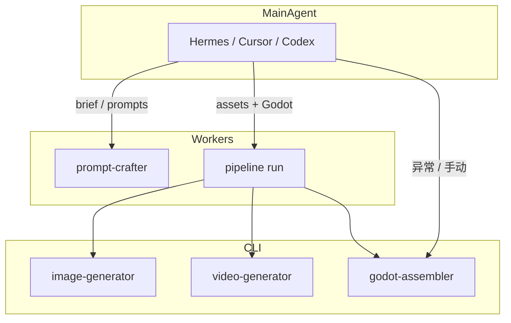

# Agent Routing — 混排执行器

主 Agent（Hermes / Cursor Agent / Codex）**只负责编排与异常**；资产与 Godot 组装由专职 Worker Agent 通过 CLI 或 `pipeline run` 执行。

---

## 六 Agent 角色

| Role ID | 默认 executor | Hermes skill | 职责 |
|---------|---------------|--------------|------|
| `orchestrator` | `hermes` | `game-factory-orchestrator` | brief、委派、失败 triage |
| `prompt-crafter` | `hermes` | `game-factory-prompt-crafter` | `prompt craft` → plan JSON |
| `image-generator` | `pipeline` | `game-factory-image-generator` | `image generate --plan-file` |
| `video-generator` | `pipeline` | `game-factory-video-generator` | `video generate` + 拆帧/抠图链 |
| `godot-assembler` | `pipeline` | `game-factory-godot-assembler` | `godot assemble` / `import-sprites`（资产导入，不写玩法） |
| `godot-developer` | `codex` | `game-factory-godot-developer` | 读 `dev_*.json` + brief → 写 C# 游戏逻辑 |

---

## 执行器选择

| Executor | 适用场景 | 实现 |
|----------|----------|------|
| **`pipeline`** | 批量资产 + Godot 组装（无 LLM） | `pipeline run` subprocess |
| **`hermes`** | 多会话委派、brief、prompt craft | `hermes install` + 单 skill 会话 |
| **`cursor`** | 本地 Cursor Agent | 读 `resources/skills/<role>/` 或 `.cursor/rules` |
| **`codex`** | `codex exec` 一次性任务 | `AGENTS.md` + Hermes skill |

默认配置见 `resources/agents.example.json`；用户可在 `~/.gamefactory/config.json` 的 `agents` 段覆盖。

```json
{
  "agents": {
    "orchestrator": { "executor": "hermes", "skill": "game-factory-orchestrator" },
    "godot-assembler": { "executor": "pipeline", "skill": "game-factory-godot-assembler" },
    "image-generator": { "executor": "pipeline", "skill": "game-factory-image-generator" }
  }
}
```

---

## CLI：解析路由

```bash
cd cli
python gamefactory.py agents show
python gamefactory.py agents show --discover   # 含本机 executor 是否可用
python gamefactory.py agents resolve --role godot-assembler
python gamefactory.py doctor                   # Hermes/Codex/Cursor/Godot 探测
```

输出包含 `executor`、`skill`（Hermes 包名）、`skills_dir`（Cursor 可读 skill 源）。  
`doctor` / `--discover` 在改 `config.agents` 前应跑一次 — **执行器不随仓库打包**。

---

## 推荐混排流程



1. **Phase A** — 主 Agent + `prompt-crafter`：定 brief、`prompt craft` → `plans/`
2. **Phase B** — `pipeline plan` + `pipeline run`（默认 `--jobs 4`）：静图 / 视频 / matte；Pass 3 含 `godot.assemble`
3. **Phase C** — 失败时主 Agent triage；`exit 2` → 改 plan → `pipeline reset` → 再 `run`
4. **Phase D（可选）** — 资产已就绪但未走 pipeline Godot 任务时：

```bash
python gamefactory.py godot assemble --assemble-file ../plans/godot_prison_demo.json
python gamefactory.py godot validate --project ../games/prison-demo
```

---

## godot-assembler 边界

- **做**：从 handoff 复制 PNG → `res://`，生成 `SpriteFrames` `.tres`，init .NET 工程骨架
- **不做**：玩法逻辑、UI 系统、关卡设计 — 交给 **godot-developer**
- **入口**：`godot assemble --assemble-file`（`consumer_role: godot-assembler`）

## godot-developer 边界

- **做**：读 `plans/dev_*.json` + brief，写/改 C# 与场景，实现产品文档中的玩法
- **不做**：生图、生视频、assemble 导入
- **入口**：`godot dev-context` 生成 handoff → Codex/Cursor 会话（skill `game-factory-godot-developer`）
- **默认 executor**：`codex`（见 `resources/agents.example.json`）

Handoff 示例：`plans/dev_test-brief-prison-walk.json`

---

## 相关文档

- [`docs/AI-HANDOFF.md`](AI-HANDOFF.md) — 命令速查、配置、抠图规则
- [`docs/HERMES-CODEX.md`](HERMES-CODEX.md) — Hermes 安装与 terminal 约定
- [`AGENTS.md`](../AGENTS.md) — Codex 速查
- [`resources/skills/godot-assembler/`](../resources/skills/godot-assembler/) — skill 源文件
