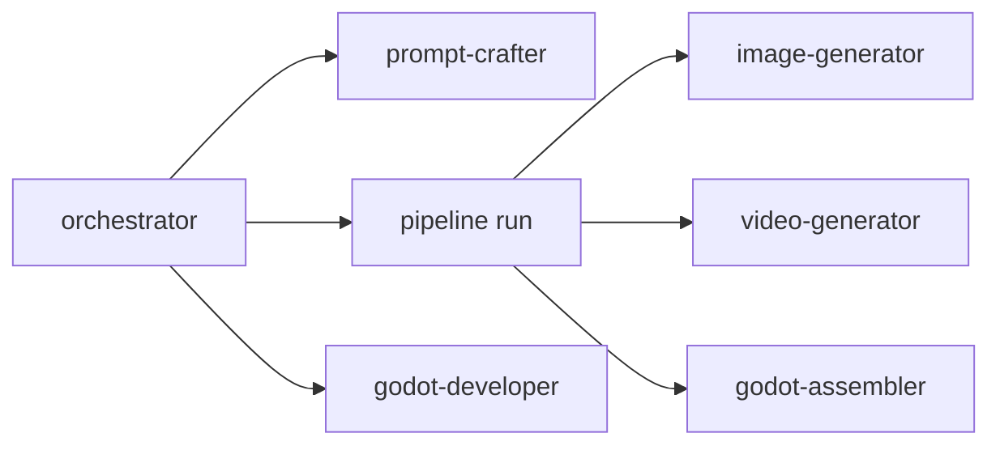

# Agent Routing — 混排执行器

| | |
|--|--|
| **读者** | 主 Agent（Hermes / Cursor / Codex）做委派时 |
| **侧重** | **六角色边界**、默认 executor、混排流程图 |
| **不写** | brief 字段表、CLI 大全、Change Request 方法论 |
| **姊妹文档** | 契约 → [`ITERATIVE-PRODUCTION.md`](ITERATIVE-PRODUCTION.md) · 命令 → [`AI-HANDOFF.md`](AI-HANDOFF.md) · 索引 → [`README.md`](README.md) · Pi/IT/存储 → [`superpowers/specs/2026-07-20-executor-storage-it-design.md`](superpowers/specs/2026-07-20-executor-storage-it-design.md) |

主 Agent **只编排与异常**；批量资产由 `pipeline run` subprocess 执行。

**已定（施工中 / 可测）**：
- **Pi 随 Release 内置**（只配 API）：① 策划 LLM 后端默认 Pi；**IT** 默认 Pi + 工具白名单。
- **Hermes / Codex**：仍 **引导安装**（可选），服务 **② 项目经理 / ③ 程序员**。
- 详见 [`superpowers/specs/2026-07-20-executor-storage-it-design.md`](superpowers/specs/2026-07-20-executor-storage-it-design.md)。

---

## 六角色 + GUI 工种

| Role ID | 一句话 | 默认 executor | Hermes skill |
|---------|--------|---------------|--------------|
| `orchestrator` | 聊体验、export brief、派活、失败 triage、Change Request 解释 | `hermes` | `game-factory-orchestrator` |
| `prompt-crafter` | brief → `plans/*.json` | `hermes` | `game-factory-prompt-crafter` |
| `image-generator` | 静图 generate + trim/remove-bg | `pipeline` | `game-factory-image-generator` |
| `video-generator` | 图生视频 + split/matte | `pipeline` | `game-factory-video-generator` |
| `godot-assembler` | Pass 3：PNG → Godot .NET，**不写玩法** | `pipeline` | `game-factory-godot-assembler` |
| `godot-developer` | Pass 4：读 dev-context 写 C# | `codex` | `game-factory-godot-developer` |
| `tester` | validate + 截图 + 视觉分析 → Validation Report | `hermes` | `game-factory-tester` |

**GUI 前台工种**（与上表不完全一一对应）：

| GUI | 后端 | 默认 |
|-----|------|------|
| 策划 `brief` | `brief chat` → 内置 Pi（JSON draft） | 只配 API |
| 项目经理 `product_host` | `agent turn` → Hermes/… | 引导装 |
| 程序员 `programmer` | `agent turn` → Codex/Hermes | 引导装 |
| **IT `it`** | `agent turn` → **内置 Pi** + `resources/skills/it/diagnose.md`（探测 + **经确认** 修环境/配置：upsert Key、install/ensure、executor step、agents.executors、heal/reset） | 只配 API |

---

## 执行器

| Executor | 何时用 |
|----------|--------|
| **`pipeline`** | `pipeline run` — 生图/视频/matte/assemble，无 LLM |
| **`pi`** | Release 内置；策划 LLM + IT（工具白名单 → `doctor` / `pipeline diagnose`…） |
| **`hermes`** | 项目经理 / 可选其它 Agent、多会话 |
| **`cursor`** | 读本仓库 `resources/skills/<role>/` |
| **`codex`** | Pass 4 玩法、`codex exec` |

```bash
cd cli
python gamefactory.py agents show --discover
python gamefactory.py doctor --json
python gamefactory.py setup check --json
python gamefactory.py setup executor status --json
```

配置：`resources/agents.example.json` → `~/.gamefactory/config.json` 的 `agents` 段。

**按实例覆盖**：花名册实例 id 对应 `agents.instances.<id>`（Provider / 模型 / 执行器 / Codex `use_third_party`）；`agent turn --instance-id` 与内置 Pi 共用解析链。策划/IT 可在聊天顶栏快选并写回同一 config；Key 仅存 `provider_accounts`。详见 [`TOOLS.md`](TOOLS.md) §3.4。

**本机工具**（`setup check`）：FFmpeg、Godot .NET、.NET SDK — 三项**必需**，可 `setup install` 或 GUI **启动自动安装**。rembg 不在列表中（Release 内嵌 Python 自带）。

**执行器安装**：GUI **环境 → 执行器** 或 `setup executor step <id> <step>` — 见 [`TOOLS.md`](TOOLS.md)。

---

## 混排流程



1. **AI 阶段** — orchestrator + prompt-crafter：brief、`plans/`
2. **程序阶段** — `pipeline plan` + `pipeline run --jobs 4`
3. **异常** — `exit 2` → 改 plan → `pipeline reset` → 再 `run`
4. **Pass 4** — `godot dev-context` → godot-developer 会话
5. **验收** — `test run` → tester 会话（或 orchestrator 委派）

Runner 细节 → [`pipeline-schedule.md`](../resources/skills/orchestrator/pipeline-schedule.md)

---

## Pass 3 / Pass 4 边界

| | godot-assembler | godot-developer |
|--|-----------------|-----------------|
| **做** | SpriteFrames、导入 PNG、.NET 骨架 | PlayerController、碰撞、HUD、胜负逻辑 |
| **不做** | 玩法、关卡设计 | 生图、生视频、assemble |
| **入口** | `godot assemble --assemble-file` | `godot dev-context -o plans/dev_*.json` |

---

## 相关文档

- [`AI-HANDOFF.md`](AI-HANDOFF.md) — CLI 速查
- [`ITERATIVE-PRODUCTION.md`](ITERATIVE-PRODUCTION.md) — 设计/施工、迭代
- [`HERMES-CODEX.md`](HERMES-CODEX.md) — Hermes 安装
- [`TOOLS.md`](TOOLS.md) — 工具配置、纠错、外部 Agent
- [`GUI-CONFIG.md`](GUI-CONFIG.md) — GUI Provider 与执行器
- [`AGENTS.md`](../AGENTS.md) — Codex 入口
