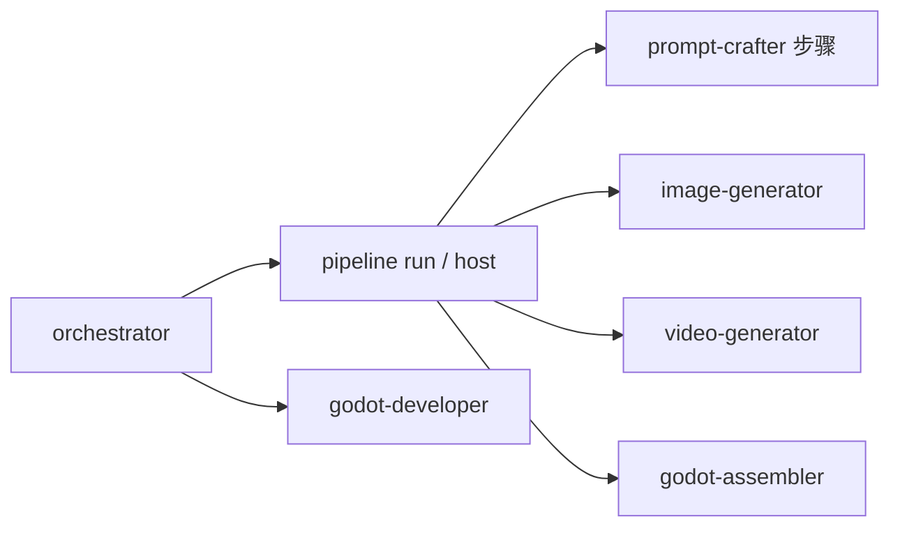

# Agent Routing — 混排执行器

| | |
|--|--|
| **读者** | 主 Agent（Hermes / Cursor / Codex）做委派时 |
| **侧重** | **六角色边界**、默认 executor、混排流程图 |
| **不写** | brief 字段表、CLI 大全、Change Request 方法论 |
| **姊妹文档** | 契约 → [`ITERATIVE-PRODUCTION.md`](ITERATIVE-PRODUCTION.md) · 命令 → [`AI-HANDOFF.md`](AI-HANDOFF.md) · 索引 → [`README.md`](README.md) · Pi/IT/存储 → [`superpowers/specs/2026-07-20-executor-storage-it-design.md`](superpowers/specs/2026-07-20-executor-storage-it-design.md) |

主 Agent **只编排与异常**；批量资产由 `pipeline run` subprocess 执行。

---

## 用户可见同事 vs pipeline 内部角色

**对用户（GUI 花名册）**：策划 · 顾问 · 项目经理 · 程序员 · IT — 这五类是**可聊天同事**。

**不对用户暴露为同事**（pipeline / CLI 内部步骤，Hermes skill 仍保留供 Runner 调试）：

| 内部 Role ID | 用户心智 | 实际入口 |
|--------------|----------|----------|
| `prompt-crafter` | **不是**第七个聊天同事 | `pipeline run --run-prompts`、`prompt craft --asset`、或 `host retry-asset --recraft-prompt` |
| `image-generator` / `video-generator` / `godot-assembler` | 同上 | `pipeline run` 子进程 |
| `orchestrator` | 混排主 Agent 概念 | Hermes / Cursor / Codex 编排 skill，非 GUI 工种 |

**要点**：用户不必、也不应被引导去「找 prompt-crafter 同事改 prompt」。validation / CJK 类失败由 **Host**（`host run-assets --auto-fix` / `host retry-asset`）或项目经理分诊后自动带 `--run-prompts`；`prompt_craft.py` 模块保留，只是产品叙事上并入流水线。

---

**已定（施工中 / 可测）**：
- **Pi 随 Release 内置**（只配 API）：① 策划 LLM 后端 **固定 Pi**（实例不可切 Hermes/Codex/Cursor）；**顾问** **固定 Pi** + **只读**工具白名单；**IT** **默认 Pi** + 工具白名单，实例可在顶栏/雇人改为 `codex` / `cursor`。
- **Hermes / Codex**：仍 **引导安装**（可选），服务 **② 项目经理 / ③ 程序员**；IT 切外置执行器前通常先用 Pi 走 `setup executor step … install_cli`（或 GUI **环境 → 执行器**）。
- 详见 [`superpowers/specs/2026-07-20-executor-storage-it-design.md`](superpowers/specs/2026-07-20-executor-storage-it-design.md)。

---

## 六角色 + GUI 工种

> **对外叙事**：上表前四行（orchestrator / prompt-crafter / image / video / godot-assembler）是 **pipeline 内部步骤**；用户只感知 GUI 工种（下表）。`prompt-crafter` 尤其 **不是** 需单独开聊的同事。

| Role ID | 一句话 | 默认 executor | Hermes skill | 用户可见？ |
|---------|--------|---------------|--------------|------------|
| `orchestrator` | 聊体验、export brief、派活、失败 triage、Change Request 解释 | `hermes` | `game-factory-orchestrator` | 混排 Agent |
| `prompt-crafter` | brief → `plans/*.json`（**pipeline 步骤**） | `pipeline` / `hermes` | `game-factory-prompt-crafter` | **否** |
| `image-generator` | 静图 generate + trim/remove-bg | `pipeline` | `game-factory-image-generator` | **否** |
| `video-generator` | 图生视频 + split/matte | `pipeline` | `game-factory-video-generator` | **否** |
| `godot-assembler` | Pass 3：PNG → Godot .NET，**不写玩法** | `pipeline` | `game-factory-godot-assembler` | **否** |
| `godot-developer` | Pass 4：读 dev-context 写 C# | `codex` | `game-factory-godot-developer` | 程序员 |
| `tester` | validate + 截图 + 视觉分析 → Validation Report | `hermes` | `game-factory-tester` | 可选委派 |

**GUI 前台工种**（与上表不完全一一对应）：

| GUI | 后端 | 默认 |
|-----|------|------|
| 策划 `brief` | `brief chat` → **内置 Pi**（JSON draft）；执行器 **锁 Pi** | 只配 API |
| **顾问 `advisor`** | `agent turn` → **锁 Pi**；`tool_profile=advisor` **只读**（不改 brief / 不跑流水线） | 只配 API |
| 项目经理 `product_host` | `agent turn` → Hermes/… | 引导装 |
| 程序员 `programmer` | `agent turn` → Codex/Hermes | 引导装 |
| **IT `it`** | `agent turn` → **默认 Pi**；实例可切 `codex` / `cursor` + `resources/skills/it/diagnose.md`（Pi 上探测 + **经确认** 修环境/配置；外置执行器走各自 CLI/ACP，装机仍靠 Pi 或 GUI 环境步进） | 开箱 Pi；可选外置 |

---

## 执行器

| Executor | 何时用 |
|----------|--------|
| **`pipeline`** | `pipeline run` — 生图/视频/matte/assemble，无 LLM |
| **`pi`** | Release 内置；策划 LLM（**仅 Pi**）+ IT **默认**（工具白名单 → `doctor` / `pipeline diagnose`…） |
| **`hermes`** | 项目经理 / 可选其它 Agent、多会话 |
| **`cursor`** | 读本仓库 `resources/skills/<role>/` |
| **`codex`** | Pass 4 玩法、`codex exec` |

```bash
cd cli
python gamefactory.py agents show --discover
python gamefactory.py doctor --json
python gamefactory.py setup check --json
python gamefactory.py setup executor status --json
```

配置：`resources/agents.example.json` → `~/.gamefactory/config.json` 的 `agents` 段。

**按实例覆盖**：花名册实例 id 对应 `agents.instances.<id>`（Provider / 模型 / 执行器 / Codex `use_third_party`）；`agent turn --instance-id` 与内置 Pi 共用解析链。策划顶栏可快选 Provider/模型（**执行器仍 Pi**）；**IT** 顶栏/雇人可选执行器并写回同一 config；Key 仅存 `provider_accounts`。详见 [`TOOLS.md`](TOOLS.md) §3.4。

**本机工具**（`setup check`）：FFmpeg、Godot .NET、.NET SDK — 三项**必需**，可 `setup install` 或 GUI **启动自动安装**。rembg 不在列表中（Release 内嵌 Python 自带）。

**执行器安装**：GUI **环境 → 执行器** 或 `setup executor step <id> <step>` — 见 [`TOOLS.md`](TOOLS.md)。

---

## 混排流程


```mermaid
flowchart LR
    O[orchestrator] --> PR[pipeline run / host]
    PR --> PC[prompt-crafter 步骤]
    PR --> IG[image-generator]
    PR --> VG[video-generator]
    PR --> GA[godot-assembler]
    O --> GD[godot-developer]
```

1. **AI 阶段** — orchestrator：brief、export；`plans/` 由 pipeline 内 **prompt-crafter 步骤**（`--run-prompts` / `host retry-asset`）产出，非独立聊天同事
2. **程序阶段** — `pipeline plan` + `host run-assets --auto-fix` 或 `pipeline run --jobs 4`
3. **异常** — `exit 2` → 改 plan → `pipeline reset` → 再 `run`
4. **Pass 4** — `godot dev-context` → godot-developer 会话
5. **验收** — `test run` → tester 会话（或 orchestrator 委派）

Runner 细节 → [`pipeline-schedule.md`](../resources/skills/orchestrator/pipeline-schedule.md)

---

## IT 执行器切换 — 手工验收（E2E）

发布或改 IT/执行器相关行为后，在 GUI 或 CLI 侧逐项确认：

| # | 步骤 | 期望 |
|---|------|------|
| 1 | 仅配置 Provider API Key，打开 **IT**（默认 Pi） | `doctor --json` / 对话内探测可用 |
| 2 | 对 IT(Pi) 说「帮我装 Codex CLI」 | 走到 `setup executor step codex install_cli`（或指引 GUI **环境 → 执行器** 步进） |
| 3 | IT 顶栏执行器列表 | 仅显示 Pi / Codex / Cursor；切 **Codex** + 勾选第三方后保存，`setup executor step codex sync_api` 成功（或 GUI 保存后自动 sync） |
| 4 | 新开 IT 会话问：「策划这个确实又踩了只说不写，是代码原因吗」 | 应去读 brief 会话 / `host_chat` 等工程上下文，**不应**只答职责路由或 Godot 实现 |
| 5 | 打开 **策划** 顶栏配置 | **无** Codex/Hermes/Cursor 执行器切换（仍仅 Pi + Provider/模型） |

---

## Pass 3 / Pass 4 边界

| | godot-assembler | godot-developer |
|--|-----------------|-----------------|
| **做** | SpriteFrames、导入 PNG、.NET 骨架 | PlayerController、碰撞、HUD、胜负逻辑 |
| **不做** | 玩法、关卡设计 | 生图、生视频、assemble |
| **入口** | `godot assemble --assemble-file` | `godot dev-context -o plans/dev_*.json` |

---

## 相关文档

- [`AI-HANDOFF.md`](AI-HANDOFF.md) — CLI 速查
- [`ITERATIVE-PRODUCTION.md`](ITERATIVE-PRODUCTION.md) — 设计/施工、迭代
- [`HERMES-CODEX.md`](HERMES-CODEX.md) — Hermes 安装
- [`TOOLS.md`](TOOLS.md) — 工具配置、纠错、外部 Agent
- [`GUI-CONFIG.md`](GUI-CONFIG.md) — GUI Provider 与执行器
- [`AGENTS.md`](../AGENTS.md) — Codex 入口
