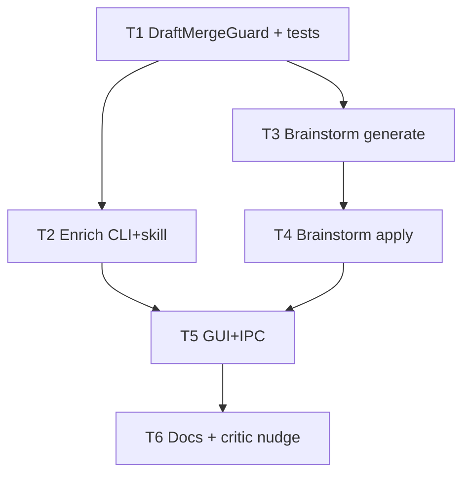

# 架构方案：Brief 补全环 + 议题多视角头脑风暴

## 执行元数据

- **Status**：reviewed（APPROVED；待用户确认 commit）
- **Workflow Stage**：review → commit（paused）
- **Updated**：2026-07-27（review APPROVED；apply_draft overlay 保 assets）
- **Resume Point**：用户确认后 commit；可选 `/anvil:compound`
- **Review**：[`.ai/anvil/reviews/2026-07-27-brief-enrich-and-topic-brainstorm-review.md`](../../../.ai/anvil/reviews/2026-07-27-brief-enrich-and-topic-brainstorm-review.md)
- **Readiness**：CLI 49 + typecheck OK

## Spec 开放问题 → Plan 默认

| 项 | Plan 决定 |
|----|-----------|
| 写回策略 | v1：**整稿替换** `draft_brief`；写前把旧 draft 存 `session["draft_brief_backup"]`（单槽）供失败/撤销 |
| 默认角色 | 4：`systems` / `ui_presentation` / `feel_feedback` / `devil_advocate` |
| 补全 vs 再审查 | **分按钮**；补全成功后聊天提示「建议再制作审查」不强制同次跑 |
| 多样本 E | **延后**；enrich 内不做 n 次择优（可用略高 temperature） |
| 多模型 | brainstorm 加 `--multi-model`；未配置 → 仅多角色并 UI/JSON 标明 `mode: personas` |
| 固定 schema | **禁止**校验必填 screens/tuning_needs |

## 模块边界

### 模块：DraftMergeGuard

- **职责**：校验 LLM 返回的 draft JSON；合并 assets 候选；写 session；使 makeability 过期
- **输入**：old_draft、candidate_draft、asset_proposals[]
- **输出**：new `draft_brief`；`draft_brief_backup`；清/标 stale `makeability_review` 与 `ready_to_export=false`
- **依赖**：`draft_fingerprint`、既有 session 持久化
- **不变量**：合并失败不改盘上 session；无通用必填字段检查

### 模块：BriefEnrichRunner

- **职责**：按钮触发的整稿加厚（自对话多步可选 + 最终 merge 稿）
- **输入**：session、可选 `user_hint`、temperature
- **输出**：加厚后的 draft（含参数名/呈现描述 + assets 候选）；摘要消息
- **依赖**：DraftMergeGuard、`chat_text_completion`、skill 文件
- **不变量**：不 export；不跑 pipeline；不替代 Critic

### 模块：TopicBrainstormRunner

- **职责**：议题多角色（±多模型）并行出方案卡；**不**自动写 draft
- **输入**：session、topic、可选 constraints、`multi_model` flag
- **输出**：`brainstorm_result`（proposals[]：id/title/bullets/source_role[/model]）挂 session 或返回 JSON
- **依赖**：并行 LLM 调用、角色 prompt
- **不变量**：先吵后拣；无采用则 draft 不变

### 模块：BrainstormApply

- **职责**：用户采用一案或融合多案 → 生成 patch 稿 → DraftMergeGuard
- **输入**：session、selected_proposal_ids[]、可选 fuse 指示
- **输出**：更新后的 draft_brief
- **依赖**：TopicBrainstormRunner 产物、DraftMergeGuard

### 模块：GuiBriefEnrichUx

- **职责**：「补全细节」按钮（可输入要求）；「议题头脑风暴」入口 + 方案卡选用
- **输入**：用户点击/文本
- **输出**：IPC → CLI；刷新侧栏 draft / status
- **依赖**：Electron host-chat IPC 模式（同 makeability）
- **不变量**：不绑导出自动跑

## 接口定义

### CLI

```text
brief chat enrich --session-id <id> [--hint "..."] [--temperature 0.7] [--json]
brief chat brainstorm --session-id <id> --topic "..." [--constraints "..."] [--multi-model] [--json]
brief chat brainstorm-apply --session-id <id> --proposal-id <id>[,<id>...] [--fuse] [--json]
```

### Session 字段（增量）

```json
{
  "draft_brief_backup": { },
  "last_enrich_at": "ISO-8601",
  "brainstorm_result": {
    "topic": "...",
    "mode": "personas" | "personas+models",
    "proposals": [
      { "id": "p1", "role": "ui_presentation", "title": "...", "bullets": [], "model": null }
    ]
  }
}
```

写回 draft 后：`ready_to_export=false`；`makeability_review` 视为过期（删除或保留但 fingerprint 不再匹配——与现门闩一致，优先 **保留旧 review 自然 stale** 即可）。

### Skills（新）

- `resources/skills/orchestrator/brief-enrich.md` — 开放式加厚：玩家可见流程/呈现；列出**需要的参数名与展示位**（不填死数）；提议 assets；禁止固定字段清单思维
- `resources/skills/orchestrator/topic-brainstorm-persona.md` — 角色卡模板
- 可选轻改 `makeability-critic.md`：强调「读完能否想象游戏」开放缺口（仍二分 intent/detail）

### GUI IPC（对称 makeability）

- `hostChatEnrich(sessionId, hint?, instanceId?)`
- `hostChatBrainstorm(sessionId, topic, constraints?, multiModel?, instanceId?)`
- `hostChatBrainstormApply(sessionId, proposalIds, fuse?, instanceId?)`

## 日志规范

| 事件 | 字段 |
|------|------|
| enrich_start / enrich_ok / enrich_fail | session_id, hint_len, temperature |
| brainstorm_start / proposal_count | session_id, topic, mode, roles |
| brainstorm_apply | session_id, proposal_ids, fuse |
| merge_reject | reason: invalid_json \| missing_project |

## RTK 过滤预设

```bash
cd cli && python -m unittest test_host_chat test_brief_enrich -q
cd gui && npm run typecheck
```

## 历史经验约束

- Critic 保持独立只读；enrich 是写路径，二者不混在同一次「静默改稿」
- enrich/apply 后 draft fingerprint 变 → makeability 自然挡 export
- assets 候选只做 brief 侧合并；不在 enrich 里改 pipeline wiring（export 后 plan 再接线）
- GUI status 全量刷新，避免 partial patch 粘旧 has_review
- 并行失败不损坏 session；未配置多模型干净降级

## 反模式检查

- ❌ 通用必填 screens schema
- ❌ export 自动 enrich
- ❌ brainstorm 未经采用写 draft
- ❌ 补全失败仍覆盖 draft
- ✅ 按钮可控 + 先吵后拣 + backup 槽

## 简化审计

已砍：导出挂钩、固定字段表、默认多样本 E、v1 强制多厂商。  
保留：单槽 backup（比完整 undo 栈简单）、4 固定角色名（可配置数，文案写死在 skill）。

## 任务 DAG



## 并行执行计划

| Layer | Group | Tasks | Execution | Reason |
|-------|-------|-------|-----------|--------|
| 1 | G1 | T1 | serial | shared merge contract |
| 2 | G2 | T2, T3 | parallel | 写集分离（enrich vs brainstorm generate） |
| 3 | G3 | T4 | serial | 依赖 T3 产物形状 |
| 4 | G4 | T5 | serial | GUI 依赖 CLI IPC 契约 |
| 5 | G5 | T6 | serial | docs |

## 任务列表

### 任务 T1：DraftMergeGuard + 单测

- **Layer**：1 · **G1** · **serial**
- **Ownership**：`cli/host_chat.py`（merge helpers）、`cli/test_brief_enrich.py`（新）
- **Write Set**：同上
- **描述**：`validate_enriched_draft`、`merge_asset_proposals`、`apply_draft_replacement`（backup + ready_to_export false）；无固定 schema 校验。
- **成功标准**：单测：非法 JSON 不改 session；合法替换后 fingerprint 变且 backup 存在；assets 按 name 去重合并。
- **依赖**：无

### 任务 T2：Enrich CLI + skill

- **Layer**：2 · **G2** · **parallel**（相对 T3）
- **Ownership**：`cli/host_chat.py` enrich runner、`cli/brief_cmds.py`、`resources/skills/orchestrator/brief-enrich.md`、`cli/test_brief_enrich.py` 扩展
- **Write Set**：同上（避免改 brainstorm 专用函数体若可拆文件则 `cli/brief_enrich.py`）
- **描述**：`brief chat enrich`；多步自对话可简化为：critique 缺口 JSON → enrich 整稿 JSON；`--hint`；`--temperature`；走 DraftMergeGuard。
- **成功标准**：mock LLM 单测 enrich 写回 draft；hint 传入 prompt；失败保留旧 draft。
- **依赖**：T1

### 任务 T3：Brainstorm generate

- **Layer**：2 · **G2** · **parallel**（相对 T2）
- **Ownership**：`cli/brief_brainstorm.py`（新，推荐）或 host_chat 专区、`brief_cmds.py`、`topic-brainstorm-persona.md`、测试
- **Write Set**：新文件 + brief_cmds 注册；**不**改 T2 enrich 核心
- **描述**：4 角色并行（ThreadPool 或等价）；组装 proposals；写入 `brainstorm_result`；`--multi-model` 探测配置后追加模型维，否则 personas。
- **成功标准**：mock 下返回 ≥3 proposals；multi-model 关时 mode=personas。
- **依赖**：T1（仅若 generate 也写 session 元数据；不写 draft 亦可弱依赖 T1——仍标 T1 以便 session save 一致）

### 任务 T4：Brainstorm apply

- **Layer**：3 · **G3** · **serial**
- **Ownership**：apply 函数 + `brainstorm-apply` 命令 + 测试
- **Write Set**：与 T3 同模块文件 + tests
- **描述**：按 proposal id 采用或 `--fuse` 多案；LLM 或确定性拼接生成新 draft → DraftMergeGuard；附资产候选。
- **成功标准**：未选 id → 错误；采用后 draft 变厚且 backup 更新；makeability fingerprint 失配。
- **依赖**：T3

### 任务 T5：GUI + IPC

- **Layer**：4 · **G4** · **serial**
- **Ownership**：`gui/electron/main.mjs`、`preload.cjs`、`vite-env.d.ts`、`App.tsx`、`DocsPreviewPanel`/`ChatInput`、少量 CSS
- **Write Set**：同上
- **描述**：补全按钮（可弹 hint 输入）；头脑风暴（议题输入 → 方案列表 → 采用）；刷新 draft/status；busy 态。
- **成功标准**：typecheck；无导出自动触发；与制作审查按钮并列不互相覆盖。
- **依赖**：T2、T4

### 任务 T6：文档 + Critic 提示加强

- **Layer**：5 · **G5** · **serial**
- **Ownership**：`docs/AI-HANDOFF.md`、`docs/HOST-CHAT-PRODUCT.md`、`RELEASE-NOTES-UNRELEASED.md`、可选 `makeability-critic.md` 一小段
- **描述**：入口说明；数值 vs 参数名；不定死 schema；按钮非导出挂钩。
- **成功标准**：`rg "补全细节|议题头脑风暴|brief chat enrich" docs/` 命中。
- **依赖**：T5

## 会话拆分点

- T1–T4 后：CLI 可测，可暂停
- T5–T6 后：可 review

## 通过条件

- [ ] 补全按钮可多次带 hint；失败不丢 draft
- [ ] 头脑风暴 ≥3 案；采用才写 draft
- [ ] 写回含 assets 候选合并规则
- [ ] 不绑 export；makeability 过期挡导出
- [ ] 无固定 screens 必填校验
- [ ] 多模型未配时降级

## 确认后

回复 **确认 plan** / **开始实现** → `/anvil:code`。
