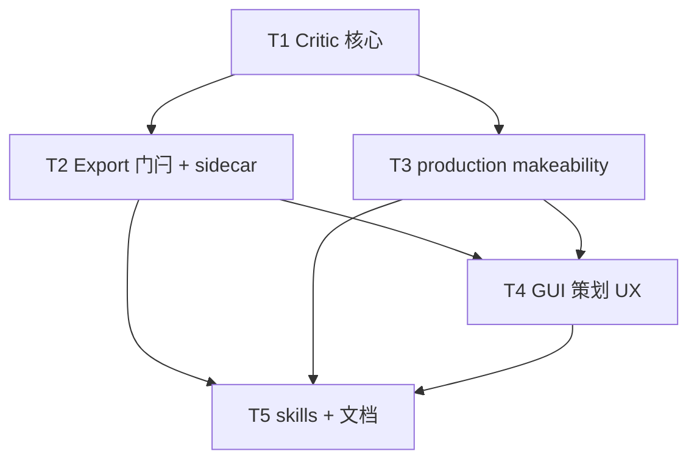

# 架构方案：制作完备性审查（Makeability Critic）

## 执行元数据

- **Status**：executed
- **Workflow Stage**：code
- **Created**：2026-07-27
- **Updated**：2026-07-27（T1–T5 完成；pause 未 commit）
- **Source Of Truth Until**：`/anvil:review` 通过并提交后失效
- **Requirements Source**：[`docs/anvil/brainstorms/2026-07-27-brief-makeability-critic.md`](../brainstorms/2026-07-27-brief-makeability-critic.md)（confirmed；方案 2）
- **Compounded Knowledge**：critical-patterns 与 ACP 无关
- **Resume Point**：实现完成；下一步 `/anvil:review`；你开口才 commit
- **Commit policy**：pause（你开口才 commit）
- **Readiness**：`cd cli && python -m unittest test_makeability_critic test_makeability_gate test_production_makeability -q`

## 任务 Code Status

| Task | Status | Verification |
|------|--------|--------------|
| T1 Critic 核心 | done | test_makeability_critic 4 OK |
| T2 Export 门闩 + sidecar | done | test_makeability_gate + critic 10 OK |
| T3 production makeability | done | test_production* 17 OK |
| T4 GUI UX | done | briefPreviewFormat 12 OK；typecheck OK |
| T5 skills + docs | done | rg makeability / 禁止改 brief 命中 |

## Spec 开放问题 → Plan 默认

| 项 | Plan 决定 |
|----|-----------|
| 审查强制时机 | **export 前强制**：session 无成功 `makeability_review`，或 `draft_fingerprint` 与审查时不一致 → 禁止 export / 清 `ready_to_export` |
| `tuning` schema | v1：**自由对象** `production_doc.tuning: { [key]: any }`；由 `suggested_defaults` / PM 写入；不做 genre 模板 |
| provisional 谁确认 | PM/Agent 可写 provisional 值；**默认保持 `provisional: true`** 直至人工改 `false`（v1 不强制试玩门闩） |
| GUI 展示 production makeability | **策划侧**：session 审查面板；**DocsPreview**：有 `production.json` 时只读展示 `makeability` 摘要（不新开 PM 看板） |

## 模块边界

### 模块：MakeabilityCritic

- **职责**：独立子 LLM 调用；只读 `draft_brief`；返回结构化审查 JSON；不改 draft。
- **输入**：`draft_brief` dict、`genre`、可选 `slug`
- **输出**：`MakeabilityReview`（见接口）
- **依赖**：现有 `chat_text_completion` / `_parse_llm_json`；skill 文件
- **不变量**：不写 brief；不读策划聊天历史；失败不污染 `draft_brief`

### 模块：HostChatMakeabilityGate

- **职责**：session 存审查结果；`intent_gaps` 未空或未审查/草稿指纹变 → 禁止 `ready_to_export` 与 export。
- **输入**：session、`MakeabilityReview`
- **输出**：更新后的 session；export 成功时写出 sidecar
- **依赖**：MakeabilityCritic；`export_brief`
- **不变量**：`detail_gaps` **不**阻塞 export；Critic **不**静默改 draft

### 模块：ProductionMakeability

- **职责**：`derive_production` 合并 sidecar → `production_doc.makeability` + 可选 `tuning` 暂定键。
- **输入**：brief path、可选 `makeability.json` sidecar（同目录或 `projects/<slug>/`）
- **输出**：带 `makeability` 的 production dict
- **依赖**：现有 `derive_production` / `validate_production`
- **不变量**：无 sidecar 时旧行为不变；`makeability` 缺省合法

### 模块：GuiMakeabilityUX

- **职责**：策划 Tab「制作审查」；展示 intent/detail；选项注入下一轮用户消息；Save 门闩。
- **输入**：IPC → `brief chat makeability`（或等价）
- **输出**：气泡 + DocsPreview 只读摘要
- **依赖**：HostChatMakeabilityGate CLI
- **不变量**：仅 `role=brief` 触发；不给 PM Tab 写 brief

### 模块：PmMakeabilitySkills

- **职责**：文档/skill 教 PM 读 `makeability`、填 provisional、**禁止改 brief 意图**。
- **输入**：无代码运行时强制（v1）
- **输出**：skill / AI-HANDOFF / HOST-CHAT 段落
- **依赖**：ProductionMakeability schema 稳定
- **不变量**：不新增 brief 写 CLI 白名单

## 接口定义

### `MakeabilityReview`（session + sidecar 共用）

```json
{
  "schema_version": 1,
  "reviewed_at": "ISO-8601",
  "draft_fingerprint": "sha256-of-canonical-draft",
  "intent_gaps": [
    {
      "id": "win_condition",
      "question": "...",
      "why_blocking": "...",
      "choices": ["A", "B"]
    }
  ],
  "detail_gaps": [
    {
      "id": "bite_rate",
      "topic": "bite chance / wait time",
      "suggested_table_shape": "object",
      "example_keys": ["base_bite_chance", "wait_sec_min"]
    }
  ],
  "suggested_defaults": [
    {
      "gap_id": "bite_rate",
      "value": { "base_bite_chance": 0.35, "wait_sec_min": 2 },
      "confidence": "low",
      "note": "provisional placeholder"
    }
  ]
}
```

### Sidecar 路径

- 隔离工程：`projects/<slug>/makeability.json`
- 写时机：`brief chat export` 成功时，把 session 当前 review 落盘（含 `detail_gaps` + `suggested_defaults`）
- `production derive`：若 sidecar 存在则合并；否则 skip

### `production_doc.makeability`

```json
{
  "status": "pending|partial|ready",
  "source": "projects/<slug>/makeability.json",
  "detail_items": [
    {
      "id": "bite_rate",
      "topic": "...",
      "status": "provisional|open|ready",
      "owner": "pm",
      "provisional_values": {}
    }
  ]
}
```

可选并行：`production_doc.tuning` 从 `suggested_defaults[].value` 浅合并（全标 provisional 语义由 makeability 承载）。

### CLI

```text
brief chat makeability --session-id <id> [--json]
# → 跑 critic，写 session.makeability_review，返回 gaps；若 intent 非空则 ready_to_export=false
```

Export 门闩（在现有 `export_brief` / GUI save 路径）：

1. 无 `makeability_review` → 拒绝（提示先「制作审查」）
2. `draft_fingerprint` ≠ 当前 draft → 拒绝（提示重跑审查）
3. `intent_gaps` 非空 → 拒绝

### 关 intent_gaps（v1）

不单独做 resolve API。用户点选项 / 回话 → host-chat 更新 draft → **再点「制作审查」**；intent 为空才放行。

## 日志规范

| 事件 | 字段 |
|------|------|
| critic_start | session_id, genre, draft_asset_count |
| critic_ok | intent_count, detail_count, elapsed_ms |
| critic_fail | error_class, message（无 draft dump） |
| export_blocked_makeability | reason: missing\|stale\|intent_open |
| derive_makeability_merged | detail_item_count, has_tuning |

## RTK 过滤预设

- 单测：`cd cli && python -m unittest test_makeability_critic test_makeability_gate test_production_makeability -q`
- 失败时只看 FAIL/ERROR 摘要，不贴完整 LLM mock 大 JSON

## 历史经验约束

- 契约与落盘分离：类似 style resolve≠wire — **critic 输出 ≠ 自动改 brief**；细节只进 production sidecar。
- ACP critical-patterns **不适用**本主题。

## 关键模式检查

- ❌ Critic 与主会话共用 messages 上下文  
- ✅ Fresh system skill + 仅 draft JSON  
- ❌ 数值写进 `art_direction` / gameplay 散文  
- ✅ `detail_gaps` → sidecar → `production_doc.makeability`  
- ❌ PM 写 brief  
- ✅ PM 只动 production / handoff  

## 简化审计

可删 50% 仍达标的砍法（已砍）：

- 不做新工种、不做圆桌、不做 genre 模板、不做 PM GUI 填表编辑器（v1 Agent+手改 JSON）
- 不做 intent resolve API（重跑 critic）
- 不做试玩后自动 `provisional→ready`

保留最小闭环：critic → 门闩 → sidecar → derive → skill。

## 任务 DAG



## 并行执行计划

| Layer | Parallel Group | Tasks | Execution | Reason |
|-------|----------------|-------|-----------|--------|
| 1 | G1 | T1 | serial | 共享 JSON schema / session 字段 |
| 2 | G2 | T2, T3 | parallel | 写集分离（host_chat/brief_cmds vs production） |
| 3 | G3 | T4 | serial | 依赖 T2 CLI + T3 字段展示 |
| 4 | G4 | T5 | serial | 依赖 schema 稳定 |

## 任务列表

### 任务 T1：Critic 核心（skill + 调用 + session 字段）

- **Layer**：1
- **Parallel Group**：G1
- **Execution**：serial
- **Parallel Blocker**：bootstrap schema
- **Ownership**：`cli/host_chat.py`、`resources/skills/orchestrator/makeability-critic.md`、`cli/test_makeability_critic.py`、`cli/brief_cmds.py`（仅 makeability 子命令骨架）
- **Read Set**：`host_chat.py`（`chat_text_completion`、`_parse_llm_json`、session）、`commit-brief.md`（对照 gaps 语气）
- **Write Set**：同上 Ownership
- **描述**：实现 `run_makeability_review(session)`：算 fingerprint、独立 LLM、解析三列表、写入 `session["makeability_review"]`；intent 非空则 `ready_to_export=false`；CLI `brief chat makeability`。
- **成功标准**：mock LLM 返回含 ≥3 `detail_gaps` 的 fishing 样例 draft → 解析成功且 draft 未被修改；坏 JSON → 抛错且 session draft 不变。
- **预估 Token**：中
- **依赖**：无
- **涉及文件**：见 Ownership
- **执行指令**：先写 skill 输出契约；再实现 fingerprint（canonical JSON sha256）；单测 mock `chat_text_completion`。

### 任务 T2：Export 门闩 + sidecar 落盘

- **Layer**：2
- **Parallel Group**：G2
- **Execution**：parallel（相对 T3）
- **Parallel Blocker**：无（不改 production.py）
- **Ownership**：`cli/host_chat.py`（`export_brief`）、`cli/brief_cmds.py`（export 路径写 sidecar）、`cli/test_makeability_gate.py`
- **Read Set**：T1 session 字段约定、`projectPaths` / `projects/<slug>/` 规则
- **Write Set**：同上 Ownership；**不**改 `production.py`
- **描述**：`export_brief` 检查 missing/stale/intent_open；通过后写 `projects/<slug>/makeability.json`（无 slug 时写 brief 旁 `makeability.json`）。
- **成功标准**：三门闩单测各拦一次；成功 export 后 sidecar 存在且含 `detail_gaps`。
- **预估 Token**：中
- **依赖**：T1
- **涉及文件**：见 Ownership
- **执行指令**：复用现有 export CLI 出口；sidecar 与 brief 同工程根。

### 任务 T3：production derive 合并 makeability

- **Layer**：2
- **Parallel Group**：G2
- **Execution**：parallel（相对 T2）
- **Parallel Blocker**：无（不改 host_chat export）
- **Ownership**：`cli/production.py`、`cli/test_production_makeability.py`
- **Read Set**：T1 review schema、现有 `derive_production` / `validate_production`
- **Write Set**：同上 Ownership
- **描述**：`derive_production` 旁路查找 sidecar；合并 `makeability` + 浅合并 `tuning`；无 sidecar 时 validate 仍绿。
- **成功标准**：有 sidecar → `detail_items` 长度匹配；无 sidecar → 与改前 derive 关键兼容（无 makeability 或空）；validate 不因缺 makeability 失败。
- **预估 Token**：中
- **依赖**：T1（schema）
- **涉及文件**：见 Ownership
- **执行指令**：`status`：有 open detail → `pending`；全有 provisional_values → `partial`；全 `ready` → `ready`（v1 可由 defaults 直接 `partial`）。

### 任务 T4：GUI 策划 UX

- **Layer**：3
- **Parallel Group**：G3
- **Execution**：serial
- **Parallel Blocker**：依赖 T2 CLI + 状态字段
- **Ownership**：`gui/src/App.tsx`（策划路径）、必要类型 `vite-env.d.ts`、DocsPreview 只读摘要（现有 `briefPreviewFormat` / DocsPreview 入口）
- **Read Set**：现有 autofix / 保存 Brief 流程、host-chat status JSON
- **Write Set**：同上 Ownership
- **描述**：按钮「制作审查」→ CLI makeability；气泡展示 intent/detail；选项点击当用户消息；`intent_gaps` 非空或未审查时禁用「保存 Brief」（或点了弹出先审查提示）。
- **成功标准**：手动/组件逻辑：无 review 时保存按钮不可用；有 intent 时不可用；仅 detail 时可用。DocsPreview 在存在 production makeability 时显示条数。
- **预估 Token**：中高
- **依赖**：T2、T3
- **涉及文件**：见 Ownership
- **执行指令**：复用气泡 `choices` 注入模式；不要新工种侧栏。

### 任务 T5：skills + 文档

- **Layer**：4
- **Parallel Group**：G4
- **Execution**：serial
- **Parallel Blocker**：schema 已定
- **Ownership**：`resources/skills/orchestrator/makeability-critic.md`（若 T1 未完则收尾）、`commit-brief.md`、`host-chat.md`、`product-host.md`、`docs/AI-HANDOFF.md`、`docs/HOST-CHAT-PRODUCT.md` 短节、`docs/ITERATIVE-PRODUCTION.md` 一句 Design/Production 映射
- **Read Set**：本 plan 接口、Spec
- **Write Set**：同上 Ownership
- **描述**：写清意图/细节二分、门闩、PM 只改 production、禁止改 brief。
- **成功标准**：`rg makeability` / `intent_gaps` 在上述文档有命中；`product-host.md` 含「禁止改 brief 意图」。
- **预估 Token**：低
- **依赖**：T2、T3、T4（可与 T4 尾部串行）
- **涉及文件**：见 Ownership
- **执行指令**：短段落，不重写整本 HOST-CHAT。

## 会话拆分点

- **拆分点 1**：T1+T2+T3 后（CLI 闭环可测；预估累计中）
- **拆分点 2**：T4+T5 后（GUI+文档；可 `/anvil:review`）

## 通过条件

- [ ] Critic 独立调用；draft 不被 critic 修改
- [ ] intent 未关 / 未审查 / 指纹过期 → export 失败
- [ ] detail 可 export；sidecar → derive 有 `makeability`
- [ ] 无 sidecar 旧工程仍可用
- [ ] GUI 仅策划侧触发；PM skill 禁止改 brief
- [ ] 单测三文件 `-q` 全绿
- [ ] 无第二套 task 状态文件；本 plan 为 `/anvil:code` 真源

## 确认后

你回复「确认 plan」或「开始实现」→ Status 改 `confirmed`/`active` → `/anvil:code` 按 T1→… 执行。
