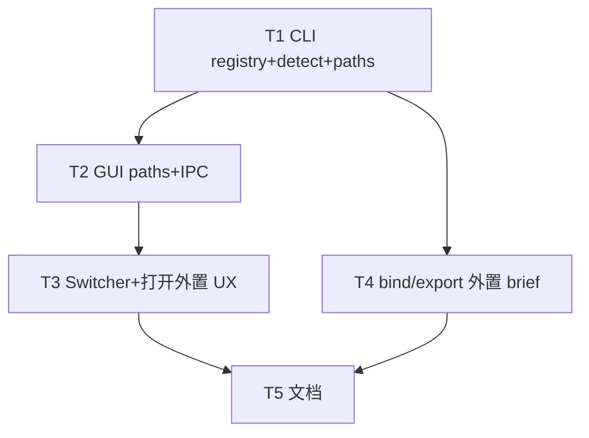

# 架构方案：外置工程根一等公民

## 执行元数据

- **Status**：reviewed（APPROVED；待用户确认 commit）
- **Workflow Stage**：review → commit（paused）
- **Created**：2026-07-27
- **Updated**：2026-07-27（review APPROVED；Electron H1–H4 已复审通过）
- **Source Of Truth Until**：提交后失效
- **Requirements Source**：[`docs/anvil/brainstorms/2026-07-27-external-project-root.md`](../brainstorms/2026-07-27-external-project-root.md)（confirmed）
- **Compounded Knowledge**：not applicable
- **Resume Point**：用户确认后 commit；可选 `/anvil:compound`
- **Commit policy**：pause（等用户确认）
- **Review**：[`.ai/anvil/reviews/2026-07-27-external-project-root-review.md`](../../../.ai/anvil/reviews/2026-07-27-external-project-root-review.md)
- **Readiness**：CLI 55 + externalFs 7 + projectPaths 7 + typecheck OK

## Spec 开放问题 → Plan 默认

| 项 | Plan 决定 |
|----|-----------|
| 索引文件 | Foundry **workspace 根**（GUI）/ CLI 用 repo 或 `--workspace` 约定：文件名 `external-projects.json` |
| activeBrief 键 | 虚拟相对键：`external:<id>/brief.json`（不把绝对路径塞进 localStorage 主键） |
| CLI `project external add` | **同版交付**（与 GUI 写同一索引）；无自由 GUI 文本框 |
| `godot_rel` | 探测结果 `.` 或 `game`；写入索引 |

## 模块边界

### 模块：ExternalRegistry（CLI）

- **职责**：索引 CRUD、路径归一化去重、`detect_external_layout`
- **输入**：workspace 根、绝对目录
- **输出**：索引 JSON；layout `{ godot_rel, has_brief, brief_abs, godot_abs }`
- **依赖**：文件系统
- **不变量**：不删用户磁盘工程；同一归一化 `root_abs` 不重复

### 模块：ExternalPathResolve（CLI + GUI 镜像）

- **职责**：`external:<id>/brief.json` → 绝对 brief / godot / pipeline / output / plans
- **输入**：brief 键或绝对 brief + 索引
- **输出**：与今日 `PlanTargets` / `default_paths_for_brief` 同构字段（外置时 `isolated=true` 语义、`godot` 按 `godot_rel`）
- **依赖**：ExternalRegistry
- **不变量**：`projects/<slug>/` 解析路径与改前 bit 一致

### 模块：GuiExternalOpen

- **职责**：目录选择器、调 CLI/IPC 登记、切换列表合并外置项
- **输入**：用户选目录
- **输出**：索引更新 + `activeBriefRel = external:<id>/brief.json`
- **依赖**：Electron dialog + ExternalRegistry IPC
- **不变量**：无自由文本路径主入口

### 模块：BindExportExternal

- **职责**：host-chat bind / brief export 写到外置根 `brief.json`；makeability sidecar 同根
- **依赖**：路径解析
- **不变量**：新建默认仍 `projects/<slug>/`

## 接口定义

### `external-projects.json`

```json
{
  "version": 1,
  "projects": [
    {
      "id": "ext_<8hex>",
      "display_name": "fishing-2d",
      "root_abs": "/abs/path",
      "godot_rel": "." ,
      "brief_rel": "brief.json",
      "added_at": "ISO-8601"
    }
  ]
}
```

### CLI

```text
project external list [--json]
project external add --root <abs> [--json]   # 探测+登记；重复 root 返回已有 id
project external remove --id <id>
project external detect --root <abs> [--json]
```

### 虚拟 brief 键

- `isExternalBriefRel(rel)` ↔ `/^external:[^/]+\/brief\.json$/i`
- `planTargetsFromBrief`：若 external → 查索引算绝对路径；GUI 层对 IPC 传 abs 或 id+rel
- Electron 读文件：外置用绝对路径 API（现有 read 若只允 workspace，需扩展白名单为「索引内 root 前缀」）

### 探测

```text
if (root/project.godot) godot_rel = "."
elif (root/game/project.godot) godot_rel = "game"
else godot_missing
has_brief = (root/brief.json).is_file()
```

## 日志规范

| 事件 | 字段 |
|------|------|
| external_add | id, root_abs, godot_rel, has_brief |
| external_resolve_fail | id, reason: missing_index\|root_gone\|no_godot |

## RTK 过滤预设

```bash
cd cli && python -m unittest test_external_projects test_project_paths -q
cd gui && npx tsx --test src/chat/projectPaths*.test.ts && npm run typecheck
```

## 历史经验检查

- 路径别名/`projects/` 前缀：外置不要误 strip
- 不强制软链进 projects

## 关键模式检查

- ❌ 强制拷贝/软链进 `projects/`
- ✅ 索引 + 虚拟 `external:<id>/…`
- ❌ GUI 粘贴任意路径
- ✅ 目录选择器 + CLI add

## 简化审计

已砍：云同步索引、自动改外置仓结构、GUI 文本路径。CLI add 同版保留（小、与 GUI 共用模块）。

## 任务 DAG



## 并行执行计划

| Layer | Group | Tasks | Execution | Reason |
|-------|-------|-------|-----------|--------|
| 1 | G1 | T1 | serial | schema bootstrap |
| 2 | G2 | T2, T4 | parallel | GUI IPC vs host_chat/export；写集分离 |
| 3 | G3 | T3 | serial | 依赖 T2 IPC |
| 4 | G4 | T5 | serial | docs |

## 任务列表

### 任务 T1：CLI registry + detect + path 解析

- **Layer**：1 · **G1** · **serial**
- **Ownership**：`cli/external_projects.py`（新）、`cli/test_external_projects.py`、`cli/project_paths.py`（扩展）、`cli/project_cmds.py`（external 子命令）、必要时 `cli/test_project_paths.py`
- **Write Set**：同上
- **描述**：实现索引读写、detect、add/list/remove；`default_paths_for_brief`：若 brief 在 repo 外或调用方传入 external 上下文，按外置根返回 paths（godot 用 godot_rel）；支持从 workspace 旁路加载索引。
- **成功标准**：tmp 根含 project.godot → detect godot_rel=`.`；game/ 形态 → `game`；add 去重；paths 指向 root/output 等；内置 projects 单测回归绿。
- **依赖**：无
- **执行指令**：索引默认路径 = `repo_root/external-projects.json`（dev）；GUI workspace 由 T2 传入同一文件名放在 workspace 根。

### 任务 T2：GUI 路径镜像 + Electron IPC

- **Layer**：2 · **G2** · **parallel**（相对 T4）
- **Ownership**：`gui/src/chat/projectPaths.ts`（+ test）、`gui/electron/main.mjs`、`preload.cjs`、`vite-env.d.ts`
- **Write Set**：同上；**不**改 App 大流程（T3）
- **描述**：`external:<id>/brief.json` 解析；IPC：`externalProjectsList/Add/Remove/Detect`（add 内部调 dialog 或接收已选 path——dialog 可在 main 或 T3 调 showOpenDialog 后把 path 传 add）。**安全**：add IPC 只接受 path 参数来自 main 进程 dialog 结果时最稳——推荐 **main 内 dialog+add 合成** `externalProjectOpen`。
- **成功标准**：单测虚拟键；typecheck；无文本框。
- **依赖**：T1（契约字段一致）
- **执行指令**：读文件白名单：绝对路径必须 `startswith` 某条 `root_abs`。

### 任务 T3：Switcher + 打开外置 UX

- **Layer**：3 · **G3** · **serial**
- **Ownership**：`gui/src/components/ProjectSwitcher.tsx`、`gui/src/App.tsx`（切换/打开）、必要时 `NewProjectModal` 旁入口文案
- **Write Set**：同上
- **描述**：列表合并外置；按钮「打开外置工程…」→ IPC open；移除外置；切换调用现有 `switchProject` 扩展。
- **成功标准**：手动标准：选外置根可出现在列表并切换；移除不删磁盘。
- **依赖**：T2
- **执行指令**：外置项显示「外置」标记。

### 任务 T4：bind / export 写到外置根

- **Layer**：2 · **G2** · **parallel**（相对 T2）
- **Ownership**：`cli/host_chat.py`（bind 路径）、`cli/brief_cmds.py` export 目标、GUI 保存 Brief 路径选择若在 CLI 侧——以 CLI 为准；`cli/test_host_chat.py` 或小测
- **Write Set**：同上；避免改 electron（T2）
- **描述**：`bound_brief_rel=external:<id>/brief.json` 可 hydrate；export/`保存 Brief` 写到索引 `root_abs/brief.json`；makeability sidecar 同目录。
- **成功标准**：单测或集成：export 后外置根出现 brief.json。
- **依赖**：T1
- **执行指令**：无 brief 时 hydrate 空草稿 OK。

### 任务 T5：文档

- **Layer**：4 · **G4** · **serial**
- **Ownership**：`docs/AI-HANDOFF.md`、`docs/GUI-CONFIG.md` 或 RELEASE-NOTES-UNRELEASED 短条、`NewProjectModal` 帮助句若未在 T3 写完
- **描述**：外置 vs `projects/`；仅对话框添加；产物在外置根。
- **成功标准**：`rg external-projects|打开外置` 命中。
- **依赖**：T3、T4

## 会话拆分点

- T1 后：CLI 可测
- T2+T4 后：路径+导出
- T3+T5 后：可 review

## 通过条件

- [x] 双形态探测单测
- [x] 索引去重；移除不删盘
- [x] `projects/` 回归
- [x] GUI 无自由文本路径
- [x] 虚拟 `external:<id>/brief.json` 可切换并解析产物路径
- [x] 缺 brief 可绑定；export 落到外置根

## 确认后

回复 **确认 plan** / **开始实现** → `/anvil:code`。
