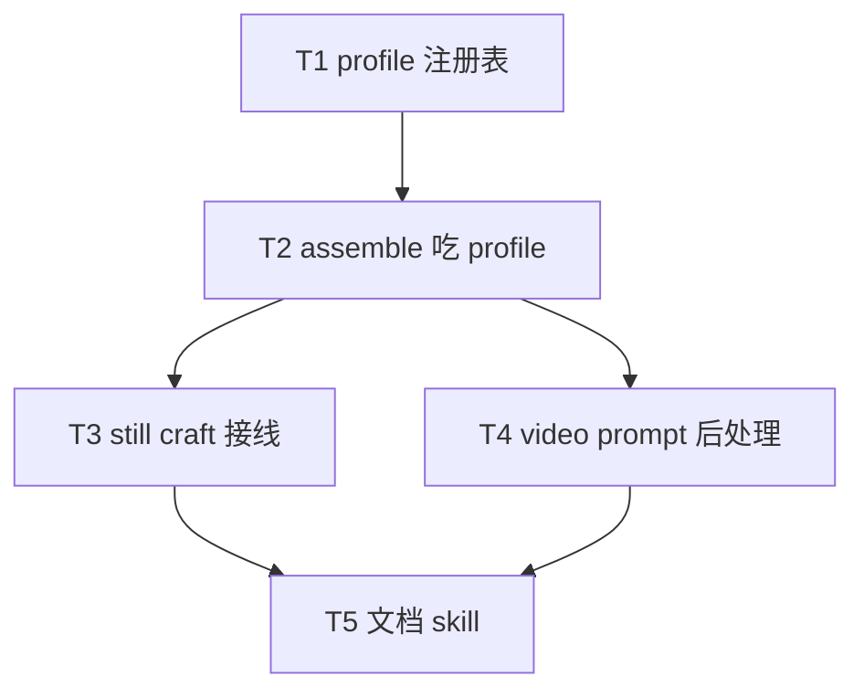

# 架构方案：模型能力自推定提示词组装

## 执行元数据

- **Status**：executed
- **Workflow Stage**：code
- **Created**：2026-07-27
- **Updated**：2026-07-27（T1–T5 完成；pause 未 commit）
- **Source Of Truth Until**：`/anvil:review` 通过并提交后失效
- **Requirements Source**：[`docs/anvil/brainstorms/2026-07-27-model-prompt-capability-profile.md`](../brainstorms/2026-07-27-model-prompt-capability-profile.md)（confirmed）
- **Compounded Knowledge**：not applicable for ACP patterns
- **Resume Point**：实现完成；下一步 review；你开口才 commit
- **Commit policy**：pause（你开口才 commit）
- **Readiness**：`cd cli && python -m unittest test_media_prompt_profile test_prompt_craft_structured test_prompt_craft_profile -q`

## 任务 Code Status

| Task | Status | Verification |
|------|--------|--------------|
| T1 profile 注册表 | done | test_media_prompt_profile OK |
| T2 assemble 吃 profile | done | test_prompt_craft_profile + structured OK |
| T3 still craft 接线 | done | craft bind 单测 OK |
| T4 video 后处理 | done | apply_video_prompt_profile + animation 单测 OK |
| T5 文档 skill | done | AI-HANDOFF + asset-planner rg 命中 |

## Spec 开放问题 → Plan 默认

| 项 | Plan 决定 |
|----|-----------|
| 各 profile 布尔初值 | 见下表；测例锁组装差异，不锁实网出图 |
| Grok 生图子串 | 归一化后含 `grok` 且 modality=image 的调用 → `grok_image`；video 路径不套 grok_image |
| gpt-image-1/2 | v1 **共用** `gpt_image` |
| 无 profile 参数 | assemble 显式走 `default`（与未知模型一致） |
| tags 方言 | 四系 v1 均 `natural`；差异主要靠 negatives 合并与 soft-style 尾句（预留 `tags` 分支：逗号压缩字段，测例可覆盖 default 强制 tags） |

### v1 能力初值

| profile_id | dialect | negatives_effective | prefer_soft_style |
|------------|---------|---------------------|-------------------|
| `gpt_image` | natural | true | true |
| `gemini_image` | natural | **false** | true |
| `volc_image` | natural | true | true |
| `volc_video` | natural | **false** | true |
| `grok_image` | natural | true | true |
| `default` | natural | **false** | true |

## 模块边界

### 模块：MediaPromptProfile

- **职责**：model id → `PromptCapabilityProfile`；纯函数、无网络、无用户开关。
- **输入**：`model: str`，`modality: "image"|"video"`
- **输出**：dataclass/TypedDict：`profile_id`, `prompt_dialect`, `negatives_effective`, `prefer_soft_style`, `modality`
- **依赖**：无
- **不变量**：未命中 → `default`；族 id 用 `volc_*` 不用 `seed`

### 模块：ProfileAwareAssemble

- **职责**：`assemble_asset_prompt`（及视频 `video_prompt` 轻量后处理）按 profile 改输出形态。
- **输入**：fields + project + spec + profile
- **输出**：最终 prompt 字符串
- **依赖**：MediaPromptProfile
- **不变量**：结构化硬锁（art_tokens/view/technical）仍强制；profile 只调「怎么写」

### 模块：CraftModelBinding

- **职责**：still craft 解析 tier→image model；animation craft 解析 video model；写入 handoff 元数据。
- **输入**：config、asset、kind
- **输出**：craft 结果含 `prompt` + 可选 `image_model`/`video_model`/`prompt_profile_id`
- **依赖**：`image_model_route`、`seedance_api.resolve_model`（或 brief video_model）
- **不变量**：无 GUI/config 新键

## 接口定义

```python
@dataclass(frozen=True)
class PromptCapabilityProfile:
    profile_id: str
    prompt_dialect: Literal["natural", "tags"]
    negatives_effective: bool
    prefer_soft_style: bool
    modality: Literal["image", "video"]

def normalize_media_model_id(model: str) -> str: ...
def resolve_media_prompt_profile(
    model: str,
    *,
    modality: Literal["image", "video"],
) -> PromptCapabilityProfile: ...
```

匹配（归一化后）：

| 条件 | profile |
|------|---------|
| modality=image 且含 `gpt-image` 或 `gptimage` | `gpt_image` |
| modality=image 且含 `gemini` 与 `image` | `gemini_image` |
| modality=image 且含 `seedream` | `volc_image` |
| modality=video 且含 `seedance` | `volc_video` |
| modality=image 且含 `grok` | `grok_image` |
| else | `default`（modality 保留调用方） |

Assemble 行为：

- `negatives_effective=False`：不单独输出 `Negatives:` 段；把 negatives 文本并入 `Style lock`（或 Subject 尾），前缀 `Avoid: `
- `prefer_soft_style=True`：若 style_lock 非空，确保含一句软对齐提示（固定短句，可常量，避免重复追加）
- `prompt_dialect=tags`：各字段改为逗号分隔短词（去 `Label:` 或多行 → 单行 comma）；v1 四系不用，测例可直接传 fake profile

Video：对 LLM 产出的 `video_prompt` 字符串做 `apply_video_prompt_profile(text, profile)`：若 `negatives_effective=False`，不依赖独立 negative；可追加 soft style 短句（无 structured fields 时的最小路径）。

## 日志规范

| 事件 | 字段 |
|------|------|
| profile_resolved | model, modality, profile_id |
| assemble_with_profile | profile_id, negatives_merged: bool |

## RTK 过滤预设

```bash
cd cli && python -m unittest test_media_prompt_profile test_prompt_craft_profile test_prompt_craft_structured -q
```

## 历史经验约束

- 契约与组装分离：LLM fields 不变；profile 只影响 assemble
- 不引入用户配置拨杆

## 关键模式检查

- ❌ 用户可配 dialect  
- ✅ 代码注册表自匹配  
- ❌ 族名 `seed`  
- ✅ `volc_image` / `volc_video` + seedream/seedance 别名  

## 简化审计

已砍：generate 前重装、大语料库、Provider 元数据、GUI、四系外精细档、gpt 1/2 拆档。

## 任务 DAG



## 并行执行计划

| Layer | Parallel Group | Tasks | Execution | Reason |
|-------|----------------|-------|-----------|--------|
| 1 | G1 | T1 | serial | bootstrap API |
| 2 | G2 | T2 | serial | depends T1 |
| 3 | G3 | T3, T4 | parallel | still vs video 写集可分离 |
| 4 | G4 | T5 | serial | docs after behavior stable |

## 任务列表

### 任务 T1：MediaPromptProfile 注册表

- **Layer**：1 · **Parallel Group**：G1 · **Execution**：serial
- **Ownership**：`cli/media_prompt_profile.py`、`cli/test_media_prompt_profile.py`
- **Write Set**：同上
- **描述**：实现 normalize + resolve + 上表匹配与初值；导出 dataclass。
- **成功标准**：单测覆盖 gpt/gemini/volc_image/volc_video/grok/default 样例 id；错误 modality+模型组合不抛（回 default）。
- **依赖**：无
- **执行指令**：新建模块；勿改 prompt_craft 本任务。

### 任务 T2：assemble 吃 profile

- **Layer**：2 · **Parallel Group**：G2 · **Execution**：serial
- **Ownership**：`cli/prompt_craft.py`（`assemble_asset_prompt` / 相关 helper）、`cli/test_prompt_craft_profile.py`、必要时微调 `test_prompt_craft_structured.py` 断言（若默认变 default 行为）
- **Write Set**：同上；**不**改 craft 主流程接线（T3）
- **描述**：`assemble_asset_prompt(..., profile=None)` → None 则 `default`；实现 negatives 合并与 soft-style；可选 tags 分支。
- **成功标准**：同 fields 下 `gpt_image` vs `gemini_image` 字符串可断言不同（Negatives 段有无）；structured 回归绿。
- **依赖**：T1
- **执行指令**：保持 Label 多行 natural 为默认外形。

### 任务 T3：still craft 绑定模型

- **Layer**：3 · **Parallel Group**：G3 · **Execution**：parallel（相对 T4）
- **Ownership**：`cli/prompt_craft.py`（`craft_asset_prompt` still 路径）、`cli/prompt_cmds.py` 若需传 config、相关单测
- **Write Set**：仍 craft 路径文件；避免与 T4 视频后处理函数抢同一未协调符号——视频函数可放 `media_prompt_profile.py` 或 `prompt_craft.apply_video_prompt_profile`
- **描述**：craft 时 `resolve_image_model_for_tier` → profile → assemble；结果写入 `image_model`、`prompt_profile_id`。
- **成功标准**：mock LLM fields + fake config model=gemini*image* → handoff profile_id=`gemini_image`。
- **依赖**：T2
- **执行指令**：animation 的 still 参考图 prompt 仍走 image profile；`video_prompt` 留给 T4。

### 任务 T4：video_prompt 按 volc_video 后处理

- **Layer**：3 · **Parallel Group**：G3 · **Execution**：parallel（相对 T3）
- **Ownership**：`cli/media_prompt_profile.py` 或 `prompt_craft.py` 中 **仅** `apply_video_prompt_profile` + 调用点（`craft_asset_prompt` animation 分支）、`cli/test_prompt_craft_profile.py` 视频用例
- **Write Set**：与 T3 协调：优先把 `apply_video_prompt_profile` 放在 `media_prompt_profile.py`，T3 不改该函数
- **描述**：animation 结果里的 `video_prompt` 经 profile（默认 seedance 模型解析）后处理。
- **成功标准**：`negatives_effective=False` 的 profile 对含 “Negative:” 的原文有稳定改写或 soft 尾句可测。
- **依赖**：T2
- **执行指令**：不改 seedance HTTP 客户端。

### 任务 T5：文档与 skill

- **Layer**：4 · **Parallel Group**：G4 · **Execution**：serial
- **Ownership**：`docs/AI-HANDOFF.md`、`resources/skills/prompt-crafter/shared-locks.md` 或 `asset-planner.md` 短段
- **描述**：说明自推定、volc_*、无用户开关、换模型需重 craft。
- **成功标准**：`rg prompt_profile|volc_image|media_prompt_profile` 命中文档。
- **依赖**：T3、T4

## 会话拆分点

- T1+T2 后：组装可测
- T3+T4+T5 后：可 review

## 通过条件

- [ ] 四系 + default 解析单测绿
- [ ] assemble 按 profile 可区分
- [ ] still craft 写入 profile_id
- [ ] video_prompt 后处理存在
- [ ] 无新用户配置开关
- [ ] 族名无独立 `seed` profile_id

## 确认后

回复 **确认 plan** / **开始实现** → Status=`active` → `/anvil:code`。
