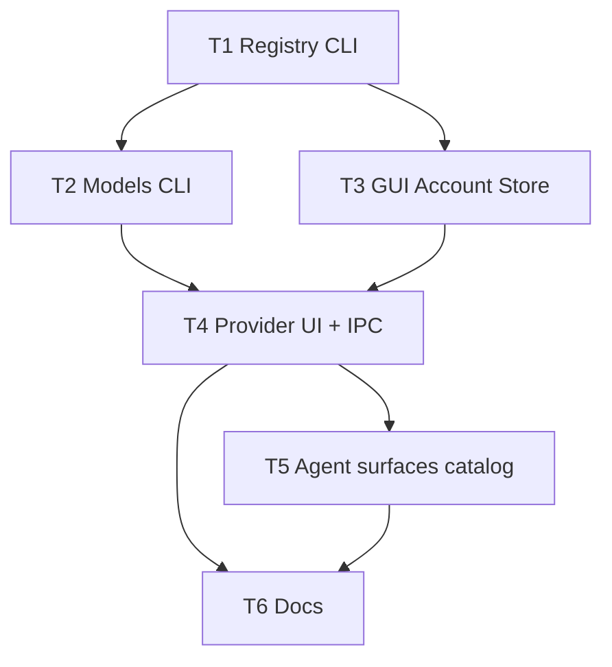

# 架构方案：开放 Provider 账号 + 文/图模型目录

## 执行元数据

- **Status**：executed
- **Workflow Stage**：done
- **Created**：2026-07-28
- **Updated**：2026-07-28
- **Source Of Truth Until**：已落地；以代码与 GUI-CONFIG / TOOLS 为准
- **Requirements Source**：[`docs/anvil/brainstorms/2026-07-28-open-provider-accounts-model-catalog.md`](../brainstorms/2026-07-28-open-provider-accounts-model-catalog.md)
- **Compounded Knowledge**：not yet compounded
- **Readiness**：CLI provider tests + gui tsc OK
- **Resume Point**：已合入；见 RELEASE-NOTES-UNRELEASED

## Spec 开放问题 → Plan 默认

| 项 | Plan 决定 |
|----|-----------|
| 大列表 UI | **不做全量展示、不做虚拟滚动**。默认只展示排序后靠前 **N=30** 条；输入关键字后在全目录上过滤，过滤结果仍最多展示 N 条；当前已选 id 若不在前 N/过滤结果中须单独保留可见；其余靠搜索或手填 |
| CLI 命名 | `setup provider upsert` 扩展；新增 `setup provider list` / `remove` / `models` |
| HTTP | `urllib`（与现有探测一致），超时 30s；走 config `proxy` 若已有统一 helper 则复用 |
| 图像启发式 | id 正则含 `image\|dall-e\|flux\|gpt-image\|imagen`（大小写不敏感）；UI「显示全部」 |
| 自建进 Agent | **不做**；GUI 过滤 + CLI `agents executors` 仍拒未知/非内置 |

## 模块边界

### 模块：ProviderAccountRegistry

- **职责**：开放读写 `provider_accounts`（内置 + 自建）；校验 slug；删除引用守卫；list
- **输入**：provider id、label/kind/api_base/key/models、config path、`--i-confirm`
- **输出**：更新后的 config 条目；JSON `{ok, provider, kind, ...}`（无完整 key）
- **依赖**：config 读写（沿用 `provider_upsert._load_config/_save_config`）
- **不变量**：保留内置 id 语义；自建必须有 `api_base`；删除前检查 `host.provider` / `image.provider` / `image.bulk_provider`

### 模块：ProviderModelsCatalog

- **职责**：按账号拉取 OpenAI 兼容 `/models`
- **输入**：provider id（或显式 base+key）、config
- **输出**：`{ok, models:[{id,label}], error, source:"openai-models"}`；永不回显 key
- **依赖**：Registry 读账号；可选 proxy
- **不变量**：失败 → `ok:false` 或 `ok:true, models:[]` + error 字段（与 executor models 空列表风格对齐：可拉但空要可区分）——**决定**：HTTP/鉴权失败 `ok:false`；成功但空列表 `ok:true, models:[]`

### 模块：GuiProviderAccountStore

- **职责**：GUI 侧开放账号 map 的 load/serialize；区分 `builtinProviders` vs `userAccounts`；活跃文/图/批量可选自建
- **输入**：config JSON
- **输出**：表单状态；写出时保留全部账号条目（不再只遍历封闭枚举）
- **依赖**：无
- **不变量**：未知非合法 slug 忽略；Agent 选择器数据源 = 仅内置

### 模块：GuiModelCatalogPicker

- **职责**：可刷新模型下拉 + 搜索过滤 + 手填兜底；生图模式可「仅图像启发式 / 全部」
- **输入**：providerId、role `text|image`、当前值、IPC 拉目录
- **输出**：选中 model id 字符串
- **依赖**：Electron → `setup provider models`
- **不变量**：目录失败不清空当前值；UI **从不**一次渲染完整 800+ 列表，只渲染「过滤后的前 N 条 + 当前值（若需）」

### 模块：AgentProviderSurface（约束）

- **职责**：雇人 / Agent 预设 / 对话栏 provider **仅内置**；模型字段接 GuiModelCatalogPicker
- **输入**：内置 provider id
- **输出**：实例/执行器上的 model 字符串
- **依赖**：GuiModelCatalogPicker、既有 executor models（Cursor/Codex 原生路径不变）
- **不变量**：自建 id 不出现在 provider `<option>`；Codex/Cursor 原生列表逻辑不替换为本 catalog

## 接口定义

### CLI

```text
setup provider upsert --provider <id> --api-key ... [--api-base ...] [--text-model ...]
  [--image-model ...] [--label ...] [--kind user|builtin] [--set-active-text] [--i-confirm] --json

setup provider list --json
setup provider remove --provider <id> --i-confirm --json
setup provider models --provider <id> --json
```

- `upsert`：若 id 不在内置表 → 视为自建，要求 `--api-base`，写入 `kind:user`。
- `remove`：引用守卫失败 → `ok:false` + error。
- `models`：`GET {api_base}/models`，Bearer key。

### Config（与 Spec 一致）

自建条目：`kind`、`label`、`api_base`、`api_key`、`text_model`、`image_model`。  
旧 `custom` 无 `kind` → 读时视为 `user`。

### GUI / IPC

- 保存路径：沿用现 Settings 整表序列化（修 serialize 丢条目 bug）。
- 拉目录：`window.api` 或现有 runCli 封装调用 `setup provider models --provider <id> --json`。
- Provider 页：添加账号表单（id/label/base/key）；删除按钮；文/图/批量模型用 CatalogPicker。

### 解析补丁

`image_model_route` / host 解析：`api_base` 优先 `provider_accounts[id].api_base`，再回退内置默认（已有账户字段时不得因「非 KNOWN」丢 base）。

## 日志规范

- CLI `--json` 成功：`has_api_key: bool`，禁止 `api_key` 字段。
- models 失败：`error` 短句（status code / timeout），不带 Authorization 头。

## RTK 过滤预设

- 单测：`python -m unittest …` 保留 FAIL/OK 摘要。
- `tsc`：只看 error 行。

## 历史经验约束

- 执行器模型列表（Cursor/Codex CLI）与 Provider `/models` **分源**；ColleagueConfigBar 原生路径保持 executor models。
- 第三方 Key 只进 `provider_accounts`（既有 settings-agent-hire 约定）。
- 无额外 `docs/solutions` 命中本主题。

## 关键模式检查

- 扫描 `docs/solutions/patterns/critical-patterns.md`：无 provider 账号相关条目；不新增违反项。
- 禁止：GUI serialize 只写枚举导致丢自建账号。
- 禁止：自建 id 写入 Hermes sync / agents.executors 校验放行。

## 简化审计

- 不做全量下拉、不做虚拟滚动、不做视频、不做自建进 Agent、不做独立 `endpoints[]`。
- CatalogPicker 共用一处，避免 Settings/Hire/Bar 三套拉目录逻辑；内存可持有全目录供搜索，DOM 只挂前 N 条。
- 50% 删除测试：若去掉「Agent 侧目录」仍满足「自建+Provider 目录」主诉求，但 Spec 已要求内置账号在 Agent 侧也可拉目录 → **保留** T5；可砍的是全量展示/虚拟滚动与视频（已砍）。

## 任务 DAG



## 并行执行计划

| Layer | Parallel Group | Tasks | Execution | Reason |
|-------|----------------|-------|-----------|--------|
| 1 | G1 | T1 | serial | 共享 config/upsert 契约 |
| 2 | G2 | T2, T3 | parallel | CLI models vs GUI store 写集不交 |
| 3 | G3 | T4 | serial | IPC+Settings 依赖 T2/T3 |
| 4 | G4 | T5, T6 | parallel* | T6 若只写 docs 可与 T5 并行；若 T6 需引用最终 UI 文案则串在 T5 后。**本 plan：T6 depends T5** → Layer4 仅 T5，Layer5 仅 T6 |

修正：

| Layer | Parallel Group | Tasks | Execution | Reason |
|-------|----------------|-------|-----------|--------|
| 1 | G1 | T1 | serial | 契约 |
| 2 | G2 | T2, T3 | parallel | 写集不交 |
| 3 | G3 | T4 | serial | UI+IPC |
| 4 | G4 | T5 | serial | 共享 CatalogPicker 用法 |
| 5 | G5 | T6 | serial | 文档收尾 |

## 任务列表

### 任务 T1：ProviderAccountRegistry CLI

- **Layer**：1
- **Parallel Group**：G1
- **Execution**：serial
- **Parallel Blocker**：共享 `provider_upsert` / setup 命令
- **Ownership**：`cli/provider_upsert.py`、`cli/setup_cmds.py`（provider 子命令）、`cli/test_provider_upsert.py`、新建 `cli/test_provider_accounts_open.py`；按需小改 `cli/agents_executors_upsert.py`、`cli/image_model_route.py`
- **Read Set**：现有 upsert/tests、image_model_route base 解析
- **Write Set**：同上 Ownership
- **描述**：开放 upsert（用户 id + label/kind/api_base）；`list`/`remove`+引用守卫；内置表保留；`custom` 无 kind 兼容为 user；解析路径尊重账户 `api_base`
- **成功标准**：单测覆盖：新建 `apilio` 写入；删除被 host 引用失败；`list` 含 kind/label；完整 key 不出现在 JSON
- **预估 Token**：80k
- **依赖**：无
- **涉及文件**：见 Ownership
- **执行指令**：扩展 `KNOWN` 为「内置默认」+ 允许未知 id；remove 检查 host/image/bulk；agents executors 仍只接受内置 id 集合

### 任务 T2：ProviderModelsCatalog CLI

- **Layer**：2
- **Parallel Group**：G2
- **Execution**：parallel
- **Parallel Blocker**：无（不改 upsert 契约）
- **Ownership**：新建 `cli/provider_models.py`、`cli/test_provider_models.py`；`cli/setup_cmds.py` 仅追加 `models` 子命令注册
- **Read Set**：Registry 读账号 API、proxy 辅助（若有）
- **Write Set**：`cli/provider_models.py`、`cli/test_provider_models.py`、`setup_cmds.py` 的 models 注册片段
- **描述**：`setup provider models --provider --json`；mock HTTP 单测；超时/401
- **成功标准**：fixture JSON → models 非空；401 → ok false 且无 key；不请求时单测不触网
- **预估 Token**：50k
- **依赖**：T1（读账号字段约定）
- **涉及文件**：见 Ownership
- **执行指令**：`GET {base}/models`（base 已含 `/v1` 则勿重复）；解析 `data[].id`

### 任务 T3：GuiProviderAccountStore

- **Layer**：2
- **Parallel Group**：G2
- **Execution**：parallel
- **Parallel Blocker**：无
- **Ownership**：`gui/src/settings/apiProviders.ts`、`gui/src/settings/providerAccounts.ts`、相关单元/类型；`agentInstances.ts` / `agentExecutors.ts` 的 id 收窄辅助（builtin-only helpers）
- **Read Set**：Spec config 契约、现 serialize 逻辑
- **Write Set**：同上 Ownership
- **描述**：`ProviderId` 改为 `string` + `BUILTIN_PROVIDER_IDS`；load 保留用户条目；serialize 写出全部；导出 `listBuiltinProviders()` / `listUserAccounts()` / `isBuiltinProviderId()`
- **成功标准**：`tsc` 过；逻辑上：含 `apilio` 的 config round-trip 不丢（可用 vitest/手工断言函数若项目有测，否则 typecheck + 纯函数单测若已有模式）
- **预估 Token**：60k
- **依赖**：T1（字段约定）
- **涉及文件**：见 Ownership
- **执行指令**：删除「非枚举即丢」；`getApiProvider` 对未知 id 返回用户条目派生的伪 preset（label/base）

### 任务 T4：Provider 页 CRUD + CatalogPicker + IPC

- **Layer**：3
- **Parallel Group**：G3
- **Execution**：serial
- **Parallel Blocker**：Settings 与 preload IPC 共享
- **Ownership**：`gui/src/components/SettingsPanel.tsx`、新建 `gui/src/components/ModelCatalogPicker.tsx`（或 `settings/`）、`gui/electron/main.mjs` / preload 类型中跑 CLI 的薄封装
- **Read Set**：T2 CLI、T3 store、现 Settings 保存流
- **Write Set**：同上 Ownership
- **描述**：添加/删除自建账号 UI；文/图/批量模型接 CatalogPicker（前 N + 搜索 + 手填）；IPC 调 `setup provider models`
- **成功标准**：typecheck；刷新后选项数 ≤ N（除非当前值额外插入）；搜索能命中不在默认前 N 的 id；失败保留原模型值；手填可用
- **预估 Token**：100k
- **依赖**：T2, T3
- **涉及文件**：见 Ownership
- **执行指令**：删除守卫与 CLI 一致（或保存前检查引用）；添加账号校验 slug

### 任务 T5：Agent / 雇人 / 对话栏 — 内置目录

- **Layer**：4
- **Parallel Group**：G4
- **Execution**：serial
- **Parallel Blocker**：共享 CatalogPicker 与 ColleagueConfigBar
- **Ownership**：`HireColleagueModal.tsx`、`ColleagueConfigBar.tsx`、Settings Agent 段（模型输入处）
- **Read Set**：T3 builtin filter、T4 CatalogPicker、现 executor models 分支
- **Write Set**：同上 Ownership
- **描述**：provider 下拉仅 `BUILTIN`；非 Cursor/Codex 原生列表的模型字段改 CatalogPicker；Cursor/Codex 原生路径不动
- **成功标准**：typecheck；代码审查：自建 id 不进 provider options；Pi/Hermes 模型可刷新
- **预估 Token**：70k
- **依赖**：T4
- **涉及文件**：见 Ownership
- **执行指令**：第三方 Codex 手填路径可接同一 CatalogPicker

### 任务 T6：文档

- **Layer**：5
- **Parallel Group**：G5
- **Execution**：serial
- **Parallel Blocker**：无
- **Ownership**：`docs/GUI-CONFIG.md`、`docs/TOOLS.md`（或 AI-HANDOFF 短节）
- **Read Set**：已实现 CLI 帮助与 UI 文案
- **Write Set**：上述 docs
- **描述**：说明自建账号、models 刷新、不进 Agent 的边界
- **成功标准**：文档含边界句 + `setup provider models` 示例
- **预估 Token**：25k
- **依赖**：T5
- **涉及文件**：见 Ownership
- **执行指令**：不写密钥示例真值

## 会话拆分点

- 拆分点 1：T1–T3 后（CLI+store 可测，预估 ~190k）
- 拆分点 2：T4–T5 后（UI 完整，预估再 ~170k）
- T6 可同会话收尾

## 通过条件

- [ ] 自建账号可增删并持久化；旧 `custom` 仍可用
- [ ] Provider 文/图/批量可刷新 `/models` 并写入
- [ ] Agent/雇人/对话无自建 provider；内置模型可目录选择（非原生 executor 路径）
- [ ] 视频无改动
- [ ] 相关 unittest + `tsc` 通过
- [ ] Key 不出现在 models/list JSON

## 确认请求

请确认本 plan（或指出修改）。确认后将 Status 标为 `confirmed` 并开始 `/anvil:code`。
