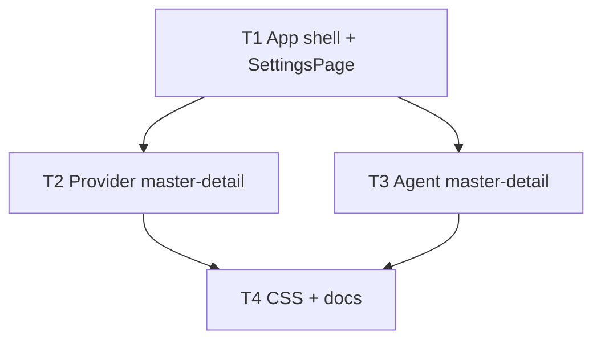

# 架构方案：设置全页壳 + ChatWise 式 Provider/Agent

## 执行元数据

- **Status**：executed
- **Workflow Stage**：done
- **Created**：2026-07-28
- **Updated**：2026-07-28
- **Source Of Truth Until**：已落地；以代码与 GUI-CONFIG 为准
- **Requirements Source**：[`docs/anvil/brainstorms/2026-07-28-settings-fullpage-chatwise-ux.md`](../brainstorms/2026-07-28-settings-fullpage-chatwise-ux.md)
- **Compounded Knowledge**：not yet compounded
- **Readiness**：gui tsc OK
- **Resume Point**：已合入；见 RELEASE-NOTES-UNRELEASED

## Spec 开放问题 → Plan 默认

| 项 | Plan 决定 |
|----|-----------|
| 设置时同事栏 | **隐藏**（设置自带顶栏：返回 + Tab） |
| 添加账号 | 左列表底部「+」展开内联最少字段（id/label/base/key），非独立常显大区 |
| Env/Guide 外壳 | 增加 `embedded` 变体：去掉 `aside.side-panel` 头，由 Settings 页提供标题 |
| 视频 | Provider 详情页「高级」折叠区内保留现逻辑 |
| config schema | **不改**；仅 GUI 导航与布局 |

## 模块边界

### 模块：SettingsAppShell

- **职责**：`appView: chat | settings`；全页设置顶栏（返回、Tab）；与开发侧栏互斥
- **输入**：用户点设置/返回、`initialTab`、`/settings`
- **输出**：渲染 `SettingsPage` 或聊天布局
- **依赖**：现有 chat store（切换视图不卸载）
- **不变量**：`sidePanel` 仅 `docs|board|assets|null`；无 settings/env/guide

### 模块：SettingsPage

- **职责**：五 Tab 容器：providers / agents / local / env / guide
- **输入**：tab、form 保存回调（可仍集中在一处 load/save config）
- **输出**：子视图
- **依赖**：ProviderSettingsView、AgentSettingsView、本机块、EnvPanel、GuidePanel
- **不变量**：单一「保存」仍写 `~/.gamefactory/config.json`（与现一致）

### 模块：ProviderSettingsView

- **职责**：ChatWise 主从账号 UI + 生文/生图短选 + 高级（批量/视频）
- **输入**：`ProviderAccountsMap`、活跃文/图/批量、更新回调
- **输出**：用户编辑后的账号与活跃选择
- **依赖**：`ModelCatalogPicker`、既有 serialize helpers
- **不变量**：无 Chips+Select 双重选择；自建可删带引用守卫

### 模块：AgentSettingsView

- **职责**：左四执行器 / 右预设详情
- **输入**：`agents.executors` map、内置 provider 列表
- **输出**：更新后的执行器预设
- **依赖**：`ModelCatalogPicker`、`listBuiltinProviders`
- **不变量**：Provider 选项仅内置

## 接口定义

### App 状态

```ts
type AppView = "chat" | "settings";
type SettingsTab = "providers" | "agents" | "local" | "env" | "guide";
type SidePanel = "board" | "assets" | "docs" | null;
```

- `openSettings(tab?: SettingsTab)`：`setAppView("settings")`、清 `sidePanel`
- `closeSettings()`：`setAppView("chat")`
- 顶栏：仅「设置」一键进全页；移除「环境」「指南」按钮
- `EnvPanel` 的 `onOpenSettings` → `openSettings("providers")`

### 组件拆分（建议路径）

- `gui/src/components/SettingsPage.tsx` — 全页壳 + Tab + 保存
- `gui/src/components/settings/ProviderSettingsView.tsx`
- `gui/src/components/settings/AgentSettingsView.tsx`
- 现 `SettingsPanel.tsx`：迁逻辑后删除或变为薄 re-export（避免双入口）

## 日志规范

- 无新增敏感日志；保存失败仍用现有 message 提示。

## RTK 过滤预设

- `tsc`：只看 error 行。

## 历史经验约束

- Key 只在 Provider 详情；Agent 不出现 Key。
- 开放账号 / models IPC 不回退。

## 关键模式检查

- 无相关 critical-patterns；禁止侧栏再承载设置。

## 简化审计

- 不做 Agent 向导化、不做视频开放、不改 CLI。
- 50% 测试：若只做全页不改主从 → 不满足 Spec；主从必须做。

## 任务 DAG



## 并行执行计划

| Layer | Parallel Group | Tasks | Execution | Reason |
|-------|----------------|-------|-----------|--------|
| 1 | G1 | T1 | serial | App 导航契约 |
| 2 | G2 | T2, T3 | parallel | 分文件写集不交 |
| 3 | G3 | T4 | serial | 文档与收尾样式 |

## 任务列表

### 任务 T1：App 壳 + SettingsPage 五 Tab

- **Layer**：1
- **Parallel Group**：G1
- **Execution**：serial
- **Parallel Blocker**：共享 App.tsx / SidePanel 类型
- **Ownership**：`gui/src/App.tsx`、新建 `gui/src/components/SettingsPage.tsx`、`gui/src/components/EnvPanel.tsx`、`gui/src/components/GuidePanel.tsx`（embedded 变体）、必要时 `vite-env` 无；可暂把旧 `SettingsPanel` 整页嵌进 providers/agents/local 以保证可编译
- **Read Set**：现 SettingsPanel load/save、Env/Guide props
- **Write Set**：同上 Ownership
- **描述**：`appView`；顶栏去环境/指南；设置全页；侧栏类型收窄；Env/Guide 作 Tab；进设置隐藏同事栏；`/settings` 开全页
- **成功标准**：`tsc` 过；手动可进出设置、切五 Tab；侧栏无 settings/env/guide
- **预估 Token**：90k
- **依赖**：无
- **执行指令**：聊天 store 不因切设置而重置；保存按钮留在 SettingsPage

### 任务 T2：ProviderSettingsView 主从

- **Layer**：2
- **Parallel Group**：G2
- **Execution**：parallel
- **Parallel Blocker**：无（不改 App.tsx）
- **Ownership**：`gui/src/components/settings/ProviderSettingsView.tsx`（新建）、`SettingsPage.tsx` 中 providers 槽接入；从 `SettingsPanel` 抽走 Provider 相关 UI；可删 SettingsPanel 内 Provider 大段
- **Read Set**：providerAccounts helpers、ModelCatalogPicker、旧 Provider UI
- **Write Set**：ProviderSettingsView + SettingsPage providers 接入 + SettingsPanel Provider 段移除/瘦身
- **描述**：左列表+添加；右详情；生文/生图短选；高级批量/视频；去除双重 Chips/Select
- **成功标准**：`tsc`；Provider 交互符合 Spec 表
- **预估 Token**：100k
- **依赖**：T1
- **执行指令**：复用现 form 状态或经 props 上下传递；serialize 行为不变

### 任务 T3：AgentSettingsView 主从

- **Layer**：2
- **Parallel Group**：G2
- **Execution**：parallel
- **Parallel Blocker**：无
- **Ownership**：`gui/src/components/settings/AgentSettingsView.tsx`（新建）、SettingsPage agents 槽、SettingsPanel Agent 段移除
- **Read Set**：agentExecutors、listBuiltinProviders、ModelCatalogPicker
- **Write Set**：同上 Ownership
- **描述**：左 Pi/Hermes/Codex/Cursor；右现有字段；仅内置 provider
- **成功标准**：`tsc`；四工具切换只改右侧
- **预估 Token**：70k
- **依赖**：T1
- **执行指令**：勿改雇人/对话栏（非本任务）

### 任务 T4：样式与文档

- **Layer**：3
- **Parallel Group**：G3
- **Execution**：serial
- **Parallel Blocker**：无
- **Ownership**：`gui/src/App.css`（settings-page 布局）、`docs/GUI-CONFIG.md`
- **Read Set**：已实现 UI
- **Write Set**：同上
- **描述**：全页左右分栏 CSS；文档更新入口（设置全页、侧栏三件、环境/指南位置）
- **成功标准**：宽屏下列表明细可读；文档与行为一致
- **预估 Token**：30k
- **依赖**：T2, T3

## 会话拆分点

- T1 后可拆（壳可验）
- T2–T3 后可拆（主从可验）
- T4 同会话收尾

## 通过条件

- [ ] 设置全页五 Tab；返回聊天
- [ ] 顶栏无环境/指南；侧栏仅文档/看板/资产
- [ ] Provider / Agent 主从
- [ ] 开放账号与 models 不回退
- [ ] `tsc` 通过

## 确认请求

请确认本 plan（或指出修改）。确认后开始 `/anvil:code`（默认不自动 commit，除非你要求提交）。
