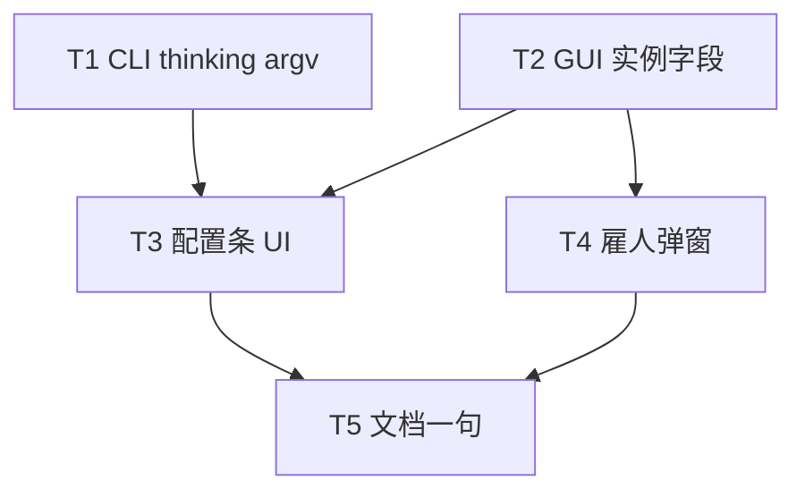

# 架构方案：Pi 同事实例 Thinking 档位

## 执行元数据

- **Status**：executed
- **Workflow Stage**：code
- **Created**：2026-07-30
- **Updated**：2026-07-30
- **Source Of Truth Until**：实现已完成；后续以代码与 review 为准
- **Confirmed By**：user「确认」（2026-07-30）
- **Code Status**：T1–T5 完成；CLI 8 tests OK；GUI typecheck OK
- **Requirements Source**：[`docs/anvil/brainstorms/2026-07-30-pi-thinking-level.md`](../brainstorms/2026-07-30-pi-thinking-level.md)
- **Compounded Knowledge**：not yet compounded
- **Resume Point**：可进入 `/anvil:review`；未提交 git（需用户明确要求才 commit）

## 模块边界

### 模块：thinking_level（纯函数）

- **职责**：规范化实例 thinking 档位枚举。
- **输入**：任意 raw（config / UI）。
- **输出**：`off|low|medium|high`。
- **依赖**：无。
- **不变量**：未知 / 空 → `off`；不读写磁盘。

### 模块：pi_runtime（argv 注入）

- **职责**：从 `agents.instances[id].thinking_level` 解析档位，在所有 Pi CLI cmd 组装点追加 `--thinking <level>`。
- **输入**：config + instance_id；已有 provider/model auth。
- **输出**：带 `--thinking` 的 subprocess argv。
- **依赖**：thinking_level 纯函数；实例字典只读。
- **不变量**：无 instance_id 或缺字段 → `off`；不修改 Host `chat_text_completion`；不把 key 写入 argv。

### 模块：GUI 实例契约

- **职责**：`AgentInstanceRecord.thinking_level` 的 load / serialize；仅 Pi 执行器持久化有意义值。
- **输入**：config JSON / 用户点击。
- **输出**：更新后的 `agents.instances`。
- **依赖**：无 CLI 运行时。
- **不变量**：不回写 `agents.executors`；非 Pi 不展示控件。

### 模块：ColleagueConfigBar / HireColleagueModal（UI）

- **职责**：Pi 配置条上四档按钮（关/低/中/高），交互对齐原生高中低。
- **输入**：当前实例 executor / thinking_level。
- **输出**：`persist({ thinking_level })`。
- **依赖**：GUI 实例契约。
- **不变量**：`executor !== "pi"`（含 Codex/Cursor 原生）不渲染；不展示 reasoning 正文。

## 接口定义

### Config

```json
{
  "agents": {
    "instances": {
      "<id>": {
        "thinking_level": "off"
      }
    }
  }
}
```

合法值：`off` | `low` | `medium` | `high`。缺省 = `off`。

### CLI

```text
normalize_thinking_level(raw) -> "off"|"low"|"medium"|"high"
resolve_pi_thinking_level(config, instance_id=None) -> 同上
```

Pi argv 片段（插在 `--model` 之后）：

```text
--thinking <level>
```

### GUI

```ts
type ThinkingLevel = "off" | "low" | "medium" | "high";
// AgentInstanceRecord.thinking_level?: ThinkingLevel  // omit 或 off 等价
```

UI 标签：`关/低/中/高` ↔ `off/low/medium/high`。

## 日志规范

- 不新增用户可见日志。
- 测试断言 argv 列表包含 `"--thinking", level` 即可。
- 若现有 Pi debug 路径打印 cmd：保持脱敏（仍禁止打印 api_key）。

## RTK 过滤预设

- 单测：`python -m unittest …` → 保留 FAIL / ERROR / OK 摘要。
- 勿全量 dump Pi stdout。

## 历史经验约束

- `docs/solutions` 无 Pi `--thinking` 先例；ACP id / Hermes 审批模式与本变更无关，不套用。
- 沿用既有约束：API key 仅环境变量，禁止进 argv（与现 `pi_runtime` 一致）。

## 关键模式检查

- ❌ 把 thinking 塞进 Host `chat_text_completion` payload（本期非目标）。
- ❌ 用 `model:thinking` 速记改写用户 model 字符串（易与手填 id 冲突；用显式 `--thinking`）。
- ❌ 在 Codex/Cursor 高中低旁塞 Think（执行器非 Pi）。
- ✅ 仅 Pi cmd + 实例字段 + Pi UI。

## 简化审计

可删除 50% 仍满足需求的部分已删：

- 不做 Host 厂商参数映射。
- 不暴露 Pi 的 minimal/xhigh/max。
- 不新增独立 `thinking_level.py` 包（纯函数可放 `pi_runtime` 顶部或 `agent_auth_resolve` 旁的小函数；优先放 `pi_runtime`，避免扩大 auth overlay 字段集）。
- Agent 预设 `executors.pi.thinking_level` 不做（实例默认 off）。

## 任务 DAG



## 并行执行计划

| Layer | Parallel Group | Tasks | Execution | Reason |
|-------|----------------|-------|-----------|--------|
| 1 | G1 | T1, T2 | parallel | 写集分离：CLI vs GUI 类型/序列化；字段名已由 Spec 钉死 |
| 2 | G2 | T3, T4 | parallel | 均只读 T2 契约；写不同 TSX |
| 3 | G3 | T5 | serial | 文档收尾 |

## 任务列表

### 任务 T1：CLI 解析 + Pi `--thinking` 注入

- **Layer**：1
- **Parallel Group**：G1
- **Execution**：parallel
- **Parallel Blocker**：无
- **Ownership**：`cli/pi_runtime.py`、`cli/test_pi_thinking_level.py`（新建）
- **Read Set**：`cli/pi_runtime.py`、`agents.instances` 形状、上游 Pi `--thinking` 语义
- **Write Set**：`cli/pi_runtime.py`、`cli/test_pi_thinking_level.py`
- **描述**：实现 `normalize_thinking_level` / `resolve_pi_thinking_level`；在 `run_pi_smoke` 与 `run_pi_text_completion` 的 cmd 中于 `--model` 后插入 `--thinking`；覆盖缺省、非法值、显式四档。
- **成功标准**：`cd cli && python -m unittest test_pi_thinking_level -v` 全绿；断言 cmd 含对应 `--thinking`。
- **预估 Token**：80k
- **依赖**：无
- **涉及文件**：见 Write Set
- **执行指令**：TDD：先写 normalize / resolve / cmd 组装单测（mock subprocess 或抽 `_build_pi_cmd`），再改 `pi_runtime`。禁止改 `prompt_craft.chat_text_completion`。

### 任务 T2：GUI 实例 `thinking_level` 契约

- **Layer**：1
- **Parallel Group**：G1
- **Execution**：parallel
- **Parallel Blocker**：无
- **Ownership**：`gui/src/settings/agentInstances.ts`、相关 vitest/单元（若仓库已有 settings 测试则补；无则仅类型+序列化并由 T3 覆盖）
- **Read Set**：`agentInstances.ts` 现有 load/serialize（对照 `pi_session_trust`）
- **Write Set**：`gui/src/settings/agentInstances.ts`（及既有测试文件若存在）
- **描述**：扩展 `AgentInstanceRecord`；load 时 normalize；serialize 在 `executor === "pi"` 时写入（`off` 可显式写或省略，须与 load 默认一致，推荐显式写 `off` 以免歧义）。
- **成功标准**：load 缺省 → `off`；serialize round-trip 保持四档；非 Pi 可不写该键。
- **预估 Token**：50k
- **依赖**：无
- **涉及文件**：见 Write Set
- **执行指令**：镜像 `pi_session_trust` 的读写模式；不要改 Agent 预设 sync 逻辑去覆盖 thinking。

### 任务 T3：ColleagueConfigBar Thinking 四档

- **Layer**：2
- **Parallel Group**：G2
- **Execution**：parallel
- **Parallel Blocker**：无
- **Ownership**：`gui/src/components/ColleagueConfigBar.tsx`、`gui/src/App.css`（若需复用 tier 样式）
- **Read Set**：现有 `pi-model-chip__tier-group`、T2 字段 API、persist 路径
- **Write Set**：`ColleagueConfigBar.tsx`、必要时 `App.css`
- **描述**：当 `executor === "pi"`（含 piLocked 策划/IT）时，在模型选择旁渲染关/低/中/高；点击 `persist({ thinking_level })`；复用高中低按钮视觉 class。
- **成功标准**：手动或组件测：Pi 可见四档；切到 Codex/Cursor 原生后消失；保存后 reload 仍选中。
- **预估 Token**：70k
- **依赖**：T1（行为联调可选）、T2（必须）
- **涉及文件**：见 Write Set
- **执行指令**：仅扩展 persist patch 类型；第三方 Codex 不显示。

### 任务 T4：雇人弹窗 Thinking（Pi）

- **Layer**：2
- **Parallel Group**：G2
- **Execution**：parallel
- **Parallel Blocker**：无
- **Ownership**：`gui/src/components/HireColleagueModal.tsx`、`gui/src/settings/hireColleague.ts`
- **Read Set**：雇人表单状态、T2 序列化
- **Write Set**：上述 Hire / hireColleague 文件
- **描述**：Pi 锁定工种或选择 executor=pi 时，表单可设 thinking_level，写入新建实例。
- **成功标准**：雇 Pi 同事后实例含所选档位；雇 Codex 无该字段控件。
- **预估 Token**：40k
- **依赖**：T2
- **涉及文件**：见 Write Set
- **执行指令**：默认 `off`；不阻塞主路径若与 T3 并行冲突则 T3 优先合入。

### 任务 T5：文档一点

- **Layer**：3
- **Parallel Group**：G3
- **Execution**：serial
- **Parallel Blocker**：文档统一收尾
- **Ownership**：`docs/GUI-CONFIG.md`
- **Read Set**：雇人与对话配置节
- **Write Set**：`docs/GUI-CONFIG.md`
- **描述**：在 `agents.instances` 说明中补一句：Pi 实例可设 `thinking_level`（关/低/中/高）→ Pi `--thinking`；Host 直连不读。
- **成功标准**：文档句与 Spec 一致；无扩写 Host 适配。
- **预估 Token**：20k
- **依赖**：T3、T4
- **涉及文件**：`docs/GUI-CONFIG.md`
- **执行指令**：短段落，不新开章节。

## 会话拆分点

- 单会话可完成（预估 &lt; 300k）。若中断：T1+T2 完成后为自然检查点（CLI 测绿 + 类型可编译）。

## 通过条件

- [ ] Spec FR1–FR6 均有对应实现或显式测试
- [ ] Pi cmd 含 `--thinking`；Host completion 无 thinking 参数
- [ ] Codex/Cursor 高中低 UI 无回归
- [ ] 缺省 `off` 与改前行为一致
- [ ] 无平行任务状态文件；本 plan 为唯一执行源
- [ ] `AGENTS.md` 保持既有 Anvil 段，未覆盖项目规则
