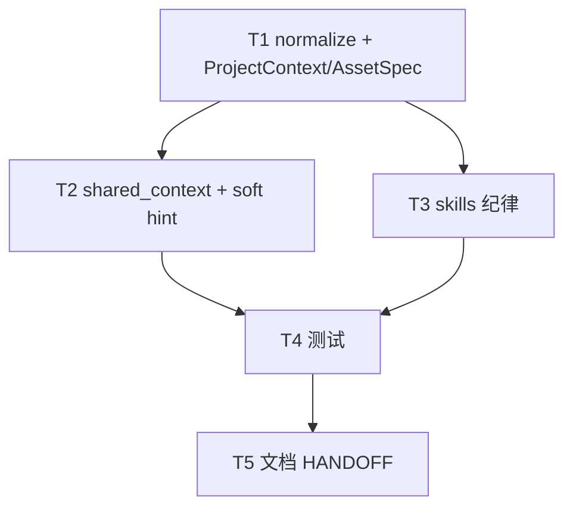

# 架构方案：Brief 场景 + 逻辑系统划分

## 执行元数据

- **Status**：executed
- **Workflow Stage**：code
- **Created**：2026-07-31
- **Updated**：2026-07-31
- **Source Of Truth Until**：实现已完成；后续以代码与 review 为准
- **Confirmed By**：user「ok 开始做吧」（2026-07-31）
- **Code Status**：T1–T5 完成；test_brief_scenes_systems 14 + test_ui_panels 10 绿
- **Requirements Source**：[`docs/anvil/brainstorms/2026-07-31-brief-scenes-systems.md`](../brainstorms/2026-07-31-brief-scenes-systems.md)
- **Compounded Knowledge**：not yet compounded
- **Resume Point**：可 `/anvil:review`；未 commit（需用户说提交）

## 模块边界

### 模块：scenes_systems_normalize（纯函数）

- **职责**：规范化 `project.scenes[]`、`project.systems[]`；规范化资产上可选 `scene_ids` / `system_ids`。
- **输入**：raw list / raw asset dict 字段。
- **输出**：干净 list；缺省 `[]`。
- **依赖**：无。
- **不变量**：永不因缺失报 validate 错；不读写磁盘；不校验 id 是否在另一侧存在。

### 模块：brief / ProjectContext / AssetSpec

- **职责**：承载可选 `scenes` / `systems`；资产可选归类 id 列表；`from_dict` / 导出透传。
- **输入**：brief/draft JSON。
- **输出**：带或不带上述字段的结构。
- **依赖**：scenes_systems_normalize。
- **不变量**：与 `ui_panels` / `hud` 无交叉强制校验；旧 brief 无字段时行为不变。

### 模块：shared_context / 下游摘要

- **职责**：`project_to_dict` 等在非空时带上 scenes/systems；程序员/PM 软提示可附短摘要。
- **输入**：ProjectContext。
- **输出**：角色上下文 dict / prompt 附加段。
- **依赖**：ProjectContext。
- **不变量**：空则不加键或加空由现有风格决定（与 ui_panels 一致：非空才带更佳）。

### 模块：host_chat / enrich / commit skills

- **职责**：字段分工纪律——短 description、可短 loop、屏→scenes、跨屏规则→systems；禁止规则全书进 description。
- **输入**：draft + 用户话。
- **输出**：更新后的 draft_brief。
- **依赖**：既有 enrich/chat。
- **不变量**：模型未识别则可空；不自动迁移旧长 description。

### 模块：文档

- **职责**：AI-HANDOFF（及必要时 HOST-CHAT）说明 scenes/systems 与 ui_panels / loop 关系；可用 fishing 作对照说明（节选，不改用户工程文件除非另嘱）。
- **输入**：本 Spec/Plan。
- **输出**：docs 更新。
- **依赖**：无。
- **不变量**：不宣称 scenes/systems 为导出硬依赖。

## 接口定义

### project.scenes[]（可选）

```json
{
  "id": "fishing_combat",
  "title": "钓场搏鱼",
  "summary": "Cast, tension combat, catch or escape.",
  "ui_panel_ids": ["sell_popup"],
  "notes": "optional free text, keep short"
}
```

| 字段 | 必填 | 说明 |
|------|------|------|
| `id` | 是 | 英文蛇形 slug |
| `title` | 是 | 可读名（可中文） |
| `summary` | 否 | 本屏职责短英文 |
| `ui_panel_ids` | 否 | 弱引用 `ui_panels[].id` |
| `notes` | 否 | 短补充；勿写跨屏经济全书 |

### project.systems[]（可选）

```json
{
  "id": "day_time_pool",
  "title": "日时间池",
  "summary": "10 real minutes fishing combat = 1 in-game day; menus do not advance time.",
  "notes": "optional"
}
```

| 字段 | 必填 | 说明 |
|------|------|------|
| `id` | 是 | 英文蛇形 |
| `title` | 是 | 可读名 |
| `summary` | 否 | 跨场景规则摘要（英文） |
| `notes` | 否 | 短补充 |

### assets[] 归类（可选）

```json
{
  "id": "fish_carp",
  "scene_ids": ["fishing_combat", "aquarium_view"],
  "system_ids": ["encyclopedia"]
}
```

- 缺省或 `[]`：合法。
- 不验证 id 是否存在于 scenes/systems。

### 既有字段纪律（技能层，非新 schema）

| 字段 | 职责 |
|------|------|
| `description` | 2–4 句产品总览（类型/体验/视角）；禁止鱼种表、数值表、全系统规则 |
| `gameplay_loop` | 场景串法 / 主重复活动；**允许短** |
| `session_goal` | 本构建目标；开放世界可写明确「endless / no final goal」类短句 |
| `ui_panels` | 屏内 UI 块（已有） |
| `scenes` / `systems` | 本方案新增 |

### validate

- **不**要求 scenes/systems。
- 不新增 description 最大长度硬失败（避免误伤）；纪律靠 skill。若实现成本极低可加 **非阻断** audit 提示，不作导出失败条件。

## 日志规范

- normalize：无日志或仅 debug；丢弃非法项时测试可断言结果长度。
- 不新增结构化业务日志要求。

## RTK 过滤预设

- 测试：`cd cli && python -m unittest test_brief_scenes_systems`（或并入现有 brief 测模块）。
- 过滤：保留 FAIL / OK 计数即可。

## 历史经验约束

- style_group / art_tokens：brief 新字段须**正交写清**，pipeline 勿另造平行模型（见 `docs/solutions/architecture/style-group-img2img-and-art-tokens-20260722.md`）。本期 scenes/systems **不**进 pipeline 产线参数。
- ACP/JSON-RPC critical patterns：本方案不触及。

## 关键模式检查

- 不把 scenes/systems 绑进 JSON-RPC id 或 Hermes 审批路径。
- ❌ 在 pipeline 里根据 scene 自动改生图后端；✅ 仅 brief/上下文/技能消费。

## 简化审计

- 已删：自动迁移工具、强制交叉校验、完整 Brief GUI 编辑器、场景进出图 DSL、description 硬长度拒绝。
- 保留最小集：normalize + 契约透传 + skills + shared_context + 测试 + 文档 + 可选软提示。
- 50% 删除测试：若再砍，可砍「资产 scene_ids」（仅靠 scenes 文内点名资产）——但归类价值高，**保留**；砍 GUI 专页——**已砍**。

## 任务 DAG



## 并行执行计划

| Layer | Parallel Group | Tasks | Execution | Reason |
|-------|----------------|-------|-----------|--------|
| 1 | G1 | T1 | serial | 共享 schema 引导 |
| 2 | G2 | T2, T3 | parallel | 写集不重叠（context vs skills） |
| 3 | G3 | T4 | serial | 依赖 T1–T3 |
| 4 | G4 | T5 | serial | 文档收尾 |

## 任务列表

### 任务 T1：normalize + 契约承载

- **Layer**：1
- **Parallel Group**：G1
- **Execution**：serial
- **Parallel Blocker**：共享 brief schema
- **Ownership**：`cli/brief.py`
- **Read Set**：`cli/brief.py`（ProjectContext、AssetSpec、ui_panels normalize 模式）
- **Write Set**：`cli/brief.py`
- **描述**：实现 `normalize_scenes` / `normalize_systems`；ProjectContext 增加字段；AssetSpec 增加可选 `scene_ids` / `system_ids`；from_dict/to 导出路径对齐现有 ui_panels 风格。
- **成功标准**：手工/单测可构造含 scenes/systems 的 dict → from_dict 后字段齐全；缺省为 `[]`；非法项（无 id）被丢弃。
- **预估 Token**：80k
- **依赖**：无
- **涉及文件**：`cli/brief.py`
- **执行指令**：仿 `normalize_ui_panels`；validate_brief **不**追加 scenes/systems 必填。

### 任务 T2：shared_context + 程序员软提示

- **Layer**：2
- **Parallel Group**：G2
- **Execution**：parallel
- **Parallel Blocker**：无（不改 brief schema 定义，只消费）
- **Ownership**：`cli/shared_context.py`；`cli/agent_turn.py`（或现有 soft-hint 挂点）
- **Read Set**：`cli/shared_context.py`、`cli/agent_turn.py`、ui_panels 软提示实现
- **Write Set**：`cli/shared_context.py`、`cli/agent_turn.py`（仅必要时）
- **描述**：`project_to_dict` 非空透传 scenes/systems；程序员/PM 上下文在存在时附极短摘要（条数 + id 列表或截断 summary），缺失不加。
- **成功标准**：单测或断言：有数据则 dict 含键；无数据则与今日兼容。
- **预估 Token**：50k
- **依赖**：T1
- **涉及文件**：`cli/shared_context.py`、`cli/agent_turn.py`
- **执行指令**：对齐 `ui_panels` 非空才导出的模式。

### 任务 T3：skills 字段纪律

- **Layer**：2
- **Parallel Group**：G2
- **Execution**：parallel
- **Parallel Blocker**：无
- **Ownership**：`resources/skills/orchestrator/`
- **Read Set**：`host-chat.md`、`brief-enrich.md`、`commit-brief.md`、本 Spec
- **Write Set**：上述 skill 文件（最小必要段落）
- **描述**：写入 scenes/systems 何时用；description 短；loop 可短；系统规则不进 description；与 ui_panels 关系一句。
- **成功标准**：三处 skill 均可 grep 到 `scenes` / `systems` 与 description 纪律。
- **预估 Token**：40k
- **依赖**：T1（字段名稳定）
- **涉及文件**：`resources/skills/orchestrator/host-chat.md`、`brief-enrich.md`、`commit-brief.md`
- **执行指令**：只加纪律段，不重写整份 skill。

### 任务 T4：单元测试

- **Layer**：3
- **Parallel Group**：G3
- **Execution**：serial
- **Parallel Blocker**：测试基建
- **Ownership**：`cli/test_*.py`
- **Read Set**：T1–T3 写出的 API
- **Write Set**：`cli/test_brief_scenes_systems.py`（或并入现有 brief 测文件）
- **描述**：normalize、ProjectContext、asset ids、shared_context 透传、无字段旧 brief 不炸。
- **成功标准**：`cd cli && python -m unittest …` 相关用例全绿。
- **预估 Token**：60k
- **依赖**：T1, T2, T3
- **涉及文件**：`cli/test_brief_scenes_systems.py`（名可调）
- **执行指令**：合成 JSON 即可；不要依赖改 fishing 工程文件。

### 任务 T5：文档

- **Layer**：4
- **Parallel Group**：G4
- **Execution**：serial
- **Parallel Blocker**：无
- **Ownership**：`docs/`
- **Read Set**：Spec、Plan、`docs/AI-HANDOFF.md`
- **Write Set**：`docs/AI-HANDOFF.md`（及必要时 `HOST-CHAT-PRODUCT.md` 短链）
- **描述**：字段表增加 scenes/systems；说明与 loop/description/ui_panels；注明可选。
- **成功标准**：文档可检索到字段名与「可选、不挡导出」。
- **预估 Token**：30k
- **依赖**：T4
- **涉及文件**：`docs/AI-HANDOFF.md`
- **执行指令**：对照 ui_panels 文档段风格追加；可用 fishing 作「反例：勿把系统堆 description」一句，勿大段粘贴用户 draft。

## 会话拆分点

- 拆分点 1：T1+T2+T3 完成后（契约与文案就位，预估 ~170k）
- 拆分点 2：T4+T5 完成后收工 / review

## 通过条件

- [ ] scenes/systems 可选；旧 brief 不因缺失失败
- [ ] description/loop 纪律写在 skills；不强制自动迁移 fishing
- [ ] 资产可选 scene_ids/system_ids；无交叉强制校验
- [ ] 测试绿；AI-HANDOFF 已更新
- [ ] 无 pipeline 产线行为变更
- [ ] 本 plan 经用户确认后方可 `/anvil:code`（当前 Status=draft）

## Gate Checklist（plan 质量）

- [x] 模块边界清晰、无交叉强制
- [x] 简化审计已砍迁移器/GUI/硬校验
- [x] 任务含 Ownership / Read / Write / 可验证成功标准
- [x] DAG 无环；共享 schema 串行
- [x] AGENTS.md 已存在，未覆盖项目规则
- [x] 无第二套 task 状态文件
