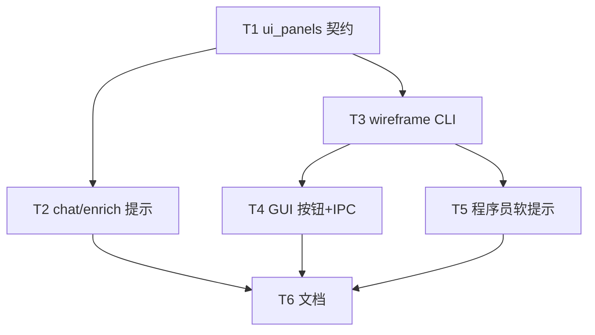

# 架构方案：可选 UI 面板清单 + 按需字符示意

## 执行元数据

- **Status**：executed
- **Workflow Stage**：code
- **Created**：2026-07-31
- **Updated**：2026-07-31
- **Source Of Truth Until**：实现已完成；后续以代码与 review 为准
- **Confirmed By**：user「确认」（2026-07-31）
- **Code Status**：T1–T6 完成；test_ui_panels 10、test_ui_wireframe 6、soft hint 测绿；GUI typecheck OK
- **Requirements Source**：[`docs/anvil/brainstorms/2026-07-31-ui-panels-wireframe.md`](../brainstorms/2026-07-31-ui-panels-wireframe.md)
- **Resume Point**：可 `/anvil:review`；未 commit（需用户说提交）

## 模块边界

### 模块：ui_panels_normalize（纯函数）

- **职责**：规范化 `project.ui_panels[]`（id/title 必填；非法项丢弃或降级）。
- **输入**：raw list。
- **输出**：干净 list；缺省 `[]`。
- **依赖**：无。
- **不变量**：永不把缺失当成 validate 错误；不读写磁盘。

### 模块：brief / ProjectContext

- **职责**：`ProjectContext` 增加可选 `ui_panels`；`from_dict` / 导出 dict 透传；`validate_brief` **不**因缺失报错。
- **输入**：brief/draft JSON。
- **输出**：带或不带 `ui_panels` 的 project。
- **依赖**：ui_panels_normalize。
- **不变量**：与 `hud` / `ui_element` 无交叉强制校验。

### 模块：host_chat 提示与 enrich

- **职责**：host-chat / enrich skill 文案要求：聊到菜单/装备等面板时写入 `project.ui_panels` 分条；**禁止**自动写示意 md。
- **输入**：draft + 用户话。
- **输出**：更新后的 draft_brief。
- **依赖**：既有 enrich/chat 路径。
- **不变量**：补全可不产出 panels（模型未识别则空）。

### 模块：ui_wireframe_generate

- **职责**：根据当前 draft 的 `ui_panels`（可附短上下文）经 LLM 生成 ASCII/表格 md，写入**当前工程目录**内固定文件名。
- **输入**：session/draft、project root。
- **输出**：`ui-wireframe.md`（覆盖写）。
- **依赖**：host LLM 设置；路径安全（必须落在 project root 下）。
- **不变量**：无 panels 时不静默成功——返回明确错误/提示「先聊出 UI 面板」；**从不**在 enrich 内调用。

### 模块：GUI 入口

- **职责**：「生成 UI 示意」按钮；IPC → CLI；成功后 Docs 聚焦该 md。
- **输入**：当前 brief session / 工程绑定。
- **输出**：用户可见 md。
- **依赖**：wireframe CLI/IPC。
- **不变量**：与「补全细节」按钮分离。

### 模块：程序员软提示

- **职责**：`agent_turn`（或 handoff 组装）若工程存在 `ui-wireframe.md`，在上下文加一行路径提示。
- **输入**：project root。
- **输出**：prompt 附加段。
- **依赖**：文件存在性检查。
- **不变量**：文件不存在则不加、不报错。

## 接口定义

### Brief / draft

```json
{
  "project": {
    "ui_panels": [
      {
        "id": "equip_panel",
        "title": "装备面板",
        "kind": "inventory",
        "anchor": "center",
        "slots": ["武器槽", "防具槽", "5x4 背包格"],
        "notes": "暂停时打开"
      }
    ]
  }
}
```

- 缺省或 `[]`：合法。
- `kind`：自由短字符串，不做死枚举校验。

### 示意文件

- 路径：与当前工程 brief 同目录（`brief.draft.json` / `brief.json` 所在目录）下的 **`ui-wireframe.md`**。
- 内容：Markdown + ASCII/表格；标题含工程名；按 `ui_panels` 分节。

### CLI（建议）

```bash
python gamefactory.py brief chat ui-wireframe --session-id …   # 或 brief ui-wireframe --draft …
```

具体子命令名在实现时与现有 `brief chat *` 风格对齐；须 `--json` 友好。

### GUI

- 策划 Docs / Chat 区新增按钮：「生成 UI 示意」。
- 无 panels：toast/助手消息提示先聊 UI；不写空文件冒充成功。

## 日志规范

- CLI `--json`：`{ ok, path, panel_count, error? }`。
- 不打印 API key；不 dump 全文 draft。

## RTK 过滤预设

- unittest：保留 FAIL/OK 摘要。
- 勿全量打印 LLM 示意正文到 CI 日志。

## 历史经验约束

- 不得把 `ui_panels` 做成导出必填（对齐 2026-07-27 反强制 screens）。
- 路径写入限制在项目根内（既有 project_paths 习惯）。

## 关键模式检查

- ❌ enrich 结束自动写 md  
- ❌ validate 缺 `ui_panels` 报 gap  
- ❌ 本期改 description 拆分  
- ✅ 可选字段 + 点击生成 + 软提示  

## 简化审计

已删：硬绑定资产、自动示意、强制中文说明镜像、像素原型。无 panels 时示意按钮：**明确失败提示**（Spec 开放项落定）。

## 任务 DAG



## 并行执行计划

| Layer | Parallel Group | Tasks | Execution | Reason |
|-------|----------------|-------|-----------|--------|
| 1 | G1 | T1 | serial | 共享 brief 契约 |
| 2 | G2 | T2, T3 | parallel | 提示词 vs 新命令；写集分离 |
| 3 | G3 | T4, T5 | parallel | GUI vs agent_turn |
| 4 | G4 | T6 | serial | 文档收尾 |

## 任务列表

### 任务 T1：`ui_panels` 契约与 validate 豁免

- **Layer**：1
- **Parallel Group**：G1
- **Execution**：serial
- **Parallel Blocker**：共享 `brief.py` / ProjectContext
- **Ownership**：`cli/brief.py`、`cli/test_ui_panels.py`（新建）、必要时 `cli/test_brief_contract.py` 增补
- **Read Set**：ProjectContext、validate_brief、hud 相关测试
- **Write Set**：上列 Ownership
- **描述**：normalize + `ProjectContext.ui_panels` 读写；validate **不**要求该字段；round-trip 测。
- **成功标准**：单测证明缺省通过 validate；非法项被清洗；导出 dict 含 panels。
- **预估 Token**：60k
- **依赖**：无
- **执行指令**：TDD；禁止加「缺 ui_panels」gap。

### 任务 T2：聊天 / 补全写入 panels

- **Layer**：2
- **Parallel Group**：G2
- **Execution**：parallel
- **Parallel Blocker**：无
- **Ownership**：`resources/skills/orchestrator/host-chat.md`、enrich 相关 skill 或 `host_chat.py` 内嵌 system 字符串、`commit-brief.md` 短注（若需要）
- **Read Set**：现有 enrich/chat 提示、T1 字段
- **Write Set**：上列 skill / host_chat 提示片段
- **描述**：要求模型聊到 UI 面板时写 `project.ui_panels` 分条；禁止自动生成 wireframe 文件；说明可选。
- **成功标准**：提示词 diff 含明确指令；至少 1 个轻量测或快照断言提示包含关键词（若项目惯用）。
- **预估 Token**：50k
- **依赖**：T1
- **执行指令**：不改 enrich 调用链去写 md。

### 任务 T3：生成 `ui-wireframe.md` CLI

- **Layer**：2
- **Parallel Group**：G2
- **Execution**：parallel
- **Parallel Blocker**：无
- **Ownership**：新模块如 `cli/ui_wireframe.py`、`cli/brief_cmds.py`（或 host chat 子命令）、`cli/test_ui_wireframe.py`
- **Read Set**：draft 加载、`resolve_host_api_settings`、project 路径解析
- **Write Set**：上列
- **描述**：从 session/draft 读 `ui_panels`；LLM 生成字符 md；安全写入 brief 同目录 `ui-wireframe.md`；无 panels → 非 0 / JSON error。
- **成功标准**：单测 mock LLM 断言路径与内容片段；路径穿越用例失败。
- **预估 Token**：80k
- **依赖**：T1
- **执行指令**：可复用 `chat_text_completion`；不碰 image/video API。

### 任务 T4：GUI「生成 UI 示意」

- **Layer**：3
- **Parallel Group**：G3
- **Execution**：parallel
- **Parallel Blocker**：无
- **Ownership**：`gui/electron/main.mjs`、`preload.cjs`、`vite-env.d.ts`、`DocsPreviewPanel.tsx` 和/或策划 Chat 工具条、`App.tsx`（最小接线）
- **Read Set**：既有 `hostChatEnrich` IPC 模式、Docs 聚焦逻辑
- **Write Set**：上列 GUI/Electron 文件
- **描述**：按钮 → IPC → CLI；成功刷新 Docs 并 focus `ui-wireframe.md`；失败展示错误文案。
- **成功标准**：typecheck 通过；与补全按钮分离。
- **预估 Token**：70k
- **依赖**：T3
- **执行指令**：勿在 enrich IPC 里顺带调 wireframe。

### 任务 T5：程序员软提示

- **Layer**：3
- **Parallel Group**：G3
- **Execution**：parallel
- **Parallel Blocker**：无
- **Ownership**：`cli/agent_turn.py`（或集中组装 project context 处）+ 小测
- **Read Set**：programmer 上下文组装、project root 解析
- **Write Set**：上列
- **描述**：若 `{project}/ui-wireframe.md` 存在，附加「布局示意：…」一行。
- **成功标准**：有文件时 prompt 含路径；无文件时不变。
- **预估 Token**：40k
- **依赖**：T3（路径约定）
- **执行指令**：不要变成缺文件就 fail turn。

### 任务 T6：文档

- **Layer**：4
- **Parallel Group**：G4
- **Execution**：serial
- **Parallel Blocker**：文档收尾
- **Ownership**：`docs/AI-HANDOFF.md`、可选 `docs/HOST-CHAT-PRODUCT.md` 一句
- **Read Set**：Spec 字段表
- **Write Set**：上列 docs
- **描述**：说明可选 `ui_panels`、点击生成 `ui-wireframe.md`、非施工硬依赖。
- **成功标准**：与 Spec 一致；不写「必须有 panels」。
- **预估 Token**：25k
- **依赖**：T2、T4、T5
- **执行指令**：短段落。

## 会话拆分点

- T1+T2+T3 完成后为检查点（契约 + CLI 可测）。
- 单会话可跑完（预估 &lt; 500k）。

## 通过条件

- [ ] Spec FR1–FR7 有对应任务
- [ ] 无 panels / 无 md 不挡 validate/export
- [ ] 示意仅点击路径生成
- [ ] 程序员仅软提示
- [ ] 未整改 description 过载
- [ ] 本 plan 为执行唯一源（无平行 JSON 任务状态）
- [ ] `AGENTS.md` 未覆盖项目规则
