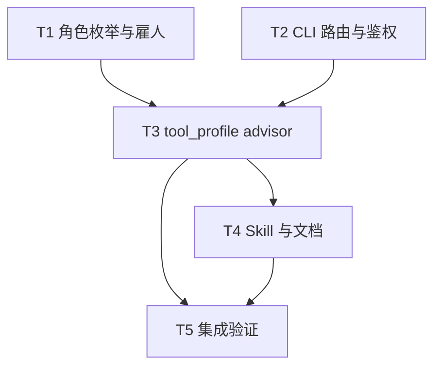

# 架构方案：顾问工种（ask-only）

## 执行元数据

- **Status**：completed
- **Workflow Stage**：review-ready
- **Created**：2026-08-06
- **Updated**：2026-08-06
- **Source Of Truth Until**：实现已落地；后续以代码与 review 为准
- **Requirements Source**：`docs/anvil/brainstorms/2026-08-06-advisor-colleague-role.md`（用户口头确认）
- **Compounded Knowledge**：not yet compounded

---

## 模块边界

### 模块 A：角色枚举与雇人 UI

- **职责**：把 `advisor` 注册为第五工种，可雇佣、可展示、会话独立。
- **输入**：用户雇人选择。
- **输出**：roster 实例 `role_kind=advisor`，独立 `session`。
- **依赖**：现有 `ColleagueRoster` / `hireColleague` / `sessions` 模式。
- **不变量**：顾问会话永不绑定 host-chat `draft_brief` 写入路径。

### 模块 B：执行器鉴权与 turn 路由

- **职责**：`advisor` 走 `agent turn`（与 IT 同类），默认/锁定 Pi；会话目录 `plans/conversations/advisor/`。
- **输入**：`role_kind`、instance、消息。
- **输出**：Pi 回合结果；不触碰 brief host-chat export。
- **依赖**：`agent_turn`、`agent_auth_resolve`、`agents_instances_upsert`。
- **不变量**：首版 `isPiLockedRole` 含 `advisor`；不可切 Codex/Cursor（避免无 FOUNDRY 白名单的外置写盘）。

### 模块 C：工具白名单 `tool_profile=advisor`

- **职责**：硬拦写 brief / 审查写入 / 导出 / pipeline 变更 / shell。
- **输入**：argv + profile。
- **输出**：允许/拒绝。
- **依赖**：`pi_foundry_tools.is_allowed_argv`、`run_pi_executor_turn` 按 role 选 profile。
- **不变量**：允许集为只读超集的子集；禁止集显式单测。

### 模块 D：Skill 与文档

- **职责**：顾问人格与禁令；产品文档工种表更新。
- **输入**：用户问题 + 可选只读上下文。
- **输出**：建议性回答；指向「去策划落实 / 去 IT 修环境」。
- **不变量**：Skill 明文禁止改 brief / 跑流水线。

---

## 接口定义

### `role_kind`

```text
既有: brief | product_host | programmer | it
新增: advisor
```

### `tool_profile=advisor` 允许前缀（首版）

```text
conversations list|show
inspect list|read
doctor
setup check
setup pi status|smoke   # 只读探测
pipeline status|diagnose
assets review list
```

### 明确禁止（单测）

```text
brief chat export|makeability|makeability-answer|autofix|enrich|bind|zh-doc
brief zh-doc
pipeline plan|run|heal|reset
shell run
setup * upsert|install|executor step
```

### 会话路径

```text
plans/conversations/advisor/<session-id>.json
```

---

## 日志规范

- 拒绝工具：`profile=advisor` + `argv` + `reason=not_allowed`（沿用现有 foundry tool 拒绝路径，不新增格式）。
- 不新增顾问专用埋点。

## RTK 过滤预设

- 验证：`python -m unittest …` 与 GUI 小测；RTK 默认截断即可。

## 历史经验约束

- 调研子代理结论：无现成 ask-only 工种；可复用 **第三 tool_profile**（勿只靠 prompt）。
- IT 外置「只说不写」不可靠 → 顾问首版锁 Pi + 硬白名单。
- Brief 与 Agent 会话分盘已存在 → 顾问走 agent 盘，避免污染 `brief/`。

## 关键模式检查

- 仓库无 `docs/solutions/patterns/critical-patterns.md` 可加载项；无额外约束。

## 简化审计

- 不做：顾问工具条、跨会话自动回写 brief、多执行器、顾问专用 Provider。
- 不做：把顾问并进 IT「只读模式」开关（职责混淆）。
- 若砍 50%：仍须保留「新 role_kind + advisor profile + 雇人入口」三件套。

---

## 任务 DAG



## 并行执行计划

| Layer | Parallel Group | Tasks | Execution | Reason |
|-------|----------------|-------|-----------|--------|
| 1 | G1 | T1, T2 | parallel | GUI 与 CLI 枚举 Write Set 不重叠 |
| 2 | G2 | T3 | serial | 共享 `pi_foundry_tools` / `agent_turn` 接口 |
| 3 | G3 | T4 | serial | 依赖 profile 名与 role 稳定 |
| 4 | G4 | T5 | serial | 端到端验证 |

---

## 任务列表

### 任务 T1：GUI 角色与雇人

- **Layer**：1
- **Parallel Group**：G1
- **Execution**：parallel
- **Parallel Blocker**：无
- **Ownership**：GUI chat/settings
- **Read Set**：`gui/src/chat/roles.ts`、`hireColleague.ts`、`ColleagueRoster.tsx`、`agentInstances.ts`、`App.tsx`（handleAgentTurn 白名单）
- **Write Set**：同上相关文件 + 对应 `*.test.ts`（若有）
- **描述**：`ChatAgentRole` 增 `advisor`；标签「顾问」；hero/hints/suggestions；`HIRE_KINDS`；`isPiLockedRole` 含 advisor；`handleAgentTurn` 允许 advisor。
- **成功标准**：类型与雇人列表含顾问；选顾问时执行器 UI 锁定 Pi。
- **预估 Token**：80k
- **依赖**：无
- **执行指令**：先扩 `roles.ts` 联合类型与常量，再串雇人/实例默认执行器，最后 App 白名单。

### 任务 T2：CLI role_kind 与会话盘

- **Layer**：1
- **Parallel Group**：G1
- **Execution**：parallel
- **Parallel Blocker**：无
- **Ownership**：CLI agent auth / turn / conversations
- **Read Set**：`agent_turn.py`、`agent_auth_resolve.py`、`agents_instances_upsert.py`、`conversations_ops.py`
- **Write Set**：同上 + 既有 auth/turn 单测
- **描述**：`ROLE_KINDS` / `_KNOWN_ROLE_KINDS` / 默认 executor / agent key 映射 / `ROLE_ALIASES` 增加 `advisor`；会话目录自动 `advisor/`。
- **成功标准**：`normalize_role("顾问")` 或别名（若加）→ advisor；upsert instance 接受 advisor；单测绿。
- **预估 Token**：60k
- **依赖**：无
- **执行指令**：与 IT 同路径注册；默认 executor=`pi`；agent key 可用新键 `agents.advisor` 或暂映到 `it` 只读配置——**优先独立 `advisor` 键**以免 IT 配置污染。

### 任务 T3：`tool_profile=advisor` 硬闸

- **Layer**：2
- **Parallel Group**：G2
- **Execution**：serial
- **Parallel Blocker**：共享 `pi_foundry_tools` / `run_pi_executor_turn`
- **Ownership**：CLI Pi tools
- **Read Set**：`pi_foundry_tools.py`、`agent_turn.py`、`test_pi_foundry_tools.py`
- **Write Set**：同上
- **描述**：新增 `_ADVISOR_ALLOWED_PREFIXES`；`is_allowed_argv(..., profile="advisor")`；`run_pi_executor_turn` 对 `role_kind==advisor` 传 `advisor`（勿写死 `it`）。
- **成功标准**：单测：允许 `conversations show` / `inspect read`；拒绝 `brief chat export`、`makeability`、`pipeline run`、`shell run`。
- **预估 Token**：100k
- **依赖**：T2（role 已存在）
- **执行指令**：TDD：先写拒绝/允许用例，再实现 profile 分支。

### 任务 T4：Skill + 产品文档

- **Layer**：3
- **Parallel Group**：G3
- **Execution**：serial
- **Parallel Blocker**：无
- **Ownership**：resources/skills + docs
- **Read Set**：`resources/skills/it/diagnose.md`、`docs/HOST-CHAT-PRODUCT.md`、`docs/AGENT-ROUTING.md`
- **Write Set**：`resources/skills/advisor/`（新建短 SKILL）、上述 docs、可选 `docs/GUI-CONFIG.md` 一句
- **描述**：顾问 Skill：咨询边界、只读工具、转介策划/IT/程序员；文档工种表改为含顾问。
- **成功标准**：Skill 可被 agent_turn 解析到；文档表格与实现对齐。
- **预估 Token**：50k
- **依赖**：T3（profile 名稳定）
- **执行指令**：Skill 控制在一页内；禁令列表与白名单一致。

### 任务 T5：集成冒烟

- **Layer**：4
- **Parallel Group**：G4
- **Execution**：serial
- **Parallel Blocker**：无
- **Ownership**：验证
- **Read Set**：T1–T4 产物
- **Write Set**：无（或仅测试夹具）
- **描述**：跑 CLI/GUI 相关单测；手工清单：雇顾问 → 问「鱼竿弯曲用代码还是视频」→ 确认无 draft 变更；尝试诱导导出被拒。
- **成功标准**：相关 unittest + GUI 角色相关测试 PASS；手工清单打勾。
- **预估 Token**：40k
- **依赖**：T1–T4
- **执行指令**：`cd cli && python -m unittest test_pi_foundry_tools test_agent_auth_resolve …`；GUI `roles`/`hire` 相关 test。

---

## 会话拆分点

- 拆分点 1：T3 完成后（核心硬闸已落地，可单独验证）
- 拆分点 2：T5 完成后（交付）

## 通过条件

1. 可雇佣顾问，会话在 `plans/conversations/advisor/`
2. 工具白名单硬拦写 brief / 审查写入 / 导出 / pipeline mutate / shell
3. 文档与雇人 UI 一致
4. 相关自动化测试通过

## 确认门闩

请确认本计划后将 Status 改为 `confirmed` 再实现。待你拍板的仅一点（若无异议按默认）：

- **默认**：顾问锁 Pi、独立 `agents.advisor` 配置键。  
- **备选**：允许以后放开 Codex read-only（首版不做）。
