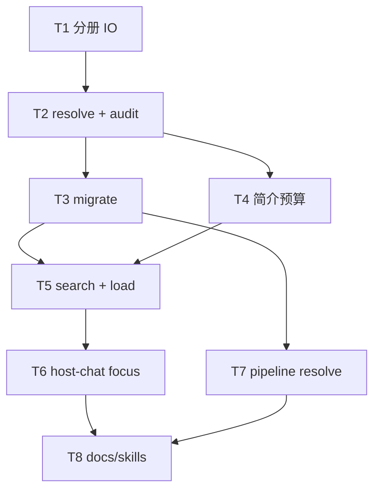

# 架构方案：Foundry Brief 分册 + 结构化搜索 + 简介瘦身

## 执行元数据

- **Status**：executed
- **Workflow Stage**：review
- **Created**：2026-08-10
- **Updated**：2026-08-10（T1–T8 完成；unittest 104 相关绿）
- **Source Of Truth Until**：`/anvil:review` 或 supersede
- **Requirements Source**：[`docs/superpowers/specs/2026-08-10-brief-catalog-shards-design.md`](../../superpowers/specs/2026-08-10-brief-catalog-shards-design.md)；用户确认 plan（2026-08-10）
- **Compounded Knowledge**：not yet compounded
- **Resume Point**：`/anvil:review` → CHANGES REQUESTED（见 `.ai/anvil/reviews/2026-08-10-foundry-brief-shards-search-review.md`）；优先补策划读闭环（focus + 白名单）
- **Confirmed By**：user「确认」（2026-08-10）
- **Code Status**：T1–T8 done；doer [T1–T4](33c7cc8c-e67c-444d-a72d-b9f7273b1d11) / [T5–T8](6f68b6ae-ceb3-43b3-a9a5-4e1e07eae8bb)

## Goal

让 Foundry 的 brief 变成**薄目录 + 短门面简介**；场景/系统/资产/表级细节只住在分册与数据表；host-chat 用 **focus + 结构化搜索**按需读盘，不再每轮灌整份厚 draft。

## Architecture

1. **`brief_shards`**：catalog 判定、分册 IO、migrate、`resolve_asset_specs`、`search_shards`。
2. **`brief` validate / normalize**：认 catalog 形；校验 path/id；对超长 `description`/`gameplay_loop` 告警。
3. **host-chat**：payload = 薄索引 + 短简介 + focus 分册；工具/命令可 `search` / `load_shard`；写入禁扩简介、禁双写索引正文。
4. **pipeline**：读资产走 `resolve_asset_specs`，不信厚 `assets[]` 正文。
5. **不做向量检索**（v1）。

## Tech Stack

Python 3.11+、现有 `unittest`、Click（`brief_cmds`）、JSON 落盘于工程根；无新向量依赖。

## Global Constraints

- Catalog 条目仅 `id` + `title`|`name` + `path`。
- 分册为正文唯一真源；path 缺失或 id 不一致 → validate 错误。
- Legacy 厚 brief：可读 + warning；**新写入**只写 catalog + 分册。
- `description` ≤ **800** 字符（warning）；`gameplay_loop` ≤ **1200** 字符（warning）；export 不因超长硬拦。
- 细则落位：规则/数值 → systems（或 `tuning`）；屏交互 → scenes；名单/倍率表 → system.tuning 或可选 `data/<name>.json`。
- v1 无 GUI Brief 大编辑器、无 embedding。

---

## 模块边界

### 模块：brief_shards（CLI）

- **职责**：catalog/legacy 判定、分册读写、migrate、resolve 资产 Spec、结构化搜索。
- **输入**：brief path、project_root、query、focus id。
- **输出**：refs、shard dict、search hits、resolved AssetSpec 列表。
- **依赖**：`project_paths`（或本模块内复用 `project_root_for_brief`）。
- **不变量**：不写 LLM；不改无关文件；migrate 先 backup。

### 模块：brief_normalize_validate（CLI）

- **职责**：normalize catalog 形；audit path/id；简介长度告警。
- **输入**：brief dict。
- **输出**：normalized brief + errors/warnings。
- **依赖**：brief_shards。
- **不变量**：不静默把分册正文合并回索引。

### 模块：brief_search（CLI 表面）

- **职责**：`brief search` / `brief shard load` 人机入口。
- **输入**：`--brief`、`--q`、可选 `--kind`。
- **输出**：JSON hits 或 shard JSON。
- **依赖**：brief_shards。

### 模块：host_chat_focus（CLI）

- **职责**：组轮次上下文（目录+短简介+focus）；patch 分册；拒绝简介扩写与索引双写。
- **输入**：session focus、draft/catalog、user message。
- **输出**：turn payload、落盘分册/索引。
- **依赖**：brief_shards。
- **不变量**：非 focus 分册正文不进 payload。

### 模块：pipeline_resolve（CLI）

- **职责**：plan/craft 取资产 Spec 时走 resolve。
- **输入**：brief path。
- **输出**：完整 AssetSpec 列表。
- **依赖**：brief_shards。

### 模块：docs_skills（文档）

- **职责**：AI-HANDOFF / ITERATIVE / orchestrator 或 brief skill：简介纪律 + search 工作流。
- **不变量**：不描述「每轮灌整 draft」。

---

## 接口定义

```text
is_catalog_ref(entry) -> bool
is_legacy_*_entry(entry) -> bool
load/save_json_shard(path, data?)
migrate_brief_to_shards(brief_path, *, backup=True) -> report
resolve_asset_specs(brief_path) -> list[dict]
audit_catalog_refs(brief, project_root) -> list[str]  # errors
audit_intro_budgets(brief) -> list[str]               # warnings
search_shards(project_root, brief, query, *, kinds=None, limit=20)
  -> list[{kind, id, path, score, snippet}]
load_shard(project_root, kind, id, brief) -> dict
```

落位约定（migrate / enrich / host 写入纪律）：

| 内容 | 目标 |
|------|------|
| 战斗/经济/纪录片规则与数值 | `systems/<id>.json`（`notes` / `tuning`） |
| 某屏 UI / 镜头 / 按钮 | `scenes/<id>.json` |
| 鱼种名单、钓点池、倍率表 | `tuning` 或 `data/<name>.json` |
| UI skin 实现方案 | `systems/ui_skin.json`（可新建） |
| 门面 | 短 `description` + 短步骤 `gameplay_loop` |

---

## 日志规范

- migrate / search / validate：stdout 或 `--json` 结构化字段 `ok`、`warnings[]`、`errors[]`、`hits[]`。
- 同输入同结构；密钥不入日志。

## RTK 过滤预设

- 单测：`cd cli && python -m unittest test_brief_shards test_host_chat -q`（相关用例）。
- 手工：对 fishing draft 跑 migrate dry-run / search。

## 历史经验约束

- 无额外 `docs/solutions` 命中可注入；遵循仓库「不做 scope creep / validate 失败先修」既有纪律。

## 关键模式检查

- 不适用（无 critical-patterns.md 命中本主题）。

## 简化审计

- 砍掉：向量库、GUI 编辑器、自动打开即 migrate、第三层全局数值库（除非多系统共享再开 `data/`）。
- 保留：catalog、分册、search、简介预算、focus 注入。

---

## 任务 DAG



## 并行执行计划

| Layer | Parallel Group | Tasks | Execution | Reason |
|-------|----------------|-------|-----------|--------|
| 1 | G1 | T1 | serial | 新模块根基 |
| 2 | G2 | T2 | serial | 依赖 T1 接口 |
| 3 | G3 | T3, T4 | parallel | 写集：migrate vs validate 预算，可并行若 T4 只碰 audit 助手 |
| 4 | G4 | T5 | serial | 搜索 API |
| 5 | G5 | T6, T7 | parallel | host_chat vs pipeline 写集分离 |
| 6 | G6 | T8 | serial | 文档收口 |

> 若并行有风险：T3→T4 也可改为串行（先 migrate 测再预算）。

---

## 任务列表

### 任务 1：Catalog 判定 + 分册 IO

- **Layer**：1 · **Parallel Group**：G1 · **Execution**：serial
- **Ownership**：`cli/brief_shards.py`、`cli/test_brief_shards.py`
- **Read Set**：`cli/project_paths.py`（若有）、现 brief 样例形状
- **Write Set**：同上 Ownership
- **Dependencies**：无
- **Success**：`TestBriefShardsIo` 绿；roundtrip 写读 shard
- **Validation**：`python -m unittest test_brief_shards.TestBriefShardsIo -v`
- **Blockers**：无
- **执行指令**：TDD 实现 `is_catalog_ref` / legacy 判定 / `resolve_shard_path` / load/save。

### 任务 2：resolve_asset_specs + catalog audit

- **Layer**：2 · **Parallel Group**：G2 · **Execution**：serial
- **Ownership**：`cli/brief_shards.py`、`cli/test_brief_shards.py`、必要时 `cli/brief.py` 钩子
- **Read Set**：`cli/brief.py` validate 入口
- **Write Set**：Ownership 内
- **Dependencies**：T1
- **Success**：catalog brief 从 path 解出 type；缺文件/id 不一致 → error 字符串
- **Validation**：`python -m unittest test_brief_shards -v`
- **Blockers**：无
- **执行指令**：实现 `resolve_asset_specs`、`audit_catalog_refs`；单测覆盖 legacy 厚 brief 不硬挂。

### 任务 3：migrate 厚 brief → 分册 + 薄索引

- **Layer**：3 · **Parallel Group**：G3 · **Execution**：serial（与 T4 并行可选）
- **Ownership**：`cli/brief_shards.py`、`cli/brief_cmds.py`、`cli/test_brief_shards.py`
- **Read Set**：fishing 或夹具厚 brief
- **Write Set**：Ownership；测试临时目录
- **Dependencies**：T2
- **Success**：migrate 后 brief 仅映射；scenes/systems/assets 文件存在；留 `*.pre-shard.json` backup
- **Validation**：unittest migrate；可选对 `projects/fishing-2d/brief.draft.json` dry-run（不强制本任务改用户工程）
- **Blockers**：无
- **执行指令**：CLI `brief shard migrate --brief …`；正文字段迁出，索引只留映射。

### 任务 4：简介预算 + 落位告警

- **Layer**：3 · **Parallel Group**：G3 · **Execution**：parallel（或串行跟 T3）
- **Ownership**：`cli/brief_shards.py` 或 `cli/brief.py`、对应测试
- **Read Set**：validate 流程
- **Write Set**：Ownership
- **Dependencies**：T2（可与 T3 并行）
- **Success**：超 800/1200 产生 **warning**；文档化「细则应在 scene/system/data」
- **Validation**：unittest 断言 warning 文案含 budget
- **Blockers**：无
- **执行指令**：`audit_intro_budgets`；挂入 validate；**不**在本任务自动改写 fishing 正文（数据迁移属工程侧，可另开）。

### 任务 5：结构化 search + load_shard

- **Layer**：4 · **Parallel Group**：G4 · **Execution**：serial
- **Ownership**：`cli/brief_shards.py`、`cli/brief_cmds.py`、测试
- **Read Set**：分册文件约定
- **Write Set**：Ownership
- **Dependencies**：T3（有分册可搜；至少测试夹具）
- **Success**：`search("harbor")` 命中 `main_hub` 或对应 shard；返回 snippet；无向量依赖
- **Validation**：unittest + `brief search --json` 冒烟
- **Blockers**：无
- **执行指令**：大小写不敏感子串/分词即可；score 简单（标题命中 > 正文）；`brief shard load --kind scene --id …`。

### 任务 6：host-chat focus 注入与写入纪律

- **Layer**：5 · **Parallel Group**：G5 · **Execution**：parallel w/ T7
- **Ownership**：`cli/host_chat.py`、`cli/test_host_chat.py`；必要时 GUI 只读 focus 字段（最小）
- **Read Set**：现 turn payload 组装点
- **Write Set**：Ownership
- **Dependencies**：T5
- **Success**：focus=某 scene 时序列化 payload **不含**其他 scene 正文；写入 patch 落分册；试图把长细则写入 `description` → 拒绝或剥离并提示改分册
- **Validation**：`python -m unittest test_host_chat -v`（新增用例）
- **Blockers**：若 enrich 仍灌整 draft，本任务至少切断 **主对话轮**；enrich 可标 follow-up
- **执行指令**：session 增 `focus`；组装 catalog+intro+shard；禁索引双写。

### 任务 7：pipeline / prompt craft 走 resolve

- **Layer**：5 · **Parallel Group**：G5 · **Execution**：parallel w/ T6
- **Ownership**：`cli/asset_pipeline.py` 及实际 `load_brief`/`AssetSpec.from_dict` 调用点、相关测试
- **Read Set**：pipeline plan/craft 路径
- **Write Set**：Ownership
- **Dependencies**：T2（T3 推荐已有）
- **Success**：catalog 模式下至少一条资产能 resolve 出 type/usage；厚 brief 回归不挂
- **Validation**：相关 unittest
- **Blockers**：无
- **执行指令**：调用点改为 `resolve_asset_specs`；避免对薄 ref 直接 `from_dict`。

### 任务 8：文档与 skills

- **Layer**：6 · **Parallel Group**：G6 · **Execution**：serial
- **Ownership**：`docs/AI-HANDOFF.md`、`docs/ITERATIVE-PRODUCTION.md`、相关 `resources/skills/**`（host-chat / commit-brief 等）
- **Read Set**：本 plan + Spec
- **Write Set**：Ownership
- **Dependencies**：T6、T7
- **Success**：写明 Brief=目录、分册=正文、search 工作流、description 预算与落位表
- **Validation**：文档互链可点；无「每轮整 draft」误导句
- **Blockers**：无
- **执行指令**：短节即可；更新 Spec 状态若实现完成。

---

## 验收（整包）

1. 新/迁移工程：brief 为薄目录；分册可独立编辑；validate 查 path/id。
2. 超长 description → warning。
3. `brief search` 能按关键词找到 scene/system；host-chat focus 单测证明他景不进 payload。
4. pipeline 在 catalog 下仍能拿到资产 Spec。
5. 旧厚 brief 仍可读（warning）。
6. **不含**向量检索依赖。

## 明确不在本 Plan

- 自动把 fishing 的 description 语义迁移进各分册（可用本能力后**人工/另任务**做数据搬家）。
- App.tsx 大拆、GUI Brief 编辑器、向量 RAG。
- 安全 P1 债（另见 security remediation plan）。

## 建议执行顺序

T1 → T2 → T3 ∥ T4 → T5 → T6 ∥ T7 → T8

## Session Split

- **Session A**：T1–T4（存储与校验）
- **Session B**：T5–T6（读路径与对话）
- **Session C**：T7–T8（产线与文档）

---

请确认本 plan（或指出修改）。确认后将 Status 标为 `confirmed` 并开始 `/anvil:code`。
