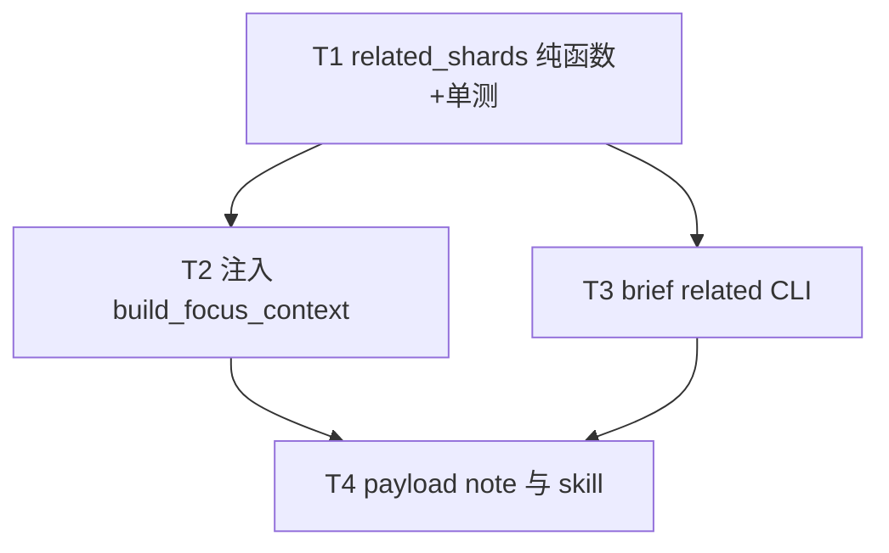

# 架构方案：宿主计算相关分册（blast radius）

## 执行元数据

- **Status**：executed
- **Workflow Stage**：code
- **Created**：2026-08-12
- **Updated**：2026-08-12
- **Source Of Truth Until**：本方案 `executed` 或被更新 spec/plan 取代
- **Requirements Source**：[`docs/superpowers/specs/2026-08-12-related-shards-blast-radius-design.md`](../../superpowers/specs/2026-08-12-related-shards-blast-radius-design.md)；用户 2026-08-12 确认「图不靠人维护 / 不做向量」
- **Compounded Knowledge**：not yet compounded
- **Policy Note**：本 DAG 记录 related_shards v1 的历史实现；后续 soft-focus correction 已删除 focus 写闸与 related allowlist，当前行为以 Requirements Source spec 为准。

## 目标

钉住 scene/system/asset 时，宿主算出「还可能碰到哪些分册」并注入策划 payload。模型看见列表。原 DAG 要求写闸只允许当前 focus；该限制已被后续 soft-focus correction 取代。

## 非目标

- 向量 / embedding / 分词库
- 人手 `dependency.json`
- related 列表当作 upsert 许可
- 相关分册全文注入、hydrate 写回 draft
- GUI 展示 related（可后置）
- 用户说「一并改」就多 path 放行（v1.5）

## 模块边界

### 模块：RelatedShards（`cli/brief_shards.py`）

- **职责**：只读扫描 catalog + 分册，返回当前 focus 的相关 `{kind,id,title,via,path?}`。
- **输入**：`project_root`、薄或可解析的 `brief`、`kind`、`id`、可选 `limit`。
- **输出**：`list[dict]`；无法读分册时抛错（由调用方写成 `related_error`）。
- **依赖**：现有 `load_shard` / `resolve_shard_path` / `_iter_catalog_sections`；不调用 LLM。
- **不变量**：不含自身；declared ∪ mention；id 词界匹配；不写盘。

### 模块：FocusContextInject（`build_focus_context`）

- **职责**：在已有薄目录 + `focus_shard` 上附加 `related_shards`。
- **输入**：与现函数相同。
- **输出**：原上下文字段 + `related_shards` 或 `related_error`。
- **依赖**：RelatedShards。
- **不变量**：无 scene/system/asset focus 时不加空列表冒充「无关联」；失败不吞掉 `focus_error`。

### 模块：RelatedCLI（`cli/brief_cmds.py`）

- **职责**：`brief related --brief --kind --id [--json]` 人机/测入口。
- **输入**：brief 路径 + kind + id。
- **输出**：JSON `{ok, related}` 或 stderr + exit 1。
- **依赖**：RelatedShards。
- **不变量**：只读。

### 模块：PlannerNote（`host_chat.py` + `host-chat.md`）

- **职责**：payload note / skill 写明 related ≠ 写许可。
- **输入**：现有 chat payload 组装。
- **输出**：note 字符串；不改 `validate_focus_allows_write`。
- **依赖**：FocusContextInject 已把列表放进 `current_draft_brief`。
- **不变量**：不新增 `enforce_focus=False` 旁路。

## 接口定义

```python
def related_shards(
    project_root: Path,
    brief: dict[str, Any],
    kind: Kind,
    entry_id: str,
    *,
    limit: int = 12,
) -> list[dict[str, Any]]:
    """Return related catalog rows for focus (kind, entry_id). Never includes self."""
```

每条：`kind: Kind`，`id: str`，`title: str`（资产用 name），`via: list[str]` 子集 `{"declared","mention"}`，`path: str | None`。

**declared 边（双向）：**

- 资产行 / 分册：`scene_ids`、`system_ids`、`asset_ids`
- 场景分册：`ui_panel_ids`（只用于找到 panel；v1 related 仍只输出 scene/system/asset。若 panel 无独立分册则不进列表）
- 反向：其它 scene/system/asset 的上述数组包含当前 id

**mention 边：** 当前分册 JSON 文本中，其它 catalog id 满足 `(^|[^a-z0-9_])id([^a-z0-9_]|$)`（`re.I`）。id 长度 &lt; 3 跳过 mention，避免噪。

**排序：** declared 先于仅 mention；同组按 kind、id。截断 `limit`。

## 日志规范

无新常驻日志。CLI `--json` 即结构化输出。计算失败进入 payload `related_error`（字符串，同 `focus_error` 风格）。

## RTK 过滤预设

- 单测：`python -m unittest test_brief_shards test_host_chat -q`，保留 FAIL / ERROR / `related_shards` / `HostChatError`
- CLI 冒烟：`brief related --json` 的 `ok` / `related`

## 历史经验约束

| Source | Applied lens |
|--------|----------------|
| catalog shards spec | 索引薄；正文在分册；search 非向量 |
| stable-ids spec | 边用 id 不用 title；related ≠ 写许可 |
| focus P1 review | 硬写闸不变量；禁止 merge 旁路 |
| docs-focus zh-title review | 禁止 hydrate 落盘进 draft |
| makeability audit | 审查仍是事后闸；related 不替代 hydrate |
| human-docs spec | 预览跟随 ≠ focus；v1 不做 GUI related |

## 关键模式检查

- ACP JSON-RPC id 分流：本包不碰。
- 无新「先匹配 pending id」路径。

## 简化审计

可删 50% 仍满足需求的部分：**已删** GUI、软写闸、向量、全文注入、独立图存储。留下「纯函数 + 注入 + CLI + 一句 skill」。若再删注入、只留 CLI，策划轮仍看不见列表，不满足「不靠模型自觉 search」。

## 任务 DAG



## 并行执行计划

| Layer | Parallel Group | Tasks | Execution | Reason |
|-------|----------------|-------|-----------|--------|
| 1 | G1 | T1 | serial | 新接口定义 |
| 2 | G2 | T2, T3 | parallel | 写集不交：`brief_shards.py` 的 `build_focus_context` vs `brief_cmds.py`；T2 只调已冻结的 `related_shards` 签名 |
| 3 | G3 | T4 | serial | 依赖注入字段名已稳定 |

T2 与 T3 并行时 **禁止** 再改 `related_shards` 签名。

## 任务列表

### 任务 1：`related_shards` 纯函数

- **Layer**：1
- **Parallel Group**：G1
- **Execution**：serial
- **Parallel Blocker**：共享 `brief_shards.py` 新导出
- **Ownership**：`cli/brief_shards.py`、`cli/test_brief_shards.py`
- **Read Set**：`cli/brief_shards.py`（load_shard、catalog 遍历）
- **Write Set**：`cli/brief_shards.py`、`cli/test_brief_shards.py`
- **描述**：实现 `related_shards`；temp 目录构造 catalog：资产 declared → 场景；场景 notes 提及 system id → mention；自身排除；短 id 不 mention；改 notes 去掉 id 后 mention 边消失。
- **成功标准**：`python -m unittest test_brief_shards.RelatedShardsTests -q` PASS（新 TestCase）
- **Code Status**：done
- **Actual Write Set**：`cli/brief_shards.py`、`cli/test_brief_shards.py`
- **Verification**：`python -m unittest test_brief_shards.RelatedShardsTests -q` → 7 PASS
- **Evidence**：commit `c17a632`
- **预估 Token**：40k
- **依赖**：无
- **涉及文件**：`cli/brief_shards.py`、`cli/test_brief_shards.py`
- **执行指令**：先写失败测再实现；只读分册；`via` 去重有序列表。

### 任务 2：注入 `build_focus_context`

- **Layer**：2
- **Parallel Group**：G2
- **Execution**：parallel
- **Parallel Blocker**：无（不改 `related_shards` 签名）
- **Ownership**：`cli/brief_shards.py` 中 `build_focus_context`、对应单测
- **Read Set**：`related_shards`、现有 focus 注入
- **Write Set**：`cli/brief_shards.py`（仅 `build_focus_context` 段）、`cli/test_brief_shards.py`（focus context 测）
- **描述**：scene/system/asset + 有 id 时调用 `related_shards`；成功写入 `related_shards`；异常写入 `related_error` 且不丢 `focus_error`。project / 无 focus 不加该键。
- **成功标准**：现有 focus context 测仍绿；新增测：focus scene 时 context 含 related 且无他册 `notes` 全文。
- **Code Status**：done
- **Actual Write Set**：`cli/brief_shards.py`、`cli/test_brief_shards.py`
- **Verification**：`python -m unittest test_brief_shards -q` → 36 PASS
- **Evidence**：commit `2f6a9bd`
- **预估 Token**：25k
- **依赖**：T1
- **涉及文件**：`cli/brief_shards.py`、`cli/test_brief_shards.py`
- **执行指令**：`project_root is None` 时跳过 related（与 load_shard 失败路径一致，设 `related_error` 或省略——**省略**，避免假「无关联」）。

### 任务 3：`brief related` CLI

- **Layer**：2
- **Parallel Group**：G2
- **Execution**：parallel
- **Parallel Blocker**：无
- **Ownership**：`cli/brief_cmds.py`、可选 `cli/test_brief_shards.py` 或现有 cmd 测
- **Read Set**：`related_shards`、`brief search` 命令形态
- **Write Set**：`cli/brief_cmds.py`、`cli/pi_foundry_tools.py`（brief 白名单加 `brief related` 只读，与 search 同类）
- **描述**：对齐 `brief search` 的 `--brief --kind --id --json`。Pi 白名单放行，否则策划工具调不到。
- **成功标准**：对 fishing 或 temp brief `--json` 含 `ok: true` 与 `related` 数组；白名单测若已有 search 用例则加 related 前缀。
- **Code Status**：done
- **Actual Write Set**：`cli/brief_cmds.py`、`cli/pi_foundry_tools.py`、`cli/test_pi_foundry_tools.py`
- **Verification**：`python -m unittest test_pi_foundry_tools -q` → 15 PASS
- **Evidence**：commit `5b468fa`
- **预估 Token**：20k
- **依赖**：T1
- **涉及文件**：`cli/brief_cmds.py`、`cli/pi_foundry_tools.py`、相关 test
- **执行指令**：复用 `load_brief_document` + `project_root_for_brief_path`。

### 任务 4：payload note 与 skill

- **Layer**：3
- **Parallel Group**：G3
- **Execution**：serial
- **Parallel Blocker**：payload 文案与 T2 字段名
- **Ownership**：`cli/host_chat.py` note、`resources/skills/orchestrator/host-chat.md`
- **Read Set**：`build_focus_context` 输出
- **Write Set**：`cli/host_chat.py`（仅 `current_draft_brief_note`）、`resources/skills/orchestrator/host-chat.md`、`docs/superpowers/specs/2026-08-10-document-focus-and-stable-ids.md` 实现清单一行
- **描述**：note 写明 `related_shards` 是连锁提示，upsert 仍须 focus.id 一致。Focus 纪律补一句。不改 `validate_focus_allows_write`。
- **成功标准**：`rg related_shards cli/host_chat.py resources/skills/orchestrator/host-chat.md` 命中；`python -m unittest test_host_chat -q` 仍拒跨册 upsert。
- **Code Status**：done
- **Actual Write Set**：`cli/host_chat.py`、`resources/skills/orchestrator/host-chat.md`、`docs/superpowers/specs/2026-08-10-document-focus-and-stable-ids.md`
- **Verification**：`python -m unittest test_host_chat -q` → 75 PASS
- **Evidence**：T4 本批提交
- **预估 Token**：15k
- **依赖**：T2、T3
- **涉及文件**：上列
- **执行指令**：禁止为 related 加 `enforce_focus=False`。

## 会话拆分点

- 拆分点 1：T1 后（纯函数可独立合入）
- 拆分点 2：T4 后（v1 完成）；软写闸另开 plan

## 通过条件

- [x] 模块 hermetic：算边纯函数、不写盘 — **Code Status**：passed
- [x] 简化：无 GUI / 向量 / 软闸 — **Code Status**：passed
- [x] 无 dependency piercing：写闸模块不读 related 放行 — **Code Status**：passed
- [x] 任务有可验证标准 — **Code Status**：passed
- [x] DAG 无环；T2/T3 写集不交 — **Code Status**：passed
- [x] AGENTS.md 已存在，本包不改 — **Code Status**：not applicable
- [x] 验证命令已写；Resume 已写 — **Code Status**：passed
- [x] 用户确认后 Status → `confirmed` — **Code Status**：passed（已 executed）

## 验收

1. declared / mention / 脱离（mention 消失）有单测 — **Code Status**：done（RelatedShardsTests）
2. payload 有列表无他册正文 — **Code Status**：done（TestFocusContextRelatedShards）
3. 跨册 upsert 仍失败 — **Code Status**：done（test_host_chat write-gate）
4. 无新向量依赖 — **Code Status**：done
