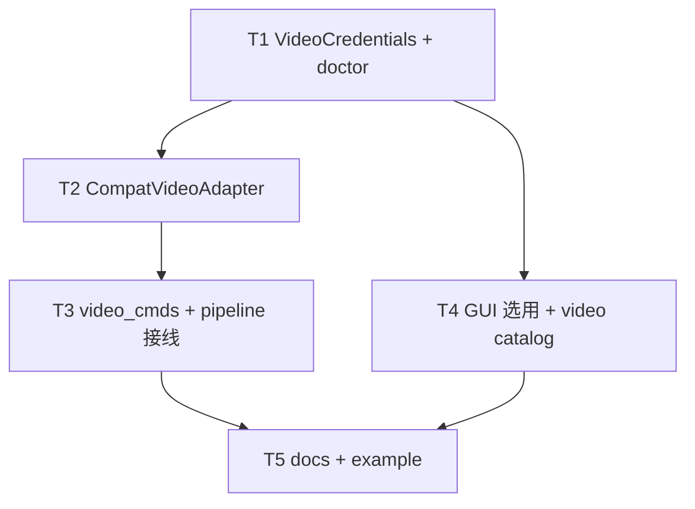

# 架构方案：生视频复用 Provider 账号

## 执行元数据

- **Status**：review
- **Workflow Stage**：review
- **Created**：2026-08-13
- **Updated**：2026-08-13
- **Source Of Truth Until**：合入后以代码 + GUI-CONFIG / TOOLS 为准
- **Requirements Source**：[`docs/anvil/brainstorms/2026-08-13-multi-vendor-video-via-providers.md`](../brainstorms/2026-08-13-multi-vendor-video-via-providers.md)；用户「1.确认」Spec
- **Compounded Knowledge**：not yet compounded
- **Readiness**：`python -m unittest test_video_route test_video_compat test_seedance_api test_host_chat -q`；Apilio fish probe 已提供 Veo/Grok `/v1/videos` + Wan `/v2` + Hailuo `/minimax` path 证据
- **Resume Point**：视频 T1–T5 已落地并通过审查（空 provider + 自定义 api_base 误判 Seedance 已修）。host-chat 自愈为并行交付，建议拆 commit。动画切分未做。
- **Code Status**：T1–T5 已实现（compat adapter / CLI facade / GUI 选用 / docs + Seedance 2.5）

## 模块边界

### 模块：VideoCredentials

- **职责**：从 `video.provider` + `provider_accounts`（回退遗留 `video.api_key`）解析 Key/Base/model/backend
- **输入**：config、可选 CLI override
- **输出**：`{provider, api_key, api_base, model, backend}`；`backend` ∈ `seedance` | `openai_compat`
- **依赖**：`provider_accounts` 读取方式对齐 `image_model_route`
- **不变量**：无 provider 且无遗留 Key → 不可用；不把 Key 写入返回日志字段以外的磁盘

### 模块：CompatVideoAdapter

- **职责**：OpenAI 兼容中转的图生视频：提交 → poll → 下载 MP4
- **输入**：credentials、prompt、首帧 Path、duration/resolution/ratio/generate_audio
- **输出**：输出文件 + `{task_id, backend, endpoint}`
- **依赖**：`proxy_utils.http_post/http_get`；模型 id 规范化（非 OpenRouter 去 vendor 前缀）
- **不变量**：失败不留下半截 MP4；不认的可选字段省略；`video.extra` 本期不合并进请求

### 模块：SeedanceBackend（既有）

- **职责**：火山 ARK 现有 `seedance_api.generate_video`
- **输入/输出**：不变
- **不变量**：`provider=seedance` 或 base 含 `volces.com`/`ark.` 才走此路径

### 模块：VideoGenerateFacade

- **职责**：`video generate` / pipeline `video.generate` 统一入口：resolve settings + credentials + 分发 backend
- **依赖**：VideoCredentials、CompatVideoAdapter、SeedanceBackend、`video_config`
- **不变量**：未配置生视频账号时错误文案指向 Provider 选用，而不是只提 Ark Key

### 模块：GuiVideoProviderPick

- **职责**：Provider 短选「生视频用账号（可选）」+ `ModelCatalogPicker(role=video)`
- **输入**：`provider_accounts` 列表、当前 `video.provider/model`
- **输出**：保存 `video.provider` + `video.model`；不得抹掉其它 `video.*`
- **依赖**：既有 `providerModels` IPC
- **不变量**：未启用可选；目录失败不清空已填 model；Agent 下拉仍仅内置

## 接口定义

```python
@dataclass(frozen=True)
class VideoCredentials:
    provider: str
    api_key: str | None
    api_base: str
    model: str
    backend: Literal["seedance", "openai_compat"]

def resolve_video_credentials(config, *, explicit_model=None, explicit_key=None, explicit_base=None) -> VideoCredentials: ...

def generate_compat_video(*, model, prompt, output_path, api_key, api_base, reference_image=None, duration, resolution, ratio, generate_audio=False, proxy=None, poll_interval=10, timeout=600) -> dict: ...
```

GUI patch `video` 块：

```json
{ "provider": "apilio"|null, "model": "veo3.1"|null }
```

合并时 deep-merge，保留 `duration`/`split_frames` 等未编辑键。

`doctor.capabilities.video_api`：`resolve_video_credentials` 有可用 Key，或遗留 `video.api_key`。

## 日志规范

- stderr 短行：`video backend=<seedance|openai_compat> endpoint=<path> model=<id>`（无 key）
- 探测失败：`compat video probe <path> HTTP <code>: <snippet<=200>`
- 成功：`video task <id> status=<...>`（沿用 Seedance on_status 风格）

## RTK 过滤预设

- 单测：`python -m unittest test_video_route test_video_compat -q` → 保留 FAIL/ERROR
- GUI：`npx tsc --noEmit -p gui` 若已有脚本则用之，只看 error

## 历史经验约束

- 生图 Apilio：裸 model id，OpenRouter slug 会 503 → 视频同样按 api_base 剥前缀
- Provider 保存曾误清空邻键 → `video` patch 必须 deep-merge
- ACP JSON-RPC id 规则与本需求无关，不改 Hermes

## 关键模式检查

- ❌ 保存 Provider 整段替换 `video` 丢掉 `split_frames`
- ✅ deep-merge `video` 只更新 provider/model
- ❌ 全局 duration 4–15 套到 Veo
- ✅ 硬限制按 backend；compat 提交前不因 Seedance 规则拒 Veo 4/6/8
- ❌ 目录失败清空 model
- ✅ 与生图一致：保留手填

## 简化审计

可删：独立 `video_accounts` 新写入、末帧、extra 透传、按厂商原生 SDK。「生视频沿用生图」开关本期不做。

## Spec 开放问题 → Plan 默认

| 项 | Plan 决定 |
|----|-----------|
| Apilio videos path | T2 先双 path 探测；fish probe 报告若先返回则采纳 |
| 高级区旧 Seedance Key 表单 | **隐藏**重复 Key；若仅有遗留 `video.api_key` 且无 `video.provider`，运行时当 `seedance` |
| 生视频沿用生图 | 不做 |
| `video.extra` | 允许存盘，adapter 忽略 |

## 任务 DAG



## 并行执行计划

| Layer | Parallel Group | Tasks | Execution | Reason |
|-------|----------------|-------|-----------|--------|
| 1 | G1 | T1 | serial | 共享凭证接口 |
| 2 | G2 | T2 | serial | 依赖 T1 类型 |
| 3 | G3 | T3, T4 | parallel | T3=CLI 接线；T4=GUI；写集不重叠 |
| 4 | G4 | T5 | serial | docs 依赖行为稳定 |

## 任务列表

### T1：VideoCredentials + doctor

- **Layer**：1
- **Parallel Group**：G1
- **Execution**：serial
- **Parallel Blocker**：共享 config 解析
- **Ownership**：`cli/video_route.py`（新建）、`cli/test_video_route.py`（新建）、`cli/env_discover.py`
- **Read Set**：`cli/image_model_route.py`、`cli/env_discover.py`、`cli/video_cmds.py`
- **Write Set**：`cli/video_route.py`、`cli/test_video_route.py`、`cli/env_discover.py`
- **描述**：实现 `resolve_video_credentials`；backend 判定；`video_api` 认 provider 账号 Key。
- **成功标准**：单测覆盖：apilio provider、遗留 seedance key、未配置 → 不可用；`discover_capabilities.video_api` 对 apilio 为 true。
- **预估 Token**：80k
- **依赖**：无
- **执行指令**：对照 `resolve_image_credentials`；TDD 先写 `test_video_route.py`。

### T2：CompatVideoAdapter

- **Layer**：2
- **Parallel Group**：G2
- **Execution**：serial
- **Parallel Blocker**：新 HTTP 客户端
- **Ownership**：`cli/video_compat.py`、`cli/test_video_compat.py`、`cli/video_config.py`（时长校验按 backend）
- **Read Set**：`cli/seedance_api.py`、`cli/gamefactory.py` `normalize_image_model`、fish probe README（若已有）
- **Write Set**：`cli/video_compat.py`、`cli/test_video_compat.py`、`cli/video_config.py`
- **描述**：探测 `/videos` 与 `/videos/generations`；首帧 data URL；poll+下载；失败删不完整输出；剥非 OR vendor 前缀。
- **成功标准**：单测 mock HTTP：映射、双 path 探测、失败不落盘、前缀剥离；不发真实 Key。
- **预估 Token**：150k
- **依赖**：T1
- **执行指令**：若 `projects/fishing-2d/output/video-vendor-probe/README.md` 已有真实 path，优先固化该协议。

### T3：video_cmds + pipeline 接线

- **Layer**：3
- **Parallel Group**：G3
- **Execution**：parallel
- **Parallel Blocker**：无（不改 GUI）
- **Ownership**：`cli/video_cmds.py`、`cli/asset_pipeline.py`（仅 video.generate 调用点）
- **Read Set**：T1/T2 接口、`cli/plan_io.py`
- **Write Set**：`cli/video_cmds.py`、`cli/asset_pipeline.py`
- **描述**：Facade 按 backend 调用 Seedance 或 compat；错误文案区分未配置 Provider vs Ark。
- **成功标准**：无 Key 时退出码非 0 且文案含 Provider；seedance 路径回归现有测试若有。
- **预估 Token**：80k
- **依赖**：T2
- **执行指令**：尽量少改 pipeline，只换 generate 入口。

### T4：GUI 生视频选用 + 目录

- **Layer**：3
- **Parallel Group**：G3
- **Execution**：parallel
- **Parallel Blocker**：无（不改 CLI adapter）
- **Ownership**：`gui/src/components/settings/ProviderSettingsView.tsx`、`gui/src/settings/providerAccounts.ts`、`gui/src/components/ModelCatalogPicker.tsx`、`gui/src/settings/sections.ts`
- **Read Set**：现有生图短选与 ModelCatalogPicker
- **Write Set**：上述 GUI 文件
- **描述**：短选「生视频用账号」未启用+账号列表；选中后 video ModelCatalogPicker；保存 deep-merge `video.provider/model`；隐藏高级区重复 Seedance Key 表单。
- **成功标准**：tsc 无新错误；序列化 round-trip 不丢 `split_frames`（可用纯函数测若已有 vitest，否则 CLI 侧测 patch 合并 helper）。
- **预估 Token**：120k
- **依赖**：T1（字段名约定）
- **执行指令**：`role="video"` 启发式过滤；失败手填。

### T5：docs + example

- **Layer**：4
- **Parallel Group**：G4
- **Execution**：serial
- **Parallel Blocker**：文档依赖行为
- **Ownership**：`docs/GUI-CONFIG.md`、`docs/TOOLS.md`、`resources/config.example.json`
- **Read Set**：落地代码
- **Write Set**：上述 docs/example
- **描述**：说明生视频选用账号库 + 模型目录；example 增加 `video.provider/model/extra`。
- **成功标准**：文档与 GUI 字段一致；example JSON 可 parse。
- **预估 Token**：40k
- **依赖**：T3、T4

## 会话拆分点

- 拆分点 1：T2 后（adapter + 单测绿）
- 拆分点 2：T4 后（GUI + CLI 可本地选 Apilio 真跑）

## 通过条件

- [x] `resolve_video_credentials` + doctor 覆盖 Apilio 与遗留 Seedance
- [x] compat adapter 单测绿；Apilio probe 已对齐：`POST /videos` + string `input_reference` + `ratio`；`/videos/generations` 仅作回退；Wan/Hailuo 503 已记录
- [x] GUI 可选生视频账号 + 刷新模型；保存不丢其它 `video.*`
- [x] Seedance 旧配置仍能 generate
- [x] 末帧 / extra 透传未实现
- [x] AGENTS.md 未改项目规则（仅保留既有 Anvil 段）
