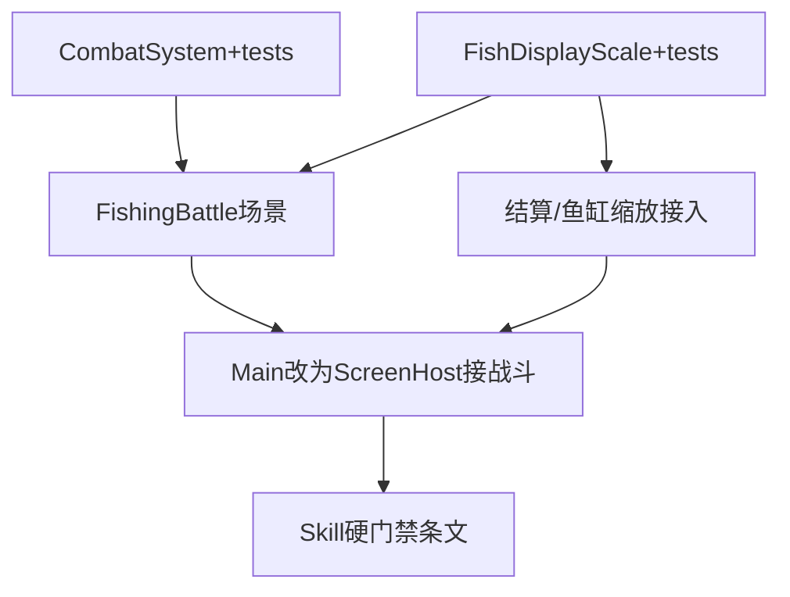

# 架构方案：fishing Godot 可维护原型首刀落地

> **For agentic workers:** 按任务 DAG 逐项实现；成功标准必须可验证。子技能可用 subagent-driven-development。

**Goal：** 把 fishing-2d 从上帝 `Main` 竖切，落地为可维护原型首刀：可单测的 `CombatSystem`、独立战斗场景（船/竿/线场面）、`real_length_cm` 显示缩放、godot-developer 硬门禁条文。

**Architecture：** Session/Catalog 仍为数据；Combat 规则进纯 C# System；`Main` 改为 ScreenHost 路由；`fishing_battle.tscn` 独立屏；其余 Hub/仓库等本 Plan **不**全拆（绞杀式，禁止再往 Main 加玩法）。

**Tech Stack：** Godot 4 .NET C#、xUnit（`game/tests`）、现有 `GameSession`/`GameCatalog`。

**事实源：**
- [`docs/anvil/brainstorms/2026-09-10-godot-game-architecture-guidance.md`](../brainstorms/2026-09-10-godot-game-architecture-guidance.md)（confirmed）
- [`docs/GODOT-GAME-ARCHITECTURE.md`](../../GODOT-GAME-ARCHITECTURE.md)
- [`projects/fishing-2d/GODOT-ARCHITECTURE.md`](../../../projects/fishing-2d/GODOT-ARCHITECTURE.md)

## 执行元数据

- **Status**：executed
- **Workflow Stage**：code
- **Created**：2026-09-10
- **Updated**：2026-09-10
- **Source Of Truth Until**：后续 plan 取代本首刀范围
- **Requirements Source**：2026-09-10 Godot 架构 Spec（confirmed）+ 用户要求落地
- **Compounded Knowledge**：critical-patterns 仅 ACP，与本域无关；无 Godot 历史 lessons
- **Readiness**：验证已跑通（见 Code Status）
- **Resume Point**：**首刀完成**。Follow-up：fg 抠白边；拆 Hub/商店/仓库场景；Catalog JSON 化；战斗中商店不丢局
- **Code Status**：T1–T6 完成；`dotnet test` 7 passed；公式仅在 `CombatSystem`；存在 `fishing_battle.tscn`

## 模块边界

### 模块：CombatSystem

- **职责：** 搏鱼状态机与每帧数值（张力/耐力/HP/距离/疲劳/断线/捕获判定）
- **输入：** dt、reeling、rodLevel、reelLevel、`FishDef`、随机源（咬钩等待）
- **输出：** `CombatFrame` / 事件（Catch / BreakLine / PhaseChanged）
- **依赖：** `FishDef` 数据形状（可保持现有类型）；**不**依赖 `Node`/`Control`
- **不变量：** 同输入序列 → 同状态转移；可用 `dotnet test` 验证

### 模块：FishDisplayScale

- **职责：** 由 `real_length_cm` + baseline 推导显示缩放
- **输入：** cm、可选 baseline
- **输出：** 相对 scale 系数
- **依赖：** Catalog 或硬编码 wave1 三鱼 cm（可先内嵌表，与 asset spec 对齐）
- **不变量：** 旗鱼 scale > 真鲷 scale > 鲫鱼 scale（单调）

### 模块：FishingBattleScreen

- **职责：** `fishing_battle.tscn` 展示：背景、船竿前景、动态鱼线、HUD；调用 CombatSystem；结算 Intent
- **输入：** Session 引用、Catalog、切回 Hub 回调
- **输出：** UI；写 Session 仅通过明确 API（卖/留）
- **依赖：** CombatSystem、现有素材路径
- **不变量：** 战斗规则不在 Screen 内复制一份

### 模块：AppShell（Main）

- **职责：** 启动、Session、ScreenHost 装载/切换屏
- **输入：** 屏 id
- **输出：** 当前屏实例
- **依赖：** PackedScene
- **不变量：** 无搏鱼公式；本 Plan 允许暂时保留其它屏的旧 `BuildXxx`，但 **禁止新增**

### 模块：SkillGate

- **职责：** `implement.md` 增加可检查硬门禁（合入前清单）
- **不变量：** 与 `GODOT-GAME-ARCHITECTURE.md` 一致

## 接口定义

```csharp
// 示意 — 实现可微调命名，须保持纯数据 I/O
public enum CombatPhase { AwaitCast, WaitingBite, Fighting, Result }

public sealed class CombatSystem
{
    public CombatPhase Phase { get; }
    public void StartCast(...);
    public void Tick(float dt, bool reeling);
    // Catch / Break 结果通过属性或 out 事件暴露
}

public static class FishDisplayScale
{
    public static float ScaleFromLengthCm(float realLengthCm, float baselineCm = 80f);
}
```

Screen 与 Shell：`IGameScreen` 可选；首刀可用具体类 `FishingBattleScreen : Control`。

## 日志规范

- 本刀不加结构化游戏日志；断线/捕获沿用现有 `SetNotice` 文案即可。

## RTK 过滤预设

- `rtk dotnet test`（若可用）或 `dotnet test -q`
- `rg -n "UpdateFishing|rodDamage" game/scripts` 确认公式已迁出 Main

## 历史经验约束

- 无适用 Godot 域 lessons；勿套用 ACP JSON-RPC 模式。

## 反模式检查

- ❌ 在 `Main` 继续堆积 `BuildFishingBattle` 新逻辑  
- ❌ CombatSystem 引用 `ProgressBar`/`Input`（输入由 Screen 传入 bool）  
- ❌ 一次拆完全部 9 屏  
- ❌ 全量 Redux 把每帧张力写入 Session  
- ✅ 绞杀：先战斗可测 + 独立场景，其它屏随后再拆  

## 简化审计

- 可删：完整 Autoload DI、全屏 MVVM、ECS。  
- 保留：CombatSystem、一战斗场景、cm 缩放、skill 条文。

---

## 任务 DAG



## 并行执行计划

| Layer | Parallel Group | Tasks | Execution | Reason |
|-------|----------------|-------|-----------|--------|
| 1 | G1 | T1, T2 | parallel | 写集不相交 |
| 2 | G2 | T3 | serial | 依赖 T1；建场景 |
| 3 | G3 | T4 | serial | 接缩放 UI |
| 4 | G4 | T5 | serial | 改 Main 共享壳 |
| 5 | G5 | T6 | serial | 文档/skill |

## 任务列表

### 任务 T1：抽取 CombatSystem + 单测

- **Layer**：1
- **Parallel Group**：G1
- **Execution**：parallel
- **Parallel Blocker**：无
- **Ownership**：`projects/fishing-2d/game/scripts/systems/`、`projects/fishing-2d/game/tests/`
- **Read Set**：`Main.cs` UpdateFishing/StartCast/StartFight/FinishCatch/BreakLine；`GameCatalog.cs`；`GameSession.cs`
- **Write Set**：`scripts/systems/CombatSystem.cs`（及必要小类型文件）、`tests/*`、测试 csproj
- **描述：** 将搏鱼数值逻辑迁入纯 C#；测试覆盖：收线张力上升、满张力断线、距离上限断线、HP 耗尽进入疲劳路径、捕获 distance<=0。`MathF` 替代 `Mathf`。
- **成功标准：** `dotnet test` 在 tests 工程通过；`Main` 暂可仍调用 System（T5 再清）。
- **预估 Token**：80k
- **依赖**：无
- **涉及文件：** 见 Write Set
- **执行指令：** 行为与现逻辑对齐；随机咬钩等待可注入 stub 时间。

### 任务 T2：FishDisplayScale + 三鱼 cm 表

- **Layer**：1
- **Parallel Group**：G1
- **Execution**：parallel
- **Parallel Blocker**：无
- **Ownership**：`scripts/data/` 或 `scripts/systems/FishDisplayScale.cs`；tests
- **Read Set**：asset `real_length_cm`（鲫35/真鲷60/旗鱼300）；`GameCatalog` UiScale 用法
- **Write Set**：`FishDisplayScale.cs`、Catalog 可选 cm 字段、对应测试
- **描述：** `ScaleFromLengthCm`；Catalog 为三鱼补 `RealLengthCm`（可手写常量对齐 spec）。
- **成功标准：** 单测断言 sailfish > seabream > crucian；比值接近 cm 比（允许 UI clamp）。
- **预估 Token**：30k
- **依赖**：无

### 任务 T3：fishing_battle.tscn + 船竿线场面

- **Layer**：2
- **Parallel Group**：G2
- **Execution**：serial
- **Parallel Blocker**：共享场景入口
- **Ownership**：`game/scenes/fishing_battle.tscn`、`scripts/screens/FishingBattleScreen.cs`
- **Read Set**：CombatSystem；`fg_5a1f8c3e7b` / 背景路径；现 `BuildFishingBattle`
- **Write Set**：上述场景与 Screen 脚本；可选 `parts/` 子场景
- **描述：** 独立场景：背景层、船竿前景、Line2D/折线鱼线（张力驱动弯曲或颜色）、HUD 条；输入转 `Tick(reeling)`。
- **成功标准：** 编辑器/运行进入战斗可见船竿与线，非纯数字墙；规则走 CombatSystem。
- **预估 Token**：100k
- **依赖**：T1

### 任务 T4：捕获展示与鱼缸用 cm 缩放

- **Layer**：3
- **Parallel Group**：G3
- **Execution**：serial
- **Parallel Blocker**：无
- **Ownership**：FishingBattleScreen 结算 UI；`Main.Screens` 中 tank 缩放调用点（最小改）
- **Read Set**：FishDisplayScale；tank `UiScale` 处
- **Write Set**：替换 UiScale 为 cm 推导（tank + 结算弹窗）
- **描述：** 去掉「稀有度拍脑袋 scale」作为唯一来源。
- **成功标准：** 同屏或先后对比，旗鱼视觉明显大于真鲷。
- **预估 Token**：40k
- **依赖**：T2、T3（结算在新屏）或 T2 + 旧结果 UI（若 T3 未完可用旧 UI 接 T2）

### 任务 T5：Main ScreenHost 接入战斗屏

- **Layer**：4
- **Parallel Group**：G4
- **Execution**：serial
- **Parallel Blocker**：Main 共享
- **Ownership**：`Main.cs`、`Main.Screens.cs`、`main.tscn`
- **Read Set**：FishingBattleScreen
- **Write Set**：Main 路由；删除/停用 `UpdateFishing` 内联公式与 `BuildFishingBattle`（改为装载场景）
- **描述：** ScreenHost 子节点切换；其它屏可暂留 BuildXxx。
- **成功标准：** `rg` 显示 `UpdateFishing` 战斗公式不在 Main；核心循环仍可玩：抛竿→搏鱼→结算。
- **预估 Token**：80k
- **依赖**：T3

### 任务 T6：skill 硬门禁

- **Layer**：5
- **Parallel Group**：G5
- **Execution**：serial
- **Parallel Blocker**：无
- **Ownership**：`resources/skills/godot-developer/implement.md`
- **Read Set**：`GODOT-GAME-ARCHITECTURE.md`
- **Write Set**：implement.md（Architecture 节升级为 MUST / 审查否决项）
- **描述：** 明确：新增玩法进 System/Screen；禁止上帝 Main；一屏一场景；System 需可测。
- **成功标准：** 条文可被 Agent 执行；与架构文无矛盾。
- **预估 Token**：15k
- **依赖**：T5（或文档可并行于末尾）

## 会话拆分点

- **拆分点 1：** T1+T2 完成后（纯逻辑可测）
- **拆分点 2：** T3+T5 完成后（战斗可玩且场景独立）
- T4/T6 可同会话收尾

## 通过条件（整包）

| # | 检查 | 期望 |
|---|------|------|
| A | `dotnet test` fishing tests | 通过 |
| B | 运行进战斗 | 见船/竿/线 |
| C | Main 无搏鱼公式 | `rg rodDamage|TensionUp` 仅在 systems |
| D | cm 缩放 | 旗鱼 > 真鲷 |
| E | implement.md | 含 MUST 门禁 |

## 非目标（本 Plan）

- 拆 Hub/商店/仓库/水族馆为独立场景（后续 plan）
- Catalog 全量 JSON 200 鱼
- 水下二阶段、wave2 内容
- Foundry scaffold 自动生成多场景（可另开）
