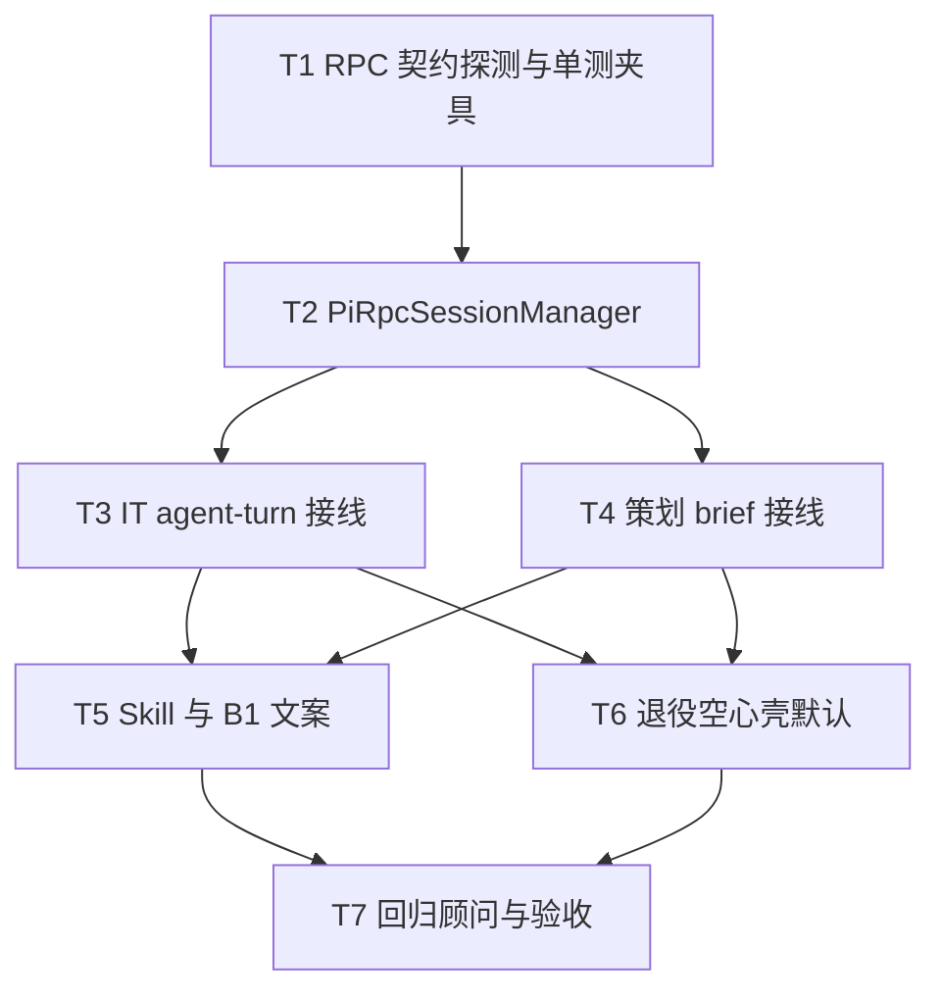

# 架构方案：Pi 常驻 RPC 独立 Agent（IT + 策划）

## 执行元数据

- **Status**：active
- **Workflow Stage**：code
- **Created**：2026-09-11
- **Updated**：2026-09-11
- **Source Of Truth Until**：本 plan 被 `/anvil:code` 执行完毕并标 `executed`，或被更新 plan `superseded` / 用户 `abandoned`
- **Requirements Source**：[`docs/anvil/brainstorms/2026-09-11-pi-rpc-independent-agent.md`](../brainstorms/2026-09-11-pi-rpc-independent-agent.md)（Status: confirmed；决策 A/X/P/S1/R2/B1/C1/T1）
- **Compounded Knowledge**：`docs/solutions/patterns/critical-patterns.md`（JSON-RPC 入站先分流）；`docs/solutions` 无 Pi 专用历史条目
- **Readiness**：每任务成功标准含命令/断言；总验收见「通过条件」
- **Resume Point**：`/anvil:code` All-tasks；**T1 done**（`8e88d9c`）；当前执行 **T2**
- **Code Status**：T1 done；T2 in progress；T3–T7 pending
- **Accepted Baseline T1**：`pi_rpc_protocol.md` / `pi_rpc_paths.mjs` / `pi_rpc_contract.test.mjs`；`node --test pi_rpc_contract.test.mjs` → 8 pass 1 skip

## 目标与非目标（继承 Spec）

- **做**：IT + 策划在 executor=pi 时走 **Pi `--mode rpc` 常驻进程**；原生工具全开；Foundry 能力靠 `gamefactory` CLI + skill；**Pi session 为聊天真相**；权威 brief 仍走导出闸门；S1 YOLO。
- **不做**：顾问迁新 Pi、假 ACP、Foundry MCP 工具注册、GUI 脱离化、外置优先、S2 批准为默认。

## 模块边界

### 模块：PiRpcContract

- **职责**：冻结内嵌 Pi RPC 的 NDJSON 命令/事件最小子集与探测脚本
- **输入**：embed 路径、`rpc-entry` / `cli.js --mode rpc`
- **输出**：契约文档片段（可放 plan 附录或 `gui/electron/pi_rpc_adapter` 注释）+ 可跑探测
- **依赖**：`gui/runtime/pi` embed
- **不变量**：只依赖官方 `type: prompt|new_session|get_messages|switch_session|get_state|abort` 等已存在命令；不发明 ACP method 名

### 模块：PiRpcSessionManager

- **职责**：按 Foundry `instanceId`（IT）或 brief `sessionId` 保活一个 Pi RPC 子进程；发 prompt、等 idle、取可见消息、switch/new session
- **输入**：cwd、provider/model/env、session 文件路径映射、用户消息、可选 system/skill 前缀
- **输出**：`{ text, piSessionPath, eventsTail?, stderrTail? }`；崩溃可重建
- **依赖**：PiRpcContract；对照 `hermes_acp_session.mjs` / `cursor_acp_session.mjs` 生命周期，**不**复用 ACP method 表
- **不变量**：客户端请求 id 与入站事件分流遵循 critical-patterns（先看 `type`/`method`，出站 id 用 `gaf-pi-N` 一类前缀）；S1 不实现 permission 拦截

### 模块：AgentTurnPiRpcBridge

- **职责**：`agent-turn` 在 `role=it` 且 `executor=pi` 时走 SessionManager，不再 `run_pi_agent_turn` 围栏循环
- **输入**：现有 IPC opts（sessionId、instanceId、message、brief…）
- **输出**：GUI 仍吃得到的 `{ ok, assistant_message, … }`；**不**再以 Foundry conversation JSON 为聊天主存（C1）——仅可写元数据指针（如 `pi_session_path`）
- **依赖**：PiRpcSessionManager；skill 文本仍可由 CLI 组装一次 system 前缀（非重放全文历史）
- **不变量**：顾问 `tool_profile=advisor` / 锁 Pi 弱工具路径不变

### 模块：BriefPiRpcBridge

- **职责**：策划 `brief chat turn`（或等价 IPC）在 `resolve_brief_executor==pi` 时走同一 SessionManager；保留 draft/export 产品闸门（B1）
- **输入**：sessionId、message、bound brief
- **输出**：助手可见文本 + 仍可触发现有 draft 更新路径（若仍需要结构化 draft：由 skill 约束模型经 `gamefactory brief …` 或既有 host 解析钩子——plan 实现时优先「Pi 自由聊 + 导出仍走 export」，避免把 JSON skill 硬塞回空心壳）
- **依赖**：PiRpcSessionManager；`host_chat` export/门闩代码保留
- **不变量**：未经 export 的权威 brief 不被本路径设计为「默认写盘落实」

### 模块：PiSkillGuidance

- **职责**：更新 IT diagnose / 策划相关 skill：原生探查 + `gamefactory`；禁止常规覆盖权威 brief
- **输入**：现有 markdown skills
- **输出**：修订后的 skill 文件
- **不变量**：不恢复 `FOUNDRY_TOOL` 为 IT/策划主协议说明

### 模块：HollowShellDeprecation

- **职责**：IT/策划默认路径移除 `--no-tools --no-session` + 围栏主循环；旧函数可留测试/回退开关但默认关闭
- **不变量**：顾问若仍依赖围栏只读，不得误删其路径

## 接口定义

### Pi RPC（官方，NDJSON stdin/stdout）

- 命令（最小集）：`prompt`、`new_session`、`switch_session`、`get_messages`、`get_state`、`abort`、`wait`/idle（以官方 client 的 `waitForIdle` 事件为准）
- 参考实现：`@earendil-works/pi-coding-agent` → `modes/rpc/rpc-client.js`、`rpc-types.d.ts`
- Spawn：`node <embed>/…/rpc-entry.js` 或 `cli.js --mode rpc`，cwd=仓库根，env 注入 Provider Key（复用 `resolve_pi_auth_for_turn`）

### Electron ↔ Renderer

- 复用 `agent-turn` / `host-chat-turn` IPC 外形，减少 App.tsx 大改
- 可选后续：流式 chunk IPC（本轮非必须；可整轮返回）
- C1：提供 `list/sync` 能力——至少能 `get_messages` 填 GUI；Foundry JSON 不再是主历史

### Session 路径映射

- 建议：`~/.gamefactory/pi-sessions/<role>/<foundrySessionId>.json` 或 Pi 默认 session 目录 + 边车索引文件记录映射
- T1 探测后在实现里写死一种；切换同事实例 = `switch_session` 或独立进程/独立文件

## 日志规范

| 字段 | 说明 |
|------|------|
| `instanceId` / `sessionId` | Foundry 侧 |
| `piSessionPath` | Pi 会话文件 |
| `phase` | spawn / handshake / prompt / idle / error |
| `stderrTail` | 截断 2k |

确定性：同一失败原因 → 同一 `phase` + 稳定 error 前缀（如 `pi_rpc_spawn_failed`）。

## RTK 过滤预设

- `rtk pytest` / `python -m unittest … -q` 跑 CLI 测
- `rg` 查 `--no-tools` 默认残留
- 避免把整份 `rpc-client.js` 塞进上下文；只摘类型与命令表

## 历史经验约束

- JSON-RPC/类 RPC：**先处理带 method/type 的入站**，再匹配出站 pending；客户端 id 用字符串前缀（critical-patterns）。
- Hermes 审批坑与本轮 S1 无关；勿把 permission bridge 默认接回 Pi RPC。
- `docs/solutions` 无其它 Pi 嵌入专项；不阻塞。

## 关键模式检查

- [x] 入站/出站 id 分流（适用于 Pi NDJSON 若带关联 id）
- [x] 不假设「关 YOLO 才会出权限」（本轮固定 S1）
- [x] 不静默吞 spawn 失败

## 简化审计

- 能删 50% 吗？不做：流式 UI、MCP 工具注册、假 ACP、顾问迁移、沙箱 S3、双写会话。
- SessionManager 对照现有 ACP manager **抄生命周期不抄协议**。
- 策划先「Pi 自由 Agent + 导出闸门」；不强制本轮重做整套 draft JSON 状态机到 Pi 内。

## 任务 DAG

## 并行执行计划

| Layer | Parallel Group | Tasks | Execution | Reason |
|-------|----------------|-------|-----------|--------|
| 1 | G1 | T1 | serial | 契约引导后续 |
| 2 | G2 | T2 | serial | SessionManager 共享接口 |
| 3 | G3 | T3, T4 | parallel | 写集分离：agent_turn/main IT vs host_chat/brief |
| 4 | G4 | T5, T6 | serial* | T6 依赖 T3/T4 默认已切；T5 可与 T6 同层但共享 skills/文档时 **serial：先 T5 后 T6** |
| 5 | G5 | T7 | serial | 总验收 |

\*为降低冲突：Layer 4 内 **T5 → T6** 串行。

## 任务列表

### 任务 T1：Pi RPC 契约探测与测试夹具

- **Layer**：1
- **Parallel Group**：G1
- **Execution**：serial
- **Parallel Blocker**：无
- **Ownership**：cli 测试 + 可选 electron 探针文档
- **Read Set**：`gui/runtime/pi/**/rpc-*.js`、`rpc-types.d.ts`、`embed-manifest.json`、`cli/pi_runtime.py`
- **Write Set**：`cli/test_pi_rpc_contract.py` 或 `gui/electron/pi_rpc_contract.test.mjs`（二选一，优先 Node 侧贴近 spawn）；短注释契约文件 `gui/electron/pi_rpc_protocol.md`（仅命令表，非长文）
- **描述**：无网或 mock 下验证能 spawn rpc、new_session、往返一条 prompt（可用假 provider/跳过真 LLM 则至少握手+命令 echo；若必须真 Key 则标 manual + 结构测）
- **成功标准**：测试或脚本退出 0；文档列出最小命令集与事件形状
- **预估 Token**：80k
- **依赖**：无
- **执行指令**：读官方 `RpcClient`；写最小 spawn；断言 stdout NDJSON 可解析；失败则记录开放问题并阻塞 T2

### 任务 T2：实现 PiRpcSessionManager

- **Layer**：2
- **Parallel Group**：G2
- **Execution**：serial
- **Parallel Blocker**：共享 electron 新模块
- **Ownership**：`gui/electron/`
- **Read Set**：`hermes_acp_session.mjs`、`cursor_acp_session.mjs`、T1 契约、`pi_runtime.resolve_pi_*`
- **Write Set**：`gui/electron/pi_rpc_session.mjs`、`gui/electron/pi_rpc_session.test.mjs`、必要时 `pi_rpc_adapter.mjs`
- **描述**：每实例保活；`prompt`→wait idle→聚合助手文本；`get_messages`/`switch_session`；stderr 尾；stop/abort
- **成功标准**：单测用假子进程 NDJSON 覆盖 prompt 完成与崩溃重建；id 分流无误
- **预估 Token**：120k
- **依赖**：T1
- **执行指令**：仿 ACP manager 结构；协议用 Pi `type` 字段；S1 无 permission 路由

### 任务 T3：IT `agent-turn` 切到 Pi RPC

- **Layer**：3
- **Parallel Group**：G3
- **Execution**：parallel（与 T4）
- **Parallel Blocker**：无（不改 host_chat）
- **Ownership**：`gui/electron/main.mjs`、`cli/agent_turn.py`（仅 IT pi 分支）
- **Read Set**：现有 `agent-turn` pi 分支、`run_pi_agent_turn`
- **Write Set**：`main.mjs`（IT+pi 分流）、`cli/agent_turn.py`（默认不再进围栏循环；可留 flag）、相关单测
- **描述**：GUI IT + pi → SessionManager；注入 skill 前缀与 cwd；返回 assistant 文本；C1：持久化 pi session 路径到实例元数据（非全文重写 Foundry messages 主存）
- **成功标准**：单元/集成：mock SessionManager 后 IPC 返回 ok；代码路径无 `--no-tools` 默认
- **预估 Token**：100k
- **依赖**：T2
- **执行指令**：不要改顾问分支；Codex/Cursor IT 外置路径不动

### 任务 T4：策划 brief 切到 Pi RPC

- **Layer**：3
- **Parallel Group**：G3
- **Execution**：parallel（与 T3）
- **Parallel Blocker**：无
- **Ownership**：`cli/host_chat.py`、`gui/electron/main.mjs` host-chat 段
- **Read Set**：`resolve_brief_executor`、`run_pi_brief_turn_with_tools`、export 门闩
- **Write Set**：`host_chat.py` pi 分支、`main.mjs` host-chat-turn、brief 相关测
- **描述**：pi 执行器走 SessionManager；保留 export/ready 闸门；结构化 draft 更新：能通则经 CLI/既有钩子，不能则本轮接受「对话为主 + 导出仍旧」并在 UI/skill 说明
- **成功标准**：测：export 门闩仍拒绝未 ready；pi 路径不再调用 `run_pi_brief_turn_with_tools` 默认
- **预估 Token**：120k
- **依赖**：T2
- **执行指令**：B1 写入 skill/注释；禁止把权威 brief 设为默认可写落实

### 任务 T5：Skill 与产品文案（B1 + S1 披露）

- **Layer**：4
- **Parallel Group**：G4a
- **Execution**：serial
- **Parallel Blocker**：文档/skills 与 T6 避免同文件冲突
- **Ownership**：`resources/skills/**`、必要时 `docs/GUI-CONFIG.md` / `AGENT-ROUTING.md` 短注
- **Read Set**：`resources/skills/it/diagnose.md`、策划/orchestrator host-chat skill
- **Write Set**：上述 skill + 短文档
- **描述**：删除/降级 FOUNDRY_TOOL 主说明；强调原生工具 + gamefactory；B1；S1 信任披露一句
- **成功标准**：`rg FOUNDRY_TOOL resources/skills/it` 不再要求围栏为主路径；B1 句可见
- **预估 Token**：40k
- **依赖**：T3, T4
- **执行指令**：顾问 skill 不放开写盘

### 任务 T6：退役空心壳默认

- **Layer**：4
- **Parallel Group**：G4b
- **Execution**：serial
- **Parallel Blocker**：改 pi_runtime 默认影响全局
- **Ownership**：`cli/pi_runtime.py`、`cli/pi_foundry_tools.py`（仅默认调用点）
- **Read Set**：所有 `run_pi_agent_turn` / `run_pi_text_completion` 调用方
- **Write Set**：`pi_runtime.py`、调用方、测
- **描述**：IT/策划生产路径不再默认 `--no-tools --no-session`；围栏循环仅顾问或显式 legacy env
- **成功标准**：`rg "\-\-no-tools" cli/pi_runtime.py` 仅出现在 legacy/顾问/测试分支；IT 默认测走 RPC mock
- **预估 Token**：60k
- **依赖**：T3, T4, T5
- **执行指令**：用 env 如 `GAMEFACTORY_PI_LEGACY_SHELL=1` 保留逃生舱并文档化

### 任务 T7：回归与总验收

- **Layer**：5
- **Parallel Group**：G5
- **Execution**：serial
- **Parallel Blocker**：无
- **Ownership**：测试与清单
- **Read Set**：全变更
- **Write Set**：测试文件必要时；本 plan Code Status 更新（code 阶段）
- **描述**：顾问只读测；IT/策划路径测；手动清单（有 Key 时）：多轮读文件 + `gamefactory doctor`
- **成功标准**：相关 unittest 绿；手动清单勾选或记 blocker；Spec 成功标准 1–5 可映射到证据
- **预估 Token**：50k
- **依赖**：T5, T6
- **执行指令**：无 Key 时自动化测必须仍绿；手工项写入 PR 说明

## 会话拆分点

- **拆分点 1**：T2 完成后（SessionManager 可测）——预估累计 ~200k
- **拆分点 2**：T3+T4 完成后——接线可演示
- **拆分点 3**：T7 后收工 / review

## 通过条件

- [ ] IT + pi：常驻 RPC，原生工具可用，可调 `gamefactory`，无围栏主路径
- [ ] 策划 + pi：同上；权威 brief 导出闸门仍在（B1）
- [ ] C1：历史以 Pi session / get_messages 可还原要点
- [ ] 顾问行为未放开写盘
- [ ] 空心壳默认退役（legacy 显式开关）
- [ ] critical-patterns id 分流被遵守
- [ ] 无循环 DAG；并行写集不交叉

## `/anvil:code` 下一动作

从 **T1** 开始执行；完成 T2 后可演示保活；T3/T4 可并行（不同 Write Set）。
