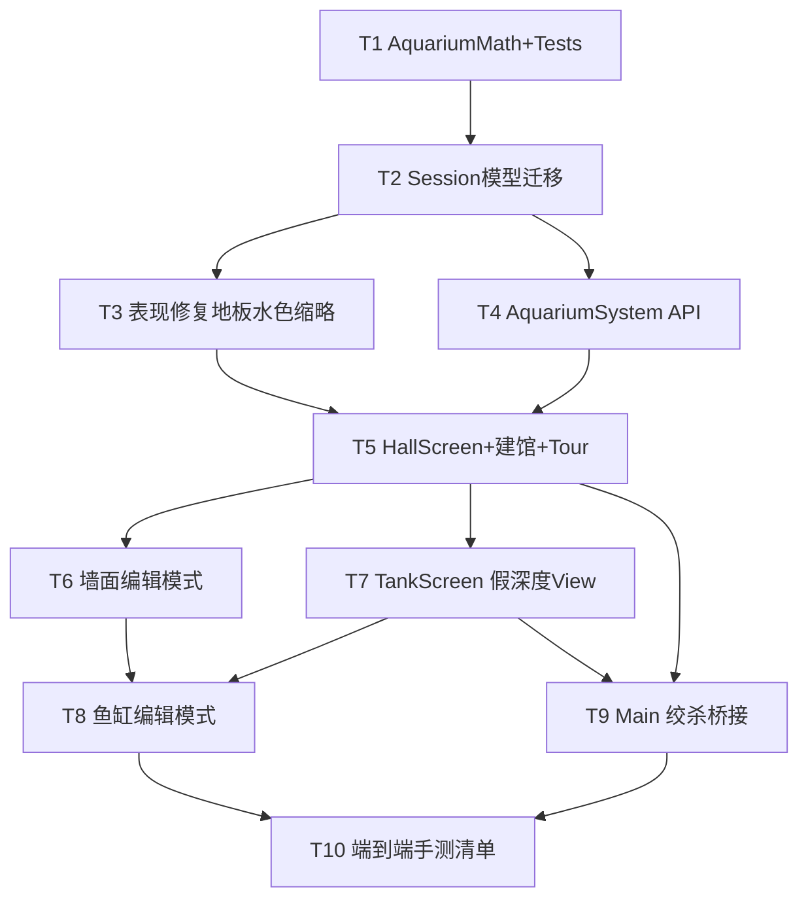

# 架构方案：fishing-2d 水族馆假深度展厅与双编辑器

> **For agentic workers：** 按任务 DAG 逐项实现；成功标准必须可验证。勿在 `Main.Screens` 继续堆编辑器。

**Goal：** 按 confirmed Spec 交付：表现修复（地板/水色/缩略缸）+ 连续宽×高×进深与价格曲线 + 建馆向导 + 墙面/鱼缸编辑器最小可用 + 大厅独立场景绞杀迁出；运行时 2D 假深度（近大远小、远淡不可见）。

**Architecture：** 纯 C# `AquariumSystem`（价格/重叠/深度映射）+ Session 扩展；`aquarium_hall.tscn` / `tank_screen.tscn` 独立屏（对齐 `fishing_battle` 迁法）；墙面编辑为大厅 Edit 模式；鱼缸编辑为 tank 屏 Edit 模式；渲染用 2D 假深度，不引入 3D。

**Tech Stack：** Godot 4 .NET C#、现有 xUnit（`game/tests`）、Shader（地板梯形铺砖、水色单轴波）。

**事实源：**
- [`docs/anvil/brainstorms/2026-09-17-fishing-aquarium-fake-depth-editors.md`](../brainstorms/2026-09-17-fishing-aquarium-fake-depth-editors.md)（confirmed）
- [`projects/fishing-2d/GODOT-ARCHITECTURE.md`](../../../projects/fishing-2d/GODOT-ARCHITECTURE.md)
- [`projects/fishing-2d/scenes/aquarium_hall.json`](../../../projects/fishing-2d/scenes/aquarium_hall.json)
- [`projects/fishing-2d/scenes/tank_view.json`](../../../projects/fishing-2d/scenes/tank_view.json)

## 执行元数据

- **Status**：executed
- **Workflow Stage**：code
- **Created**：2026-09-17
- **Updated**：2026-09-18
- **Source Of Truth Until**：后续 plan 取代本范围
- **Requirements Source**：`2026-09-17-fishing-aquarium-fake-depth-editors` Spec（用户确认）
- **Compounded Knowledge**：not yet compounded
- **Readiness**：`dotnet build` + `dotnet test`（31 passed）；手工进厅/贴窗/双编辑器待玩家验证
- **Resume Point**：Plan T1–T10 代码完成。Follow-up：水色参数持久化；手工玩一遍 F1–F6；`/anvil:review` 若要合入
- **Code Status**：T1–T10 done；Hall/Tank PackedScene；WallEditor+TankEditor；Main 旧 Build 已清；31 tests
- **Accepted Baseline**：全 DAG；SpinBox `Godot.Range.ValueChangedEventHandler` 修复；水色会话内预览未入 Session（已知）

## 模块边界

### 模块：AquariumMath（纯函数）

- **职责：** `PriceCurve`、`DepthVisual.Scale/Visibility/ZOrder`、矩形防重叠判定
- **输入：** faceW/H/depth、d、fade 参数、矩形列表
- **输出：** 价格、视觉系数、bool 重叠
- **依赖：** 无 Godot 节点
- **不变量：** 同输入同输出；价格对 depth 单调不减；visibility 在 `d>=fadeEnd` 为 0

### 模块：AquariumSystem

- **职责：** 建馆、扩墙、购/改缸（扣费）、物件增删改的 Session 写入规则
- **输入：** Session 快照意图（CreateHall / UpsertTank / PlaceProp …）
- **输出：** 新 Session 字段变更或错误码（金币不足、重叠、越界）
- **依赖：** AquariumMath、Session 数据形状
- **不变量：** UI 不直接改 Coins/Tanks；经本模块 API

### 模块：AquariumHallScreen

- **职责：** `aquarium_hall.tscn` — Tour / WallEdit / 建馆向导；缩略缸预览；地板+程序墙
- **输入：** Session、Navigate 回调
- **输出：** UI；编辑意图交给 AquariumSystem
- **依赖：** AquariumSystem、HallView 零件、地板 shader
- **不变量：** 无价格公式副本；Edit 与 Tour 模式可切换且可取消未提交草稿（第一波允许「即时提交」若文档标明）

### 模块：TankScreen

- **职责：** `tank_screen.tscn` — View / TankEdit；假深度鱼与物件；水色光参
- **输入：** 选中缸 id、Session、回调回大厅
- **输出：** UI；编辑意图 → AquariumSystem
- **依赖：** AquariumMath 视觉映射、水色 shader
- **不变量：** 不使用「小型缸烤景」作为唯一水体；鱼 `d` 在允许范围内更新

### 模块：AppShell 桥接

- **职责：** Main 对 `aquarium_hall` / `tank_view` 改为装载 PackedScene（同 fishing_battle）
- **输入：** screen id
- **输出：** 屏实例
- **依赖：** 两 PackedScene
- **不变量：** 删除或掏空 Main 内 BuildAquariumHall/BuildTankView 大块逻辑

## 接口定义（示意，实现可微调命名）

```csharp
// 单位：面=画布整数格；进深=逻辑单位 float（默认 1 格面 ≈ 可映射，plan 锁：depth∈[1,20]）
public sealed class AquariumTank {
  public string Id;
  public WaterType WaterType;
  public int RectX, RectY;       // 开窗左上角（格）
  public float FaceW, FaceH;     // 开窗面
  public float Depth;            // 进深
  public float FishDepthMin, FishDepthMax; // 默认 0..Depth
  public List<TankProp> Props;
  public List<FishInstance> Fish;
  // Capacity 由 FaceW*FaceH*Depth 或单独曲线 — 实现选：Max(1, round(FaceW*FaceH*DepthFactor))
}

public static class AquariumPrice {
  public static int Quote(float faceW, float faceH, float depth);
  // Quote = ceil(Base * faceW * faceH * depth^K) clamp；K>=1 保证深度越贵
}

public static class DepthVisual {
  public static float Scale(float d, float depth, float nearScale, float farScale);
  public static float Visibility(float d, float depth, float fadeStart, float fadeEnd);
  public static int SortKey(float d); // 远小 key 先画
}

public sealed class AquariumSystem {
  public bool TryOpenHall(SessionState s, int canvasW, int canvasH, out string err);
  public bool TryExpandCanvas(SessionState s, int dw, int dh, int cost, out string err);
  public bool TryUpsertTank(SessionState s, AquariumTank draft, int? payDiff, out string err);
  public bool TryPlaceProp(SessionState s, string tankId, TankProp prop, out string err);
}
```

**本 Plan 锁定的开放问题默认值（Spec 开放问题收口）：**

| 项 | 默认 |
|----|------|
| 面单位 | 整数格；默认新建缸 6×4 |
| depth | float，范围 `[1, 16]`，默认 `4` |
| PriceCurve | `ceil(8 * faceW * faceH * Pow(depth, 1.15))`，淡水×1.0 / 海水×1.2 |
| Capacity | `Max(1, (int)(faceW * faceH * (0.35 + 0.05*depth)))` |
| scale | lerp(1.0→0.35) by `d/depth` |
| visibility | 1 直到 `0.55*depth`，再平滑到 `0.92*depth` 为 0 |
| 墙编形态 | **大厅内 Edit 模式**（非独立 tscn） |
| 缩画布 | 若裁切已有缸 → 拒绝并报错 |
| 折射第一波 | 水色 alpha/雾随 d；不做屏幕空间折射 |

## 日志规范

- AquariumSystem 失败：`err` 字符串稳定枚举意（`coins` / `overlap` / `oob` / `no_hall`），GD.Print 仅 debug。
- 不打每帧鱼 `d` 日志。

## RTK 过滤预设

- `rtk` + `dotnet build` / `dotnet test`（若环境有 rtk）；否则直接 toolchain dotnet。
- 避免 Godot `--build-solutions` 挂起；用 `/Users/czl/.gamefactory/toolchain/dotnet/dotnet`。

## 历史经验约束

- 无本域 Godot 水族馆 lessons；对齐战斗迁场景：`ShowScreen("fishing_battle")` 装载 `res://scenes/fishing_battle.tscn` 模式。
- critical-patterns（ACP）不适用 → 不注入。

## 关键模式检查

- ❌ 在 Main 内新增墙/缸编辑器大段 UI  
- ✅ 独立 Screen + System  
- ❌ `sin(a)*sin(b)` 菱形水色  
- ✅ 单轴波 + tint  
- ❌ 矩形中心强透视 UV 当地板  
- ✅ 梯形网格或轻透视 + content 裁切铺砖  
- ❌ Godot 3D 缸  
- ✅ 连续 `d` 假深度  

## 简化审计

可删 50% 仍达标的砍法（本 Plan **已砍**）：自定义层数 UI、真折射、游览角色 AI、全 prop 管线、墙编独立 tscn、进深档位表（改用连续+曲线）。保留：Math+System、Hall Tour/Edit、Tank View/Edit、迁场景、表现修复。

## 任务 DAG



## 并行执行计划

| Layer | Parallel Group | Tasks | Execution | Reason |
|-------|----------------|-------|-----------|--------|
| 1 | G1 | T1 | serial | 共享 Math 接口 |
| 2 | G2 | T2 | serial | Session 形状 |
| 3 | G3 | T3, T4 | parallel | 写集不交：shaders/view vs System |
| 4 | G4 | T5 | serial | Hall 依赖 T3+T4 |
| 5 | G5 | T6, T7 | parallel | Hall Edit vs Tank Screen 写集可分 |
| 6 | G6 | T8 | serial | 依赖 T6 缸数据流 + T7 渲染 |
| 7 | G7 | T9 | serial | 动 Main 路由 |
| 8 | G8 | T10 | serial | 验收 |

## 任务列表

### 任务 T1：AquariumMath + 单测

- **Layer**：1 · **Parallel Group**：G1 · **Execution**：serial · **Parallel Blocker**：共享接口引导
- **Ownership**：`projects/fishing-2d/game/scripts/aquarium/`、`game/tests/`
- **Read Set**：Spec；现有 Tests 风格
- **Write Set**：`AquariumPrice.cs`、`DepthVisual.cs`、`AquariumRects.cs`、对应 `*Tests.cs`
- **描述：** 实现 Quote / Scale / Visibility / Overlaps；按本 Plan 默认公式
- **成功标准：** `dotnet test` 覆盖：depth↑ 价格↑；`d>=fadeEnd` visibility=0；重叠矩形检测 true/false
- **预估 Token**：40k
- **依赖**：无
- **执行指令：** 新建纯 C# 文件，不引用 Godot；对齐现有 Tests csproj

### 任务 T2：Session / AquariumTank 模型迁移

- **Layer**：2 · **Parallel Group**：G2 · **Execution**：serial · **Parallel Blocker**：Session 共享
- **Ownership**：`GameSession.cs` 及引用编译点
- **Read Set**：T1 类型；现有 AquariumTank 用法
- **Write Set**：`GameSession.cs`（及必要的调用点最小修补使编译通过）
- **描述：** 缸增加 FaceW/H/Depth/Props/FishDepthRange；旧 RectW/H 迁移为 Face；缺 depth 默认 4；HallOpened + Canvas 尺寸保留
- **成功标准：** `dotnet build` 通过；旧逻辑容量改走新 Capacity 公式
- **预估 Token**：35k
- **依赖：** T1

### 任务 T3：表现修复（地板 / 水色 / 缩略）

- **Layer**：3 · **Parallel Group**：G3 · **Execution**：parallel
- **Ownership**：`shaders/`、`AquariumHallView.cs`
- **Read Set**：floor_patch；现有 hall view
- **Write Set**：`aquarium_floor.gdshader`、`aquarium_tank_water.gdshader`、`AquariumHallView.cs`（预览绘制）
- **描述：** 地板改为梯形 Polygon2D UV 或等价非扭形方案 + content 裁切；水色去菱形；迷你缸用水色+暗示非纯字
- **成功标准：** 手工进厅：地板无菱空洞；水色无菱格；墙上可见玻璃窗预览
- **预估 Token**：45k
- **依赖：** T2（预览可读 Depth 可选；若仅视觉可松）

### 任务 T4：AquariumSystem API

- **Layer**：3 · **Parallel Group**：G3 · **Execution**：parallel
- **Ownership**：`scripts/aquarium/AquariumSystem.cs`
- **Read Set**：T1、T2 Session
- **Write Set**：`AquariumSystem.cs` + System 单测
- **描述：** TryOpenHall / Expand / UpsertTank（含差价）/ PlaceProp；错误码稳定
- **成功标准：** 单测：重叠拒写；金币不足拒写；Quote 差价路径
- **预估 Token**：40k
- **依赖：** T1, T2

### 任务 T5：HallScreen — 建馆 + Tour

- **Layer**：4 · **Parallel Group**：G4 · **Execution**：serial
- **Ownership**：`scenes/aquarium_hall.tscn`、`scripts/screens/AquariumHallScreen.cs`
- **Read Set**：FishingBattleScreen 装载模式；T3 view；T4 API
- **Write Set**：上述 tscn/cs；可复用/搬迁 HallView
- **描述：** 建馆向导设画布宽高；Tour 显示墙+地+缩略缸；扩墙走 System
- **成功标准：** 从 Hub 进厅可建馆；未建馆不见编辑；Tour 可见已有缸缩略
- **预估 Token**：55k
- **依赖：** T3, T4

### 任务 T6：墙面编辑模式

- **Layer**：5 · **Parallel Group**：G5 · **Execution**：parallel
- **Ownership**：`AquariumHallScreen` 编辑子模块 / `WallEditorOverlay.cs`
- **Read Set**：T5、T4
- **Write Set**：墙编相关 cs（大厅屏目录内）
- **描述：** 矩形工具新建/选中/拖改大小与位置；属性面板 FaceW/H/Depth/水型 + 实时报价；提交 UpsertTank
- **成功标准：** 可画两口不重叠缸、不同 depth、价格随 depth 升；重叠无法提交
- **预估 Token**：60k
- **依赖：** T5

### 任务 T7：TankScreen — 假深度 View

- **Layer**：5 · **Parallel Group**：G5 · **Execution**：parallel
- **Ownership**：`scenes/tank_screen.tscn`、`scripts/screens/TankScreen.cs`
- **Read Set**：DepthVisual；水色 shader；现有放鱼逻辑
- **Write Set**：tank 屏文件；迁入放鱼/设备 UI 最小集
- **描述：** 贴窗观赏：代码水色；鱼带 `d` 缓动；scale/visibility/z；无烤景底图依赖
- **成功标准：** 鱼远近大小与淡出可辨；极远不可见；可从大厅点缸进入
- **预估 Token**：55k
- **依赖：** T5（入口）

### 任务 T8：鱼缸编辑模式

- **Layer**：6 · **Parallel Group**：G6 · **Execution**：serial
- **Ownership**：TankScreen Edit 子模块
- **Read Set**：T7、T4
- **Write Set**：Tank Edit UI + prop 最小（ColorRect 或现有 prop 纹理一枚）
- **描述：** 调水色/光参；放置物件并改 position/scale/`d`；设 FishDepthMin/Max；预览同 View 渲染
- **成功标准：** 物件改 `d` 后预览近大远小；鱼游动范围受 Min/Max 约束
- **预估 Token**：55k
- **依赖：** T6, T7

### 任务 T9：Main 绞杀桥接

- **Layer**：7 · **Parallel Group**：G7 · **Execution**：serial · **Parallel Blocker**：Main 路由
- **Ownership**：`Main.cs` / `Main.Screens.cs`
- **Read Set**：fishing_battle 装载分支
- **Write Set**：Main 路由；删除/禁用旧 BuildAquariumHall/BuildTankView 主体
- **描述：** `aquarium_hall` / `tank_view` 改为实例化新 tscn；Settlements 等仍可用 Session 缸列表
- **成功标准：** Hub→厅→缸→回厅→回 Hub 全通；`Main.Screens` 无大段厅/缸 Build
- **预估 Token**：30k
- **依赖：** T5, T7（T8 可并行后接，但桥接可在 T8 前先通 View）

### 任务 T10：端到端验收

- **Layer**：8 · **Parallel Group**：G8 · **Execution**：serial
- **Ownership**：文档清单（本 Plan Code Status 更新）
- **Read Set**：全部
- **Write Set**：本 Plan 元数据 / 可选 `RELEASE-NOTES-UNRELEASED` 一行
- **描述：** 按 Spec 成功标准 1–7 勾选；补测失败则打回对应任务
- **成功标准：** 清单全过；`dotnet build` + `dotnet test` 全绿
- **预估 Token**：20k
- **依赖：** T8, T9

## 会话拆分点

- **拆分点 A：** T1–T4 后（Math+Session+表现+System）— 可玩性仍旧入口，但模型已换
- **拆分点 B：** T5–T7 后（独立厅 + 贴窗假深度）— 可演示核心假深度
- **拆分点 C：** T8–T10 后（双编辑器 + 绞杀完成）

## 通过条件

- [ ] Spec F1–F6 成功标准可演示或测试证明
- [ ] 无 Godot 3D 缸；无菱形水色；地板无扭形空洞
- [ ] 价格/深度映射有单测
- [ ] 水族馆主逻辑不在 Main 内扩张
- [ ] `dotnet build` && `dotnet test` 通过

---

回 **开始实现**（或 `/anvil:code`）即从 **T1** 开工。
