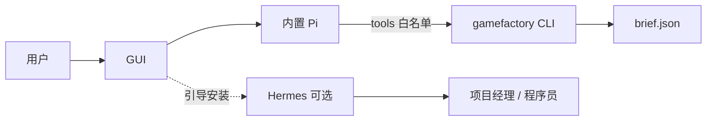

# Pi / 资产存储 / IT 角色 — 架构结论

**日期：** 2026-07-20  
**状态：** 已定决策；**可开工**（从 Spike 0：内置 Pi 冒烟）  
**相关：** [同族风格对齐草案](2026-07-20-style-group-alignment-design.md) · [Pi Agent Harness](https://github.com/earendil-works/pi) · [GUI 心智](../../HOST-CHAT-PRODUCT.md) · [Release 打包](../../RELEASE.md)

## 产品前提（执行器分档）

| 执行器 | 分发方式 | 用户门槛 |
|--------|----------|----------|
| **Pi** | **随 GUI Release 内置**（类似内嵌 Python / rembg） | 只需配置 **API Key** 即可启动策划（及可选用 Pi 的角色） |
| **Hermes / Codex / Cursor** | 打开 App **引导安装**（可选增强） | 项目经理 / 程序员等「重 Agent」岗 |

**Pi 不是可选插件**——它是 **开箱会话运行时**；Hermes 仍是可选增强，不是人人必装。

## 结论速览

| 问题 | 结论 |
|------|------|
| Pi 是否替代整套 Foundry | **否** — 不替代 `pipeline`、brief schema、文件总线 |
| Pi 用在哪 | **内置会话内核**：先接 **① 策划**（取代自建 host-chat 会话）；可顺带给 **IT** 默认用 |
| Hermes 用在哪 | **② 项目经理 / ③ 程序员**（引导安装）；IT 也可选 Hermes |
| 一致性校验是否上库 | **现阶段不上库**；brief JSON + 关系字段 + validate/pipeline |

---

## 1. Pi 内置：替代「会话内核」，不是替代 Foundry

### 意图

> 内置轻量 Pi → 用户只配 API 就能聊策划；**不必**先装 Hermes。  
> Pi 管 **对话 / session / tool loop**；Foundry 仍管 **brief 契约与导出**。

| 层 | 谁负责 |
|----|--------|
| 多轮对话、上下文、工具环 | **内置 Pi** |
| `draft_brief`、validate、导出冻结 | **Foundry**（skill + `gamefactory brief *`） |
| 权威产物 | `projects/<slug>/brief.json` |
| 批处理生图/视频 | **`pipeline`**（内嵌 Python，与 Pi 无关） |

### 与「薄 Chat」心智

[`HOST-CHAT-PRODUCT.md`](../../HOST-CHAT-PRODUCT.md) 原规定①勿上万能 Agent。改用**内置 Pi**后仍须：

1. 未「落实/导出」不得写权威 `brief.json`（工具白名单 + 确认门闩）。
2. 聊天不是契约；下游只读 brief。
3. 跨角色协作仍靠文件，不靠共享 Pi/Hermes 会话。

### 内置打包要点（实现时）

- 对标现有 [`gui/package.json`](../../../gui/package.json) `extraResources`（内嵌 Python）：增加 **pinned 的 `@earendil-works/pi-coding-agent`（或官方发布物）** 到 Release resources。
- **不要** vendoring 整个 Pi monorepo 源码树进 git；构建机 `npm pack` / 复制发布产物。
- 关注：包体增量、Node 运行时是否复用 Electron、supply-chain pin、升级通道（随 Foundry 发版）。
- Pi 官方默认无强沙箱 → 工具白名单必须严（只允许 `gamefactory brief/doctor/pipeline diagnose…`）。

### 工具

内置后工具比自建 host-chat **更容易**：agent loop 现成；代价是白名单与写盘门闩。

### 多厂商 API：向 pi-ai 借鉴（施工约束）

参考 [`@earendil-works/pi-ai`](https://github.com/earendil-works/pi/blob/main/packages/ai/README.md)：

| 做法 | 含义 | 对 Foundry |
|------|------|------------|
| **Provider ≠ API 协议** | 厂商（账号/目录）与 wire（`openai-completions` / `anthropic-messages`…）分离 | 内置 Pi 的**文本/策划**侧直接用 pi-ai Providers；**不要**再为策划自研一套多厂商 |
| 统一 `stream` + tools | 一次事件流含 tool call | 策划/IT 会话走 Pi；图像/视频**仍**走现有 Python 路由 |
| Auth 解析链 | env / credential / OAuth 集中 | GUI `provider_accounts` → 注入 Pi 所用 key；与 Hermes 引导装并存 |
| 按 Provider 注册 | 可 tree-shake，勿默认 `builtinModels()` 全家桶 | **只 register 产品需要的几家**（至少 OpenRouter + custom OpenAI-compat），控包体 |
| token/cost（可选） | pi-ai 自带追踪 | 后期可接到环境面板；非首期必做 |

**明确不搬进 Python pipeline：** Seedance、Images API 双路由、抠图 —— 继续 [`gamefactory.py`](../../../cli/gamefactory.py) / [`seedance_api.py`](../../../cli/seedance_api.py)。

**配置对齐（与 Pi 同构的小改，可并行）：** 以 `provider_accounts` 为 GUI 权威，保存时必扁平化到 `host`/`image`（已有）；施工时补「CLI 只改 accounts 无效」的文档/doctor 提示，避免双轨踩坑。

### 包体粗估（v0.80.10）

- 核心包解压合计约 **20+ MB**；完整 deps 乐观增量 **~30–50 MB**（复用 Electron Node 时）。
- 构建后对 `extraResources` 目录称重验收；超预算再砍 Provider 注册集。

---

## 2. 一致性校验：JSON vs 小型数据库

（不变）不上库；见 [风格对齐草案](2026-07-20-style-group-alignment-design.md)。

---

## 3. IT 角色：在「Pi 内置」前提下怎么选

| | |
|--|--|
| Role | `it` / 「运维」 |
| 职责 | doctor、pipeline diagnose、日志、配置脱敏 |
| **默认 executor** | **`pi`（内置）** — 零额外安装，与「只配 API 就能用」一致 |
| 可选 | Hermes（用户已引导装过时） |
| Skill | `resources/skills/it/diagnose.md`（命令白名单） |

**相对旧建议的修正：** 若 Pi **不**内置，IT 用 Hermes 更省事；在你已定 **Pi 内置** 后，IT 默认 Pi 更贴产品门槛。项目经理/程序员仍建议 Hermes（skill/派工生态已通）。

### 与项目经理分工

| 角色 | 管什么 | 默认引擎 |
|------|--------|----------|
| **策划** | 出 brief | **内置 Pi** |
| **IT** | 机器侧查错 | **内置 Pi** |
| **项目经理** | 业务分诊 / 派工 | Hermes（引导装） |
| **程序员** | 改 C# | Hermes / Codex（引导装） |

---

## Hermes 多角色：要两个服务吗？

**不需要。** 一个 Hermes CLI；每同事会话各自 `executor_session_id` + `--resume`；Foundry 侧 `plans/conversations/<role>/` 分文件。详见 [`cli/agent_turn.py`](../../../cli/agent_turn.py)。Memory 按 session 隔离，不是两个常驻服务。

---

## 文档一致性与已知缺口（开工前已核对）

| 项 | 状态 |
|----|------|
| Pi 内置 + 只配 API | 已定 |
| 策划 = Pi 会话；brief 文件仍权威 | 已定 |
| IT 默认 Pi；②③ Hermes 引导装 | 已定 |
| 不上 SQLite | 已定 |
| style_group 硬约束 | **另轨**（草案已有，不阻塞 Pi 内置首期） |
| [`HOST-CHAT-PRODUCT.md`](../../HOST-CHAT-PRODUCT.md)「①=薄 Chat」 | **已过时表述** → 见该文顶部勘误；契约门闩仍有效 |
| Electron 内如何跑 Pi | **施工第 0 项 spike**：子进程 `pi` CLI vs main 进程调 `pi-ai`（偏好：子进程 CLI，隔离崩溃、与 Hermes 同模式） |
| draft_brief 谁持有 | Pi 对话；草稿落盘/合并仍由 Foundry IPC（`brief status` / 侧栏）；落实才 export |
| 工具白名单初版 | `brief validate|autofix|export|status`、`doctor`、`pipeline diagnose|status`（IT）；**禁止**任意 shell / 改 config 除非用户明确 |

## 非目标

- 不把 Hermes 打进 Release（保持引导安装）。
- 不用 Pi 跑 `pipeline run` 批处理。
- 不引入 SQLite 替换 brief。
- 首期不把图像/视频生成迁到 pi-ai。

---

## 后续实施顺序（可开工）

0. **Spike（1～2 天）**：Release 目录嵌入 pinned `pi`/`pi-coding-agent`；只配 API 跑通一轮无工具对话。  
1. **Release 内置 Pi** 正式进 `extraResources` + 构建脚本 + 体积门禁。  
2. **① 策划改接内置 Pi**（旁路/替换 host-chat 会话路径；工具白名单 → brief CLI；侧栏仍读 Foundry draft）。  
3. **IT 角色默认 Pi** + `resources/skills/it/diagnose.md`。  
4. **style_group** 硬约束（JSON）— 可与 2/3 并行。  
5. ②③ 继续 Hermes 引导安装（不变）；可选日后允许选 Pi。

### Spike 0 进度（2026-07-20）

| 项 | 状态 |
|----|------|
| `scripts/prepare_embedded_pi.mjs` → `gui/runtime/pi` | **已落地**（pin `0.80.10`） |
| `extraResources` / `build-release.*` 编入 Pi | **已接线** |
| `setup pi status` / `setup pi smoke` | **已落地并通过**（`stdin=DEVNULL` + proxy + offline） |
| Electron `ELECTRON_RUN_AS_NODE` 跑 Pi | **已接线**：GUI Electron **39+**（Node ≥22.19）与 Pi 共用一套运行时；勿用 Electron 33（Node 20） |
| 另打官方 Node 二进制 | **不做**（避免两套 Node；升 Electron 对齐即可） |
| 策划旁路 host-chat | **步骤 2 已通**：`brief chat` → Pi + **工具白名单**（status/validate/export 门闩）+ JSON draft；失败回退 Host |
| IT 角色 + 工具白名单 | **已通**：GUI `it` → `agent turn --role it` → Pi + `FOUNDRY_TOOL` |
| 策划工具白名单写盘 | **已通**：`brief chat export` 仅 `allow_export` + session ready/commit；路径限 `projects|output|plans` |
| 体积门禁 | **已通**：`prepare_embedded_pi.mjs` 默认 warn 80MB / fail 100MB（`--max-mb` / `PI_EMBED_MAX_MB`） |
| style_group 硬约束 | **另轨未做**（见风格对齐草案） |

**包体实测（Windows）：** `npm install --omit=dev` 约 **122 MB**；prune `.map`/docs/非本机 clipboard 原生后约 **66 MB**（仍高于乐观 30–50 MB，后续再裁 Provider）。

**冒烟要点：** 子进程必须 `stdin=DEVNULL`（否则 `-p` 仍会等输入挂死）；注入 Foundry `proxy` + `PI_OFFLINE=1`；API key **只走环境变量**，勿放 argv。

### 联调清单（一起测）

1. **准备**：`npm run prepare:pi`（若尚无 `gui/runtime/pi`）；配置 OpenRouter Key；**完整重启** GUI（preload/main 变更）。
2. **策划**：开「策划」聊一句 → 侧栏应有草稿；JSON 回复；`llm_backend` 可为 `pi`（慢属正常）。
3. **IT**：侧栏应出现「IT · 运维」→ 说「跑 doctor」→ 应走内置 Pi，可能出现工具痕迹（`doctor --json`）。
4. **项目经理 / 程序员**：仍要 Hermes/Codex（引导装）；不依赖 Pi。
5. **回退**：`GAMEFACTORY_BRIEF_EXECUTOR=host` 可强制策划走旧 Host LLM。

---

## 相关路径

- 内嵌 Python 先例：[`docs/RELEASE.md`](../../RELEASE.md)、[`gui/package.json`](../../../gui/package.json)  
- 薄策划：[`cli/host_chat.py`](../../../cli/host_chat.py)  
- ②③：[`cli/agent_turn.py`](../../../cli/agent_turn.py)  
- Pi 上游：https://github.com/earendil-works/pi  
